# Design Document: Meld Unified CLI

## Overview

This design covers the complete unified `meld` CLI — a single binary serving as the developer interface for the Meld programming language. The CLI is a thin command-routing layer (`meld-cli/`) that delegates to reusable libraries in `meld-core/`. All execution, compilation, formatting, debugging, and tooling logic lives in `meld-core/`; CLI modules handle argument parsing, flag routing, and output formatting only.

The system implements a three-tier execution model:

- **Tier 1 — AST Interpreter** (`meld run`): Tree-walking interpreter for instant startup. Powers REPL, quick scripts, and compile-time macro evaluation.
- **Tier 2 — LLVM ORC JIT** (`meld dev`): Sub-second module swapping via ibazel for development hot-reload.
- **Tier 3 — LLVM AOT** (`meld build`): O3/ThinLTO optimization producing static native binaries for production.

All three tiers share the same Parser frontend and enforce the Effect Firewall identically. They diverge only at the execution/compilation backend.

**Cross-references (do not duplicate — reference only):**
- `.kiro/specs/meld-compiler/` — LLVM ORC JIT engine, hot-reload safety, AOT pipeline internals
- `.kiro/specs/meld-build/` — Bazel integration, `meld.toml` as single source of truth, `rules_meld`
- `.kiro/specs/meld-test/` — Testing framework internals (`@test`, assertions, mocking, BDD, property tests)
- `.kiro/specs/meld-lsp-server/` — LSP server capabilities and protocol handling
- `.kiro/specs/meld-mcp-server/` — MCP server capabilities and tool exposure
- `.kiro/specs/meld-core/requirements.md` (Req 99–118) — `@uses` annotation system, `@effect`, `perform()`, `handle()`, `resume()`


## Architecture

### CLI Module Architecture

```mermaid
graph TD
    subgraph "meld-cli — thin command routing"
        CLI[CliCore + CommandDispatcher]
        IM[InterpreterModule<br/>meld run]
        CM[CompilerModule<br/>meld build]
        DSM[DevServerModule<br/>meld dev]
        DT[DevToolsModule<br/>meld fmt]
        SM[ScaffoldModule<br/>meld new / init]
        TM[TestModule<br/>meld test]
        PM[PackageModule<br/>meld mod]
        AM[AuditModule<br/>meld audit]
        DM[DebugModule<br/>DAP server]
        DOM[DebugOrchestratorModule<br/>meld debug]
        McpM[McpModule<br/>meld mcp]
        LspM[LspModule<br/>meld lsp]
        SigM[SignModule<br/>meld sign]
        DaemM[DaemonModule<br/>meld daemon]
        VMM[VmModule<br/>meld vm]
        ShM[ShellModule<br/>meld completion]
        HM[HelpModule<br/>meld help / version]
    end

    subgraph "meld-core — reusable libraries"
        P[Parser]
        AI[AstInterpreter]
        ENV[Environment]
        K[Kernel Primitives]
        CF[Compiler_Frontend<br/>AST to LLVM IR]
        FMT[CodeFormatter]
        EF[EffectFirewall]
        EC[EffectChecker]
        DAPS[DapServer]
        PKG[PackageResolver]
        SCAF[ProjectTemplate]
    end

    CLI --> IM & CM & DSM & DT & SM & TM & PM & AM & DM & DOM & McpM & LspM & SigM & DaemM & VMM & ShM & HM

    IM --> P & AI & DAPS
    CM --> P & CF
    DSM --> P & CF
    DT --> P & FMT
    AM --> P & EC
    PM --> PKG
    SM --> SCAF
    AI --> ENV & K
    AI -.-> EF
    CF -.-> EF
```

Each CLI module (`InterpreterModule`, `CompilerModule`, etc.) extends `BaseCommandHandler` and registers with the `CommandDispatcher`. The `CliCore` initializes all modules and routes `argv` to the appropriate handler. Modules are loaded lazily via `LazyCommandLoader` for fast startup.

### Design Decisions

1. **Libraries in `meld-core/`, routing in `meld-cli/`**: All interpreter, compiler, formatter, debugger, and package logic lives in `meld-core/` as reusable libraries. `meld-cli/` modules are thin wrappers that parse flags and delegate. This avoids circular dependencies and enables reuse by the test runner, LSP, and MCP server.

2. **Visitor pattern for AST evaluation**: The `expression` type is a `boost::spirit::x3::variant` with ~50 alternatives. `std::visit` on the variant maps each AST node to an evaluation method. Idiomatic for tree-walking interpreters over variant-based ASTs.

3. **Environment as a linked scope chain**: Each `Environment` holds a `std::unordered_map<std::string, Binding>` and an optional parent pointer. Function calls create child environments extending the closure's captured environment. O(1) local lookup with O(depth) fallback.

4. **Reuse existing `kernel::Function` for closures**: The kernel already has `Function` with `closure_env_` support. The interpreter creates `kernel::Function` values that capture the defining `Environment`, parameter list, and body AST.

5. **LLVM replaces custom bytecode**: The old `BytecodeGenerator`/`BytecodeInterpreter`/`.meldc` pipeline is removed. AST is lowered directly to LLVM IR via `Compiler_Frontend`, producing `.bc` bitcode consumed by both ORC JIT (Tier 2) and AOT (Tier 3).

6. **Formatter is unconfigurable**: Like `gofmt`, there are zero style options. 4-space indent, same-line opening braces, 80-char parameter wrapping. No `FormatOptions` struct — the formatter enforces one canonical style.

7. **Effect Firewall as a shared library**: A single `EffectFirewall` class is used by all three tiers. The AST interpreter calls it at `perform()` sites; the LLVM backends emit calls to the same runtime check function. This guarantees identical enforcement.

8. **Git-first package management**: No registry. Dependencies are Git URLs with tags/commits. `meld.lock` pins exact commits for reproducibility. Registry support is a future extension.


### Three-Tier Execution Architecture

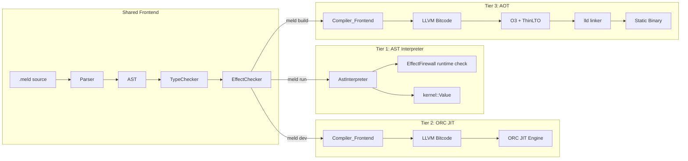

All three tiers share the Parser → AST → TypeChecker → EffectChecker pipeline. They diverge at execution:
- **Tier 1** walks the AST directly via `AstInterpreter`
- **Tier 2** lowers AST to LLVM IR, compiles to bitcode, and loads into ORC JIT for in-memory execution with hot-swap
- **Tier 3** lowers AST to LLVM IR, applies O3/ThinLTO, and links via `lld` into a static native binary

### AST-to-LLVM-IR Lowering Pipeline

The `Compiler_Frontend` (`meld-core/include/meld/compiler/compiler.hpp`) accepts a typed AST and produces an `llvm::Module`:

- `function_definition` → `llvm::Function` with appropriate signature
- `val_declaration` / `var_declaration` → `alloca` + `store` instructions
- `binary_operation` → LLVM arithmetic/comparison instructions
- `function_call` → `llvm::CallInst` with evaluated arguments
- `perform()` calls → emit calls to the EffectFirewall runtime check function

The module passes `llvm::verifyModule()` before being written as `.bc` bitcode. Deterministic output is guaranteed for identical inputs and compiler flags.

> Full LLVM pipeline details: `.kiro/specs/meld-compiler/requirements.md` (Requirements 1, 4, 6–8)

### Effect Firewall Architecture

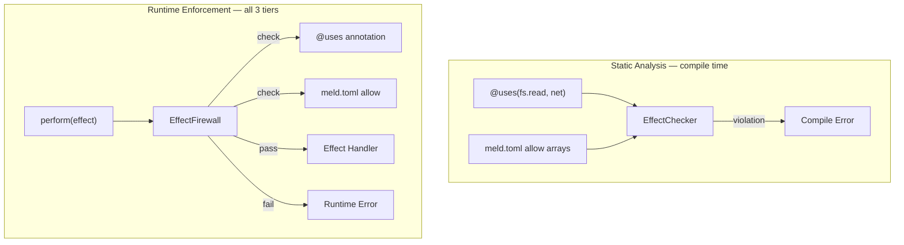

The Effect Firewall operates at two levels:
1. **Static analysis**: The `EffectChecker` validates `@uses` annotations against `meld.toml` `allow` arrays at parse/typecheck time. Violations are compile errors.
2. **Runtime enforcement**: At `perform()` call sites, the `EffectFirewall` checks that the current execution context has permission for the requested effect. In Tier 1, this is a direct function call. In Tiers 2/3, the compiler emits a call to the same `EffectFirewall::check()` function, ensuring identical behavior.

> Full effect annotation details: `.kiro/specs/meld-core/requirements.md` (Req 99–118)


### DAP Server Architecture

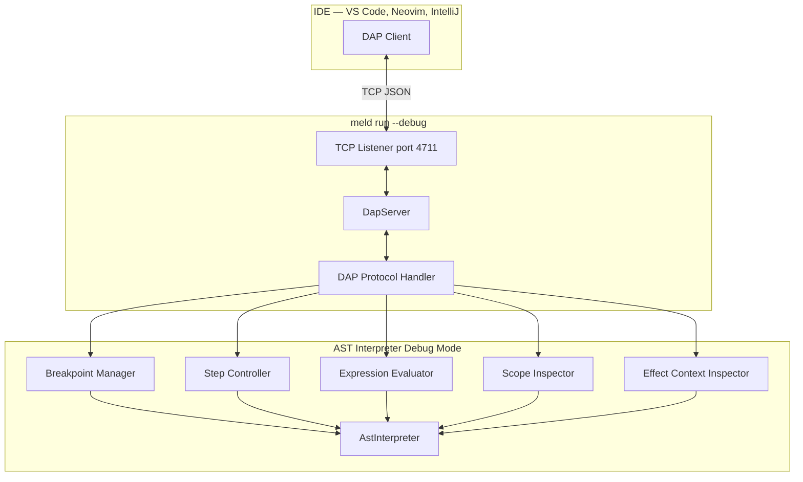

**Interpreted debugging (Req 12A):** The DAP server hooks into the `AstInterpreter` to provide:
- Breakpoints (line, conditional, logpoint) via the Breakpoint Manager
- Step-over/step-in/step-out via the Step Controller
- Variable inspection by walking the `Environment` scope chain (Local → Closure → Global)
- Expression evaluation at breakpoints using the `AstInterpreter` in the paused `Environment`
- Effect Context inspection showing active handlers and `@uses` permissions (Req 12D)

**Compiled debugging (Req 12B):** `meld build --debug` emits DWARF (Linux/macOS) or PDB (Windows) debug info mapping machine code to `.meld` source locations. Function names are mapped back to original Meld names.

**Data formatters (Req 12C):** LLDB Python scripts display kernel types in human-readable form:
- `kernel::Vec` → `vec[T] { elem0, elem1, ... }`
- `kernel::Optional` → `some(value)` or `nil`
- `kernel::Function` → function name, param count, closure/native indicator
- `kernel::String` → string content directly

### Compiled Debug Orchestrator Architecture (`meld debug`)

> **Note:** This section supersedes the former "meld debug attach" design. Req 18 has been replaced by Req 20 (`meld debug` Unified Orchestrator).

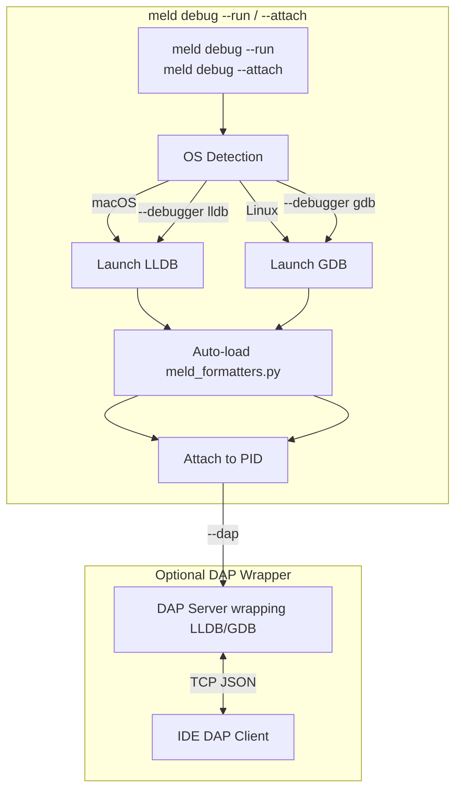

The `DebugOrchestratorModule` in `meld-cli/` wraps the OS debugger lifecycle:
1. Detect platform → select LLDB or GDB (overridable with `--debugger`)
2. Spawn the debugger process with `--attach <pid>` (LLDB) or `-p <pid>` (GDB)
3. Inject `command script import meld_formatters.py` (LLDB) or `source meld_gdb_printers.py` (GDB) before handing control to the user
4. If `--dap` is specified, start a DAP server that translates DAP requests into LLDB-DAP or GDB/MI commands, enabling IDE graphical debugging of compiled binaries
5. On exit, clean up the debugger process

### VS Code Seamless Debug Routing

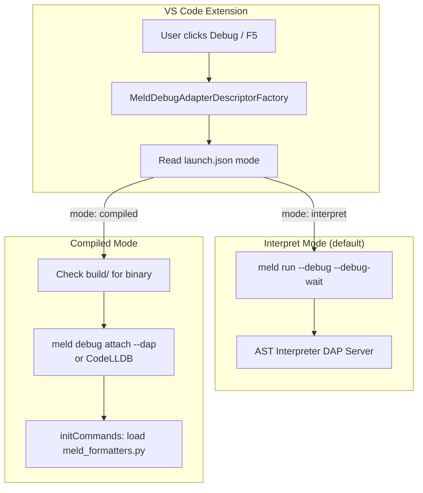

The VS Code extension provides:
- `MeldDebugAdapterDescriptorFactory`: inspects `launch.json` `mode` field to route to the correct backend
- Default `launch.json` template with two configurations:
  - `"Meld: Interpret"` → `meld run --debug --debug-wait --port ${port}` → VS Code connects to AST interpreter DAP
  - `"Meld: Compiled"` → launches compiled binary under LLDB with `meld_formatters.py` auto-loaded via `initCommands`
- Breakpoint mapping: `.meld` file breakpoints are sent to the AST interpreter DAP in interpret mode, or mapped to DWARF source breakpoints in compiled mode
- Auto-detection: if `build/<project_name>` exists, offer the compiled debug configuration

### Package Management Design

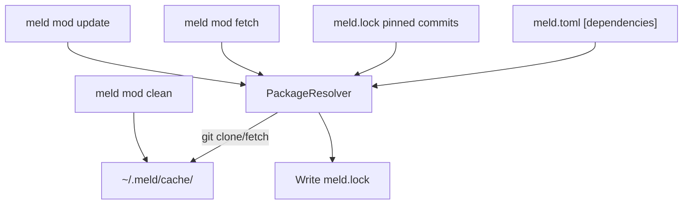

- **Git-first**: Dependencies are Git URLs with version tags or commit SHAs. No registry.
- **`meld.lock`**: Pins exact commits for reproducible builds. `meld mod fetch` respects the lock file; `meld mod update` resolves latest allowed versions and rewrites it.
- **Cache**: `~/.meld/cache/<package-name>/<commit-hash>/` stores cloned dependency sources.
- **Error handling**: Network failures, invalid URLs, and missing tags produce specific error messages identifying the failing dependency.

### Project Scaffolding Design

`meld new <name>` generates:
```
<name>/
├── meld.toml
├── src/
│   └── main.meld      (or module.meld with --lib)
└── .gitignore
```

`meld init` generates the same files in the current directory without creating a parent directory.

Generated `meld.toml`:
```toml
[package]
name = "<project_name>"
version = "0.1.0"

[dependencies]

[targets]
```

`meld new` also runs `git init`. If `meld.toml` already exists, both commands error without overwriting.


## Components and Interfaces

### 1. AstInterpreter (`meld-core/include/meld/interpreter/ast_interpreter.hpp`)

```cpp
namespace meld::interpreter {

struct Binding {
    kernel::Value value;
    bool is_mutable;
};

class Environment {
public:
    explicit Environment(std::shared_ptr<Environment> parent = nullptr);
    void define(const std::string& name, kernel::Value value, bool is_mutable);
    void assign(const std::string& name, kernel::Value value); // throws if immutable or unbound
    kernel::Value lookup(const std::string& name) const;       // throws if unbound
    bool has(const std::string& name) const;
    std::shared_ptr<Environment> parent() const;
    std::shared_ptr<Environment> create_child();
private:
    std::unordered_map<std::string, Binding> bindings_;
    std::shared_ptr<Environment> parent_;
};

class AstInterpreter {
public:
    explicit AstInterpreter(std::shared_ptr<Environment> env = nullptr);
    kernel::Value evaluate_program(const std::vector<parser::ast::expression>& exprs);
    kernel::Value evaluate(const parser::ast::expression& expr);
    std::shared_ptr<Environment> environment() const;
    void set_source_file(const std::string& file);

    // Debug hooks for DAP integration
    void set_breakpoint(const std::string& file, size_t line);
    void set_conditional_breakpoint(const std::string& file, size_t line, const std::string& condition);
    void remove_breakpoint(const std::string& file, size_t line);
    void set_step_mode(StepMode mode); // StepOver, StepIn, StepOut, Continue
    void set_pause_callback(std::function<void(const SourceLocation&, std::shared_ptr<Environment>)> cb);

    // Effect Firewall integration
    void set_effect_firewall(std::shared_ptr<EffectFirewall> firewall);

private:
    std::shared_ptr<Environment> env_;
    std::shared_ptr<EffectFirewall> effect_firewall_;
    std::string source_file_;
    std::vector<StackFrame> call_stack_;

    // Visitor methods for each AST node type
    kernel::Value eval_integer_literal(const parser::ast::integer_literal& lit);
    kernel::Value eval_string_literal(const parser::ast::string_literal& lit);
    kernel::Value eval_boolean_literal(const parser::ast::boolean_literal& lit);
    kernel::Value eval_identifier(const parser::ast::identifier& id);
    kernel::Value eval_val_declaration(const parser::ast::val_declaration& decl);
    kernel::Value eval_var_declaration(const parser::ast::var_declaration& decl);
    kernel::Value eval_function_definition(const parser::ast::function_definition& def);
    kernel::Value eval_function_call(const parser::ast::function_call& call);
    kernel::Value eval_binary_operation(const parser::ast::binary_operation& op);
    kernel::Value eval_unary_operation(const parser::ast::unary_operation& op);
    kernel::Value eval_list_expression(const parser::ast::list_expression& list);
    kernel::Value eval_block_expression(const parser::ast::block_expression& block);
    kernel::Value eval_lambda_expression(const parser::ast::lambda_expression& lambda);
    kernel::Value eval_perform_expression(const parser::ast::perform_expression& perf);

    kernel::Value apply_function(const kernel::Value& callee,
                                 const std::vector<kernel::Value>& args,
                                 const SourceLocation& call_site);
};

} // namespace meld::interpreter
```

### 2. InterpreterModule (`meld-cli/include/meld/cli/interpreter_module.hpp`)

The existing `InterpreterModule` already has the right public interface (`run_file`, `start_repl`, `run_source`). The internal `MeldRuntime` delegates to `AstInterpreter`:

- `MeldRuntime::execute_file()` → read file, `Parser::parse_file()`, `AstInterpreter::evaluate_program()`
- `ReplSession::evaluate_line()` → `Parser::parse_expression()`, `AstInterpreter::evaluate()` on a persistent `Environment`
- `:load <file>` REPL command → parse file, evaluate in current session environment
- `--watch` → `FileWatcher` triggers re-execution on file saves
- `--debug` → starts `DapServer` on TCP port, hooks into `AstInterpreter` debug callbacks

### 3. CompilerModule (`meld-cli/include/meld/cli/compiler_module.hpp`)

```cpp
class CompilerModule : public BaseCommandHandler {
public:
    CommandResult execute(const CommandArgs& args) override;

    // meld build — full AOT compilation
    CompilationResult build(const BuildOptions& options);

    // meld build --transpile <backend>
    TranspileResult transpile(const std::string& backend, const TranspileOptions& options);

private:
    struct BuildOptions {
        bool release = false;          // --release: O3 + ThinLTO + strip debug
        bool debug = true;             // --debug (default): emit DWARF/PDB
        std::string target_triple;     // --target <triple>
        std::filesystem::path output;  // --output <path>
    };

    struct TranspileOptions {
        std::string backend;           // go, jvm, cpp, wasm, rust
        std::filesystem::path output;
    };
};
```

### 4. DevServerModule (`meld-cli/include/meld/cli/dev_server_module.hpp`)

```cpp
class DevServerModule : public BaseCommandHandler {
public:
    CommandResult execute(const CommandArgs& args) override;

    // Start the ORC JIT dev server with ibazel file watching
    int start_dev_server(const DevServerOptions& options);

private:
    struct DevServerOptions {
        uint16_t port = 0;             // --port <port> for IPC
    };

    // Hot-swap a single module in the running JIT session
    bool hot_swap_module(const std::filesystem::path& changed_file);
};
```

> Full ORC JIT internals: `.kiro/specs/meld-compiler/`

### 5. EffectFirewall (`meld-core/include/meld/effects/effect_firewall.hpp`)

```cpp
namespace meld::effects {

class EffectFirewall {
public:
    // Load permissions from meld.toml allow arrays
    void load_permissions(const ProjectConfig& config);

    // Check if an effect is permitted in the current context
    // Called identically by all 3 tiers
    bool check(const std::string& effect_name,
               const std::string& module_name,
               const SourceLocation& call_site) const;

    // Build the full effect tree for meld audit
    EffectTree build_effect_tree(const std::vector<ModuleAST>& modules) const;

    // Get violations for a module
    std::vector<EffectViolation> get_violations(const std::string& module_name) const;
};

} // namespace meld::effects
```

### 6. DapServer (`meld-core/include/meld/interpreter/dap_server.hpp`)

```cpp
namespace meld::interpreter {

class DapServer {
public:
    explicit DapServer(AstInterpreter& interpreter, uint16_t port = 4711);

    // Start listening for DAP client connections
    void start(bool wait_for_attach = false);
    void stop();

    // DAP capabilities
    // setBreakpoints, configurationDone, continue, next, stepIn, stepOut,
    // pause, disconnect, threads, stackTrace, scopes, variables, evaluate
private:
    AstInterpreter& interpreter_;
    uint16_t port_;

    // Scope inspection: maps Environment chain to DAP scopes (Local, Closure, Global)
    std::vector<DapScope> build_scopes(std::shared_ptr<Environment> env) const;

    // Effect Context inspection (Req 12D)
    DapScope build_effect_context_scope() const;
};

} // namespace meld::interpreter
```

### 10. DebugOrchestratorModule (`meld-cli/include/meld/cli/debug_orchestrator_module.hpp`)

> **Note:** Supersedes the former `DebugAttachModule`. See Req 20.

```cpp
namespace meld::cli {

class DebugOrchestratorModule : public BaseCommandHandler {
public:
    CommandResult execute(const CommandArgs& args) override;

    // Launch a binary under a debugger or attach to a running process
    int debug(const DebugOptions& options);

private:
    struct DebugOptions {
        enum class Mode { Run, Attach };
        Mode mode;                             // --run or --attach
        std::filesystem::path binary_path;     // Target binary (--run mode)
        int pid = 0;                           // Target PID (--attach mode)
        std::string debugger;                  // "lldb", "gdb", or "" for auto-detect
        std::vector<std::string> breakpoints;  // --break <file:line> (repeatable)
        bool sandbox = false;                  // --sandbox: enforce SRT policy
        bool dap_mode = false;                 // --dap: wrap debugger in DAP server
        uint16_t dap_port = 4711;              // --port for DAP mode
        std::vector<std::string> extra_args;   // argv after --
    };

    // Detect the best debugger for the current platform
    std::string detect_debugger() const;

    // Spawn the debugger process with formatter auto-loading
    int spawn_debugger(const std::string& debugger, const DebugOptions& opts);

    // Resolve .mdebug sidecar via daemon API
    std::optional<std::filesystem::path> resolve_sidecar(const std::filesystem::path& binary);

    // Path to meld_formatters.py relative to CLI binary
    std::filesystem::path formatter_script_path() const;
};

} // namespace meld::cli
```

### 7. PackageResolver (`meld-core/include/meld/build/package_resolver.hpp`)

```cpp
namespace meld::build {

struct Dependency {
    std::string name;
    std::string git_url;
    std::string version_spec;  // tag, branch, or commit SHA
};

struct ResolvedDependency {
    std::string name;
    std::string git_url;
    std::string resolved_commit;
    std::filesystem::path cache_path;
};

class PackageResolver {
public:
    explicit PackageResolver(const std::filesystem::path& cache_dir = "~/.meld/cache/");

    // Fetch all dependencies declared in meld.toml
    std::vector<ResolvedDependency> fetch(const std::vector<Dependency>& deps,
                                          const LockFile& lock);

    // Resolve latest versions and update lock file
    LockFile update(const std::vector<Dependency>& deps);

    // Purge the cache
    void clean();
};

} // namespace meld::build
```

### 8. CodeFormatter (`meld-core/include/meld/compiler/code_formatter.hpp`)

```cpp
namespace meld::compiler {

class CodeFormatter {
public:
    // Format source to canonical style — no options, one style only
    std::string format(const std::string& source);

    // Check if source matches canonical style
    bool is_formatted(const std::string& source);

    // Format a file in place
    bool format_file(const std::filesystem::path& path);

private:
    // Canonical rules (not configurable):
    // - 4-space indent
    // - Opening brace on same line
    // - Closing brace on own line
    // - Parameters on own lines when >80 chars
    // - imp keyword preserved
    std::string pretty_print(const std::vector<parser::ast::expression>& ast);
};

} // namespace meld::compiler
```

### 9. ErrorHandler (`meld-cli/include/meld/cli/error_handler.hpp`)

All CLI commands use the shared `ErrorHandler` for consistent error formatting:

- Parse errors: `<file>:<line>:<column>: error: <message>`
- Runtime errors: error message + stack trace of function calls
- File not found: `error: file not found: <path>`
- Non-`.meld` extension: warning, proceed with processing
- `--json` mode: `{"file": "...", "line": N, "column": N, "severity": "error", "message": "..."}`


## Data Models

### Environment Scope Chain

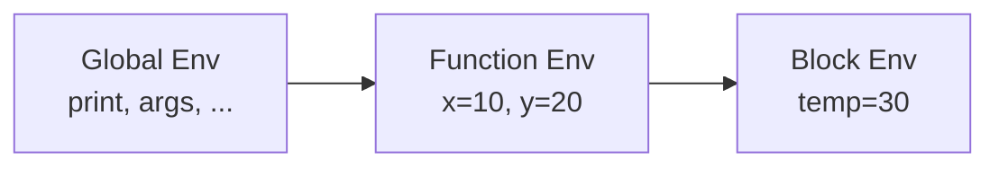

Each `Environment` node holds:
- `bindings_: unordered_map<string, Binding>` where `Binding = {value: kernel::Value, is_mutable: bool}`
- `parent_: shared_ptr<Environment>` (nullptr for global scope)

Lookup walks the chain from current to global. Assignment checks mutability before updating.

### Effect Tree Structure

The `EffectTree` is built by `meld audit` and represents the full dependency graph of effect permissions:

```
EffectTree
├── root_package: string
├── nodes: vector<EffectNode>
│   └── EffectNode
│       ├── package_name: string
│       ├── direct_effects: vector<string>     (effects this package performs)
│       ├── transitive_effects: vector<string>  (effects from dependencies)
│       ├── allowed_effects: vector<string>     (from meld.toml allow array)
│       ├── violations: vector<EffectViolation> (effects not in allow list)
│       └── dependencies: vector<EffectNode*>
```

### Project Config Model (`meld.toml`)

```
ProjectConfig
├── package
│   ├── name: string
│   ├── version: string (semver)
│   └── authors: vector<string>
├── dependencies: map<string, DependencySpec>
│   └── DependencySpec
│       ├── git: string (URL)
│       ├── tag: string (optional)
│       ├── branch: string (optional)
│       ├── commit: string (optional)
│       └── allow: vector<string> (permitted effects)
├── targets: map<string, TargetConfig>
│   └── TargetConfig
│       ├── type: "bin" | "lib"
│       ├── entry: string (path to main.meld)
│       └── allow: vector<string> (permitted effects for this target)
└── dev_dependencies: map<string, DependencySpec>
```

### Lock File Model (`meld.lock`)

```
LockFile
├── version: int (lock file format version)
└── packages: vector<LockedPackage>
    └── LockedPackage
        ├── name: string
        ├── git_url: string
        ├── resolved_commit: string (full SHA)
        ├── tag: string (optional, for display)
        └── integrity: string (SHA-256 of fetched content)
```

### Interpreter Call Stack

The `AstInterpreter` maintains a `call_stack_: vector<StackFrame>` for error reporting. Each `StackFrame` records the function name and source location. On function entry, a frame is pushed; on return, it's popped. On error, the entire stack is captured into `InterpreterError`.

### DAP Protocol Messages

The DAP server communicates via JSON messages over TCP. Key request/response types:

- `initialize` → capabilities (supportsConditionalBreakpoints, supportsEvaluateForHovers, etc.)
- `setBreakpoints` → verified breakpoint locations
- `stackTrace` → list of `StackFrame` with source locations
- `scopes` → Local, Closure, Global, Effect Context
- `variables` → bindings in a scope with name, value, type, mutability
- `evaluate` → expression result with value and type


### `melds` Production Supervisor Architecture

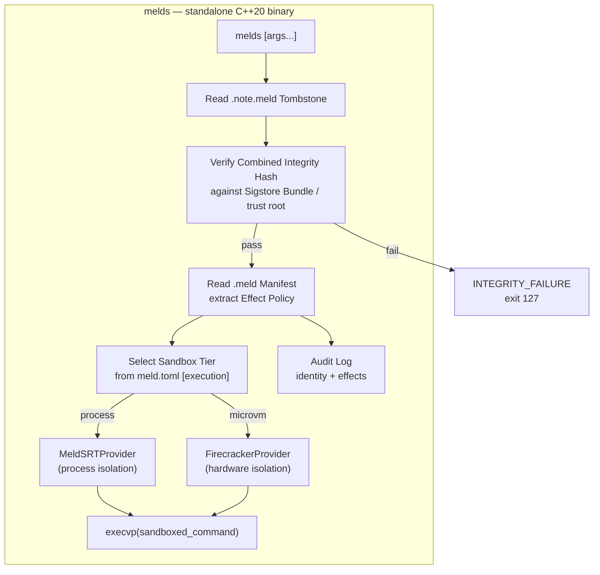

`melds` is a separate binary from the unified `meld` CLI. It excludes the AST parser, LLVM backend, MCP server, and AI context. Its only dependencies are the Sigstore verification logic, Tombstone/manifest parsers, and the `SandboxProvider` interface from `meld-manifest`.

### `melds` Component (`cmd/melds/main.cpp`)

```cpp
namespace meld::supervisor {

struct SupervisorConfig {
    bool offline_mode = true;           // --offline (default) or --online
    std::string isolation = "process";  // --isolation=[process|microvm]
    std::filesystem::path trust_root;   // Path to trusted_root.json
};

// melds entry point: verify → extract policy → sandbox → execvp
int supervisor_main(int argc, char** argv);

} // namespace meld::supervisor
```

### VFS Bridge Architecture

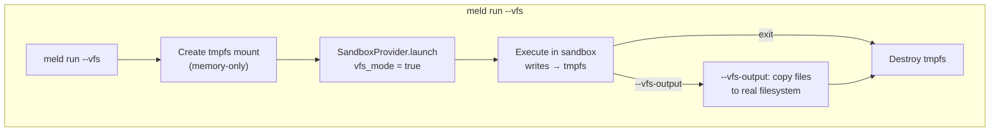

The VFS bridge leverages the `SandboxConfig.vfs_mode` flag added to `meld-manifest`. When active, the `SandboxProvider` creates a memory-only working directory and redirects all writes there. The real filesystem remains read-only per the effect policy.

### Daemon Handshake (meld run with compiled binaries)

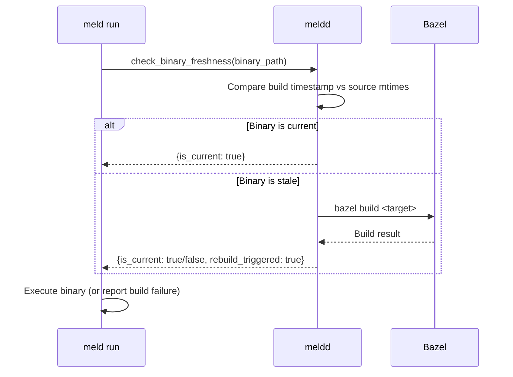

When `meld run` is invoked with a compiled binary, it pings the daemon's `check_binary_freshness` API before execution. This ensures stale binaries are automatically rebuilt without manual intervention.

### Binary Signing Architecture (`meld sign`)

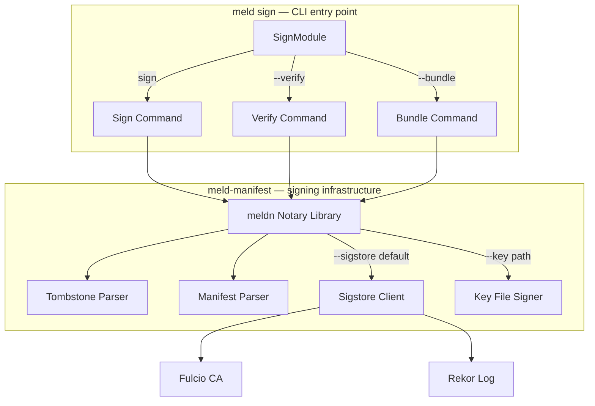

`SignModule` is a thin CLI wrapper around the `meldn` notary library in `meld-manifest/`. It handles argument parsing and output formatting; all cryptographic logic lives in `meld-manifest/`.

**Signing flow:**
1. Parse CLI flags (`--key`, `--sigstore`, `--fulcio-url`, `--rekor-url`)
2. Read `meld.toml` `[signing]` section for defaults
3. Locate co-located `.meld` manifest sidecar
4. Validate `code_hash` in manifest matches actual binary content
5. Compute Combined Integrity Hash: `H_total = Hash(code_hash + manifest_hash + debug_id)`
6. Sign `H_total` via Sigstore (default) or private key
7. Embed signed Tombstone in binary's `.note.meld` section

**Verification flow:**
1. Read `.note.meld` Tombstone from binary
2. Read co-located `.meld` manifest
3. Recompute `code_hash` from binary, `manifest_hash` from manifest
4. Verify `signature_blob` against Combined Integrity Hash
5. In `--online` mode: query Rekor for revocation status
6. Report pass/fail with specific check details

### SignModule Component (`meld-cli/include/meld/cli/sign_module.hpp`)

```cpp
class SignModule : public BaseCommandHandler {
public:
    SignModule(std::shared_ptr<NotaryLibrary> notary);

    // meld sign <binary> [--key <path>] [--sigstore]
    // meld sign --verify <binary> [--offline|--online]
    // meld sign --bundle <binary>
    CommandResult execute(const CommandArgs& args) override;

private:
    CommandResult handle_sign(const std::filesystem::path& binary, const SignOptions& opts);
    CommandResult handle_verify(const std::filesystem::path& binary, const VerifyOptions& opts);
    CommandResult handle_bundle(const std::filesystem::path& binary);

    SigningConfig load_signing_config(const CommandArgs& args);  // merge CLI flags + meld.toml [signing]

    std::shared_ptr<NotaryLibrary> notary_;
};

struct SignOptions {
    std::optional<std::filesystem::path> key_path;  // --key <path>
    bool sigstore = true;                            // default mode
    std::optional<std::string> fulcio_url;           // --fulcio-url
    std::optional<std::string> rekor_url;            // --rekor-url
};

struct VerifyOptions {
    bool offline = true;   // --offline (default)
    bool online = false;   // --online
};
```

### Daemon Management Architecture (`meld daemon`)

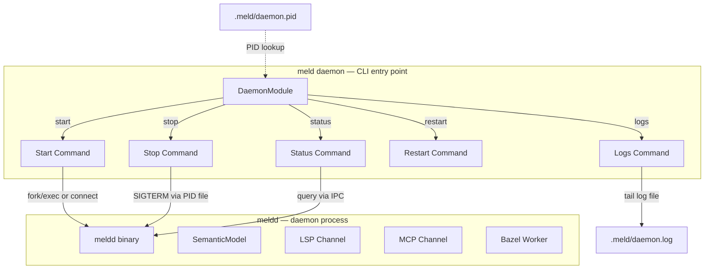

`DaemonModule` manages the `meldd` process lifecycle via a PID file at `<workspace>/.meld/daemon.pid`. It does not embed daemon logic — it spawns, signals, and queries the separate `meldd` binary.

**Process discovery:**
1. Read `<workspace>/.meld/daemon.pid`
2. Verify PID is alive via `kill(pid, 0)`
3. If stale (process dead), remove PID file and treat as stopped

**Start flow:**
1. Check for existing daemon via PID file
2. If running, print connection details and exit
3. If not running, fork/exec `meldd --workspace=<path>` (or run in foreground with `--foreground`)
4. Wait for daemon to write PID file and become ready
5. Print daemon PID and status

**Stop flow:**
1. Read PID from PID file
2. Send `SIGTERM` to daemon process
3. Wait for clean exit (up to 10s timeout per daemon Req 8.3)
4. If timeout, send `SIGKILL`
5. Remove PID file

### DaemonModule Component (`meld-cli/include/meld/cli/daemon_module.hpp`)

```cpp
class DaemonModule : public BaseCommandHandler {
public:
    // meld daemon start [--workspace=<path>] [--foreground] [--timeout=<s>]
    // meld daemon stop
    // meld daemon status
    // meld daemon restart
    // meld daemon logs [--lines=<N>] [--no-follow]
    CommandResult execute(const CommandArgs& args) override;

private:
    CommandResult handle_start(const DaemonStartOptions& opts);
    CommandResult handle_stop();
    CommandResult handle_status();
    CommandResult handle_restart(const DaemonStartOptions& opts);
    CommandResult handle_logs(const DaemonLogOptions& opts);

    std::optional<pid_t> find_running_daemon();
    std::filesystem::path pid_file_path();
    std::filesystem::path log_file_path();
    std::filesystem::path workspace_root_;
};

struct DaemonStartOptions {
    std::filesystem::path workspace;       // --workspace=<path>
    bool foreground = false;               // --foreground
    std::optional<uint32_t> timeout_secs;  // --timeout=<seconds>
};

struct DaemonLogOptions {
    uint32_t lines = 50;     // --lines=<N>
    bool follow = true;      // default: tail mode; --no-follow disables
};

struct DaemonStatus {
    bool running;
    pid_t pid;
    std::filesystem::path workspace;
    std::chrono::seconds uptime;
    uint32_t lsp_clients;
    uint32_t mcp_clients;
    float indexing_progress;  // 0.0–1.0, 1.0 = complete
    uint32_t active_sandboxed_processes;
};
```


### Agent-Test Mode Design (`--agent-test`)

When `--agent-test` is active on `meld run` or `meld test`, the CLI activates the language runtime's deterministic mode before user code executes:

1. Install deterministic effect handlers: `time` (virtual clock at epoch 0), `random` (fixed seed 0), deterministic actor scheduling
2. Print notice to stderr: `[agent-test] Deterministic mode active: time=virtual, random=seed(0), scheduling=deterministic`
3. After execution, write structured execution trace to `<project>/.meld/traces/`

The flag is composable with `--filter`, `--parallel`, `--debug`, `--json`, and `--vfs`. It is rejected on `meld build` (runtime mode only).

> Cross-reference: Agent-Test mode runtime behavior is defined in `.kiro/specs/meld-core/requirements.md` Req 143. Deterministic actor scheduling is defined in `.kiro/specs/meld-async/requirements.md` Req 24.


### VM Management Architecture (`meld vm`)

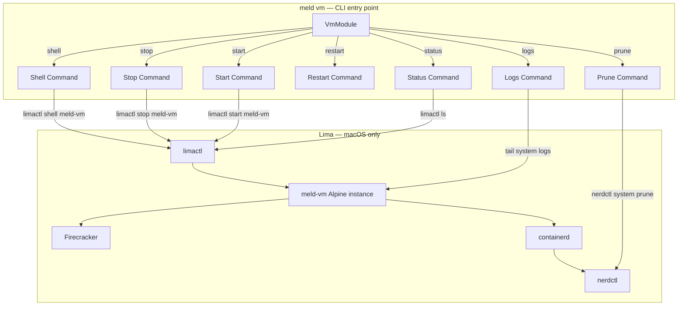

`VmModule` is a thin wrapper around `limactl` and `nerdctl` commands targeting the `meld-vm` Lima instance. On native Linux (where `/dev/kvm` is directly accessible), all subcommands except `status` print an info message and exit — Lima is not needed.

### VmModule Component (`meld-cli/include/meld/cli/vm_module.hpp`)

```cpp
namespace meld::cli {

class VmModule : public BaseCommandHandler {
public:
    // meld vm status | start | stop | restart | shell | prune | logs [--no-follow]
    CommandResult execute(const CommandArgs& args) override;

private:
    CommandResult handle_status();
    CommandResult handle_start();
    CommandResult handle_stop();
    CommandResult handle_restart();
    CommandResult handle_shell();
    CommandResult handle_prune();
    CommandResult handle_logs(const VmLogOptions& opts);

    // Returns true if running on native Linux with /dev/kvm
    bool is_native_linux() const;

    // Run a limactl command and capture output
    CommandOutput run_limactl(const std::vector<std::string>& args);

    // Run a command inside the Lima VM via nerdctl
    CommandOutput run_in_vm(const std::vector<std::string>& args);
};

struct VmLogOptions {
    bool follow = true;  // default: tail mode; --no-follow disables
};

struct VmStatus {
    bool running;
    std::string ram_usage;
    std::string cpu_usage;
    uint32_t active_microvms;
    uint32_t active_containers;
};

} // namespace meld::cli
```

> Cross-reference: The Lima VM instance `meld-vm` is defined in `.kiro/specs/meld-supervisor/requirements.md` Req 1. The daemon's Lima lifecycle management is defined in `.kiro/specs/meld-daemon/requirements.md` Req 14.


### Isolation Backend Override Design (`meld run --isolation`)

The `--isolation=<backend>` flag on `meld run` overrides the `local` key from `meld.toml` `[isolation]` section for a single execution:

- `srt` — process-level sandboxing via MeldSRTProvider (default)
- `finch` — OCI container via containerd/nerdctl with `meldi` as PID 1
- `microvm` — Firecracker MicroVM with Alpine ext4 rootfs and `meldi` as PID 1

When specified, the InterpreterModule delegates execution to `melds` with the selected provider. When not specified, the value is read from `meld.toml`. The flag is composable with `--debug`, `--strict`, `--watch`, `--agent-test`, and `--vfs`.

> Cross-reference: The `[isolation]` configuration block is defined in `.kiro/specs/meld-supervisor/requirements.md` Req 11. The FinchProvider is defined in Req 13. The MicroVMProvider is defined in Req 3.
