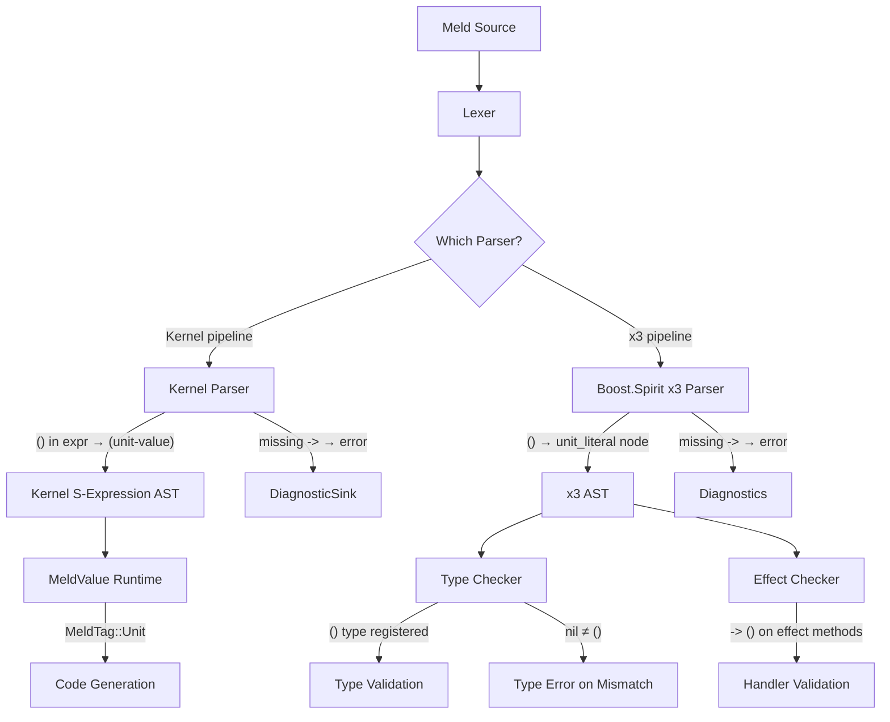
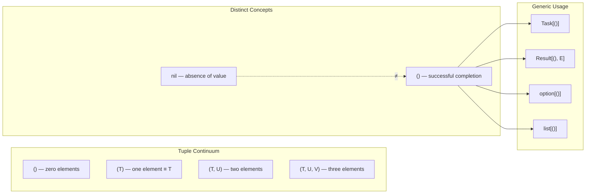

# Meld Language Design (v2.0)

**Based on:** CONSOLIDATED_v2.1.md + Unified Requirements  
**Status:** Active Development  
**Date:** 2024

---

## Executive Summary

Meld is **the first programming language designed explicitly for AI-Augmented Development**. It combines:

- **Minimal homoiconic kernel** (cell, vec, symbol, scope — 20 primitives total)
- **AI-native features** for structural search, semantic compression, and contract-based generation
- **Algebraic effects system** for safe sandboxing of AI-generated code
- **Property-based testing** with forall macro quantification
- **Visual logic** with flow macro for state machines
- **Code provenance tracking** for trust and authorship
- **Flight recorder** for deterministic crash replay
- **Powerful metaprogramming** through compile-time decorators and runtime reflection
- **Polyglot architecture** for JVM, Rust, C++17, and WebAssembly
- **Safety-first design** with no exceptions, null safety, structured concurrency, and shared-nothing guarantees
- **Library-based control flow** with NO keywords (including if/else, match/case, flow — all provided as library macros)

---

## Architecture Overview

### Three-Layer Architecture

```
┌─────────────────────────────────────────────────────────────┐
│                    User-Facing Language                    │
│  Modern Syntax • AI-Native Features • Safety Guarantees    │
├─────────────────────────────────────────────────────────────┤
│                   Meta-Macro System (MMS)                  │
│     type (library) • Hygienic Macros • Language Extension  │
├─────────────────────────────────────────────────────────────┤
│                      Meld Kernel                           │
│    cell • vec • symbol • scope + 16 more primitives       │
└─────────────────────────────────────────────────────────────┘
```

---

## Layer 1: The Meld Kernel

### The "Meld 20" - Complete Kernel Primitives

Meld is built on exactly **20 primitives** organized into 7 categories:

#### 1. Data Structure Primitives (The Matter)

```meld
cell        // A pair (head, tail) - builds AST, linked lists, S-expressions
vec         // Contiguous memory block - backs arrays, strings, buffers
symbol      // Interned unique identifier (e.g., :id) - variable names, keys, AST nodes
scope       // Dictionary binding symbols to values - environments, modules, closures
```

> **Note:** `type` is NOT a kernel primitive. It is a library-level concept built on `meta_set`/`meta_get` primitives, enabling runtime type checking and multiple dispatch.

#### 2. Scalar Primitives (The Values)

```meld
int         // 64-bit signed integer
float       // 64-bit IEEE floating point
bool        // true / false atoms
nil         // The empty unit / null
```

#### 3. Execution Primitives (The Energy)

```meld
lambda      // (env, args, body) -> Function - creates closure, captures current scope
apply       // (func, args...) -> Value - invokes function, pushes frame to call stack
eval        // (ast, scope) -> Value - interpreter core, turns data (cell) into result
quote       // (ast) -> ast - prevents evaluation, essential for macros
```

#### 4. Control Flow Primitives (The Physics)

```meld
primitive_suspend  // Captures current execution context (continuation) and jumps to delimiter
```

**Critical Insight:** This single primitive enables delimited continuations and algebraic effects. With primitive_suspend, we do NOT need `return`, `break`, `yield`, `throw`, or `await` as kernel features. They are all library constructs built on top of primitive_suspend.

**Note:** The library implements `mark_stack`, `suspend`, and `resume` as wrapper functions that use `primitive_suspend` internally.

#### 5. Memory & Binding Primitives (The Context)

```meld
def         // (symbol, val) -> void - defines variable in current scope
set         // (symbol, val) -> void - mutates variable in nearest defining scope
lookup      // (symbol) -> val - traverses scope chain to find value
```

#### 6. AI & Metadata Primitives (The Provenance)

```meld
meta_set    // (obj, key, val) -> obj - attaches hidden metadata without changing value
meta_get    // (obj, key) -> val - retrieves hidden metadata (provenance, docs, types)
```

#### 7. Interop Primitives (The Bridge)

```meld
native_call // (ptr, sig, args) -> val - calls function in host environment (C, JVM, JS)
native_load // (path) -> handle - dynamically loads shared library (.dll, .so)
```

**Key Insight:** All other types (class, struct, type) and ALL control flow (if/else macro, loops, exceptions, async, generators) are **built from these 20 primitives** as library macros and functions, not kernel features. The `type` concept itself is a library feature built on `meta_set`/`meta_get`. `string` is a kernel data type in the Value variant.


### Homoiconic AST

Code is data, enabling powerful metaprogramming:

```meld
// User writes:
val x = 42

// Internal AST:
(val-decl :x (int-literal 42))

// Built from cons cells:
(:val-decl . (:x . ((int-literal . (42 . null)) . null)))
```

This representation enables macros to manipulate code as data structures.

### Kernel Operations

- **Cons operations**: `car`, `cdr`, `cons`
- **Function application**: `apply`
- **Symbol operations**: `gensym`, `symbol-name`
- **Type query**: `typeof` (returns a type instance)
- **Equality**: `eq` (reference), `equal` (structural)

### Unsigned Types and Numeric Wrappers (Library-Based)

To support unsigned values and specific bit-widths without bloating the kernel, Meld uses a dual approach: **Refinement Types** for logical safety (AI-facing) and **Standard Library Wrappers** for machine representation (Transpiler-facing).

#### The Logical Layer (Refinement Types)

For most AI and high-level logic, "unsigned" just means "cannot be negative." We handle this using **Logic Constraints**:

```meld
// Defined in Standard Library
type uint -> int where { it >= 0 }

// Usage
fnc setAge(age: uint) { ... }

// Compiler/AI Check:
setAge(-5) // Error: Logic constraint failed.
```

#### The Machine Layer (Zero-Cost Abstractions)

For systems programming (crypto, binary parsing) where you need specific bit-widths (`u8`, `u32`) and overflow behavior, we use **Struct Wrappers** in the Standard Library:

```meld
// Standard Library (std.core)
// @transpile_as tells the compiler to map this to native types
@transpile_as(c: "uint8_t", go: "uint8", jvm: "byte")
@value
struct u8 {
    bits: int // Kernel stores it as a 64-bit int
}

@transpile_as(c: "uint64_t", go: "uint64")
@value
struct u64 {
    bits: int
}
```

#### Bitwise Semantics (Library Operators)

Since the kernel `int` is signed, right-shifting (`>>`) does an arithmetic shift (preserves sign). To support unsigned logical shifts (`>>>`), we define operators on the wrapper structs:

```meld
// In std.core for u64 ('extend' is a macro, not a keyword)
extend u64 {
    infix operator >>> (shift: int) -> u64 {
        // Calls a native primitive to treat bits as unsigned
        native_call("logical_shift_right", this.bits, shift)
    }
}
```

#### Literal Suffixes (Macros)

We use the macro system to support literals like `255u8`:

```meld
// Macro expands `100u8` -> `u8(100)`
val byte = 255u8
val hash = 0xDEAD_BEEF_u32
```

#### Byte, Short, and Char Types

```meld
// Standard Library (std.core)

// --- Byte (8-bit signed) ---
@transpile_as(java: "byte", c: "int8_t", go: "int8")
@value
struct i8 {
    _val: int 
}

// --- Short (16-bit signed) ---
@transpile_as(java: "short", c: "int16_t", go: "int16")
@value
struct i16 {
    _val: int
}

// --- Char (32-bit Unicode scalar) ---
@transpile_as(java: "int", c: "char32_t", go: "rune")
@value
struct char {
    code_point: int
}

// Logic Constraints (Refinement Type)
type ValidChar -> char where { 
    it.code_point <= 0x10FFFF 
}
```

#### Summary of Implementation

| Feature | Implementation |
|---------|----------------|
| **Kernel Primitive** | None (Uses `int`) |
| **Safety** | **Refinement Types** (`where { it >= 0 }`) |
| **Storage** | **Struct Wrappers** (`struct u8`) |
| **Performance** | **Transpiler** maps `struct u8` directly to C++ `uint8_t` |
| **Behavior** | **Library Methods** define wrap-around overflow and bitwise logic |

This maintains the **20 Primitive** limit while giving Meld full capabilities for low-level systems programming.

---

## Layer 2: Meta-Macro System (MMS)

### type Architecture

```meld
// type is the type of all types (self-referential)
typeOf(type) == type

// All types are instances of type
typeOf(int) == type
typeOf(string) == type
typeOf(MyClass) == type

// Types are first-class values
val t: type = int
val instance = t.create(42)
```

### Macro System

**Critical Rule:** class, struct, enum, trait, and match are **NOT keywords**—they are library macros.

```meld
// class is a macro, not a keyword
macro class(name, body) {
    val fields = extractFields(body)
    val methods = extractMethods(body)
    
    val classType = createClassType(
        name: name,
        fields: fields,
        methods: methods
    )
    
    return `{
        val ${name} = ${classType}
        ${generateConstructor(name, fields)}
        ${generateMethods(methods)}
    }`
}
```

When a user writes `class Person { ... }`, the `class` macro expands it into kernel-level code.


### Hygiene

Macros are hygienic by default:

- Generated symbols are automatically gensym'd to avoid capture
- Explicit `unhygienic` annotation required for intentional capture
- Macro expansion happens in isolated scope

### AST Parent Pointer Architecture

Every AST node in the Meld compiler maintains a `.parent()` pointer — a weak reference to its enclosing parent node. This enables bottom-up traversal, which is essential for field-level macros that need to inject generated code into an enclosing class.

**Why it's needed:** A field-level macro like `@Getter` receives only the `FieldNode`. Since a function cannot be injected *inside* a field, the macro must navigate up the tree to find the enclosing `ClassNode` and inject the generated method there. Without `.parent()`, field-level macros would be impossible.

**Memory safety:** Because Meld uses Automatic Reference Counting (ARC), the `.parent()` pointer is a **weak reference** to prevent reference cycles between parent and child nodes during compilation. If a node is detached from the tree, `.parent()` returns `nil`.

```
AST Node Memory Model:

  ClassNode (strong refs to children)
    ├── FieldNode (.parent() = weak ref → ClassNode)
    ├── FieldNode (.parent() = weak ref → ClassNode)
    └── MethodNode (.parent() = weak ref → ClassNode)
```

**Usage pattern in macros:**

```meld
// Safe parent access with ast.abort fallback
val parent_class = node.parent() ?: ast.abort("@Getter must be applied to a field inside a class")
```

### Macro Authoring APIs: ast.quote and ast.abort

The MMS provides two essential APIs for macro authors:

**`ast.quote { ... }`** — Quasiquoting for generating AST fragments from template code. Instead of manually constructing AST nodes, macro authors write code templates with `${}` interpolation for dynamic values:

```meld
// Instead of manual AST construction:
val getter = ast.quote {
    pub fnc ${node.name}() -> ${node.type} {
        rtn this.${node.name}
    }
}
```

`ast.quote` parses the template at compile time, producing an AST fragment with the interpolated values spliced in. This is type-safe — the compiler validates that interpolated expressions produce valid AST node types.

**`ast.abort(message)`** — Structured error reporting for macro expansion failures. When a macro encounters an invalid context (e.g., a field-level macro applied outside a class), it calls `ast.abort` to produce a clear compiler error:

```meld
// Structured error when macro is misapplied
val parent = node.parent() ?: ast.abort("@Property must be applied to a field inside a class")
```

`ast.abort` halts macro expansion and reports the error through the Compiler-Agent Protocol (CAP), including the source location and a descriptive message. This ensures macro errors are as clear as built-in compiler errors.

**Combined pattern — the @Getter macro:**

```meld
macro Getter(node: FieldNode) {
    val parent_class = node.parent() ?: ast.abort("@Getter must be applied to a field inside a class")
    val getter = ast.quote {
        pub fnc ${node.name}() -> ${node.type} {
            rtn this.${node.name}
        }
    }
    parent_class.add_method(getter)
}
```

This pattern provides zero-cost abstractions with strict type safety and perfect compiler error mapping — unlike Java's Lombok (annotation processing with opaque bytecode manipulation) or Python's runtime decorators (runtime overhead and no compile-time validation).

---

## Layer 3: User-Facing Language

### Variable Declaration Syntax

Meld requires `val` or `var` keyword for all variable declarations:

```meld
// Type inference (val/var always required)
val x = 42                    // Immutable, type inferred as int
var y = 42                    // Mutable, type inferred as int

// Explicit type annotation
val name: string = "Alice"    // Immutable with explicit type
var count: int = 0            // Mutable with explicit type

// Tuples
val point: (int, string) = (10, "hello")
var coordinates: (int, int, int) = (10, 20, 30)

// Destructuring (per-binding qualifiers required)
(val x, val y) = point            // Both immutable
(var a, var b, var c) = coordinates   // All mutable
(val key, var value) = entry      // Mixed: immutable key, mutable value

// Lists (homogeneous)
val numbers: list[int] = [1, 2, 3, 4, 5]
val names: list[string] = ["Alice", "Bob", "Charlie"]

// Maps (key-value pairs)
val ages: map[string, int] = {"Alice": 30, "Bob": 25}
val config: map[string, string] = {"host": "localhost", "port": "8080"}

// Uninitialized (explicit type required)
val result: int               // Immutable, uninitialized
var accumulator: int          // Mutable, uninitialized
```

**Key Rules:**
1. **Always Required:** `val` or `var` keyword is mandatory
2. **Type Inference:** Type annotation optional when value provided
3. **Mutability:** `var` for mutable, `val` for immutable
4. **Consistency:** Uniform syntax across all declarations

### Kebab-Case Identifiers

Meld supports kebab-case (hyphenated) identifiers for improved readability:

```meld
// Variable names with hyphens
val first-name = "Alice"
val last-name = "Smith"
val email-address = "alice@example.com"

// Function names with hyphens
fnc calculate-total(item-price: int, tax-rate: float) -> int {
    val subtotal = item-price
    val tax-amount = subtotal * tax-rate
    val final-total = subtotal + tax-amount
    rtn final-total
}

// Class names with hyphens
class User-Profile {
    var first-name: string
    var last-name: string
    
    fnc get-full-name() -> string {
        rtn `${first-name} ${last-name}`
    }
}

// Context-sensitive parsing
val my-value = 100
val other-value = 50
val result = my-value - other-value  // Subtraction operator
```

**Rules:**
1. Hyphens allowed **within** identifiers
2. Cannot **start** or **end** with hyphen
3. Parser distinguishes subtraction from identifier hyphens by context


### String Syntax (Backticks)

```meld
// Template strings with backticks
val query = `SELECT * FROM users WHERE id = ${userId}`

// Multi-line strings
val html = `
    <div class="user">
        <h1>${user.name}</h1>
        <p>Age: ${user.age}</p>
    </div>
`

// Simple strings with double quotes
val message = "Hello, World!"

// Regex literals
val emailPattern = /^[a-z]+@[a-z]+\.[a-z]+$/i
```

### String Literal Types (4 Variants)

Meld has four string literal types organized along two axes: **static vs evaluated** and **single-line vs multi-line**.

| Syntax | Static/Evaluated | Single/Multi-line | `${...}` behavior |
|--------|-----------------|-------------------|-------------------|
| `"..."` | Static | Single-line | Literal text (warning if `${` detected) |
| `` `...` `` | Evaluated (template) | Single-line | Interpolated via `__interpolate-*__` functions |
| `"""..."""` | Static | Multi-line | Literal text (warning if `${` detected) |
| ` ```...``` ` | Evaluated (template) | Multi-line | Interpolated via `__interpolate-*__` functions |

**Static strings** (`"..."`, `"""..."""`) never evaluate expressions. The `$` character is literal. If the compiler detects `${` inside a static string, it emits a warning: *"'${}' found in static string literal — did you mean to use a template string?"*. The warning can be suppressed by escaping: `"\${name}"`.

**Template strings** (`` `...` ``, ` ```...``` `) evaluate `${expr}` and `${:modifier expr}` interpolations at runtime. These are the only string types that support interpolation modifiers.

**Single-line strings** (`"..."`, `` `...` ``) produce an error on unescaped newlines. **Multi-line strings** (`"""..."""`, ` ```...``` `) preserve newlines as-is.

### Interpolation Modifiers (Library-Extensible Formatting)

Template string interpolation supports an optional **symbol modifier** before the expression. The compiler treats this generically — it does NOT hardcode any modifier names or their meanings. Each modifier maps to a separate, independently-defined function via naming convention. The compiler never interprets the symbol — it just concatenates a function name and emits a call.

#### Syntax

```meld
`${expr}`              // Default: calls __interpolate-default__(expr)
`${:modifier expr}`    // Modified: calls __interpolate-modifier__(expr)
```

The `:modifier` uses Meld's existing symbol literal syntax (`:debug`, `:pretty`, `:hex`, etc.).

#### Compiler Desugaring (Generic — No Hardcoded Knowledge)

The parser recognizes `${:symbol expr}` as a modifier pattern and desugars it into a function call using a naming convention. The compiler never interprets the symbol — it concatenates `__interpolate-` + symbol name + `__` and emits a standard function call:

```meld
// What the user writes:
`User: ${:debug user}`

// What the compiler desugars to:
"User: " + __interpolate-debug__(user)

// Another modifier:
`Value: ${:hex num}`

// Desugars to:
"Value: " + __interpolate-hex__(num)

// Default (no modifier):
`User: ${user}`

// Desugars to:
"User: " + __interpolate-default__(user)
```

The compiler's only responsibilities:
1. Detect the `:symbol` token inside `${}`
2. Concatenate `__interpolate-` + symbol name + `__` to form a function name
3. Emit a standard function call with the expression as the argument
4. Never interpret what the symbol means

If `__interpolate-foo__` isn't in scope, the user gets a standard "undefined function" error — no special error handling needed.

#### Standard Library Formatter Functions (Each Modifier Is Its Own Function)

Each modifier is a standalone function in the standard library. Libraries define their own without touching a central registry:

```meld
// std/format.meld — Default interpolation (no modifier)
fnc __interpolate-default__(value: Any) -> string {
    rtn value.to-string()
}

// std/format.meld — :debug modifier
fnc __interpolate-debug__(value: Any) -> string {
    rtn value.debug()
}

// std/format.meld — :pretty modifier
fnc __interpolate-pretty__(value: Any) -> string {
    rtn value.pretty()
}

// std/json.meld — :json modifier (separate library)
fnc __interpolate-json__(value: Any) -> string {
    rtn value.json()
}

// std/numeric-format.meld — :hex modifier (separate library)
fnc __interpolate-hex__(value: Any) -> string {
    rtn value.hex()
}
```

Each function is independent. No central dispatch, no single function routing all modifiers. Adding a new modifier is just defining a new function with the naming convention.

#### Extensibility Model

There are two independent extension points:

1. **New modifiers** — define a new `__interpolate-<name>__` function:
```meld
// In your library or application code:
fnc __interpolate-xml__(value: Any) -> string {
    rtn value.xml()
}

// Now this works — no compiler changes, no registration:
println(`${:xml user}`)
```

2. **New types** — add methods that existing modifiers call:
```meld
// Your type supports :debug because it has a .debug() method
extend User {
    fnc debug() -> string {
        rtn `User { name: ${:debug self.name}, age: ${:debug self.age} }`
    }

    fnc xml() -> string {
        rtn `<user><name>${self.name}</name><age>${self.age}</age></user>`
    }
}
```

These two axes are fully independent. A modifier function like `__interpolate-debug__` calls `value.debug()`. A type provides `.debug()`. Neither knows about the other at definition time — they compose through normal method dispatch.

#### Built-In Formatters (Standard Library)

These are provided by decorator macros and standard library functions:

| Modifier | `__interpolate-*__` defined in | Calls method | Output |
|----------|-------------------------------|-------------|--------|
| *(none)* | `std/format.meld` | `.to-string()` | User-facing string (`"Alice (30)"`) |
| `:debug` | `std/format.meld` | `.debug()` | Structural repr (`"User { name: \"Alice\", age: 30 }"`) |
| `:pretty` | `std/format.meld` | `.pretty()` | Pretty-printed, indented multi-line output |
| `:json` | `std/json.meld` | `.json()` | JSON representation |
| `:hex` | `std/numeric-format.meld` | `.hex()` | Hexadecimal (`"0xFF"`) |

#### @debug and @stringify Decorators

Instead of `@derive(Debug)`, Meld uses standalone decorator macros — each is its own independent macro, consistent with Meld's existing decorator pattern (`@Getter`, `@Setter`, `@Builder`, etc.).

**`@debug`** generates `.debug()` and `.pretty()` methods on the type:

```meld
@debug
struct User {
    val name: string
    val age: int
}

// The @debug macro generates:
extend User {
    fnc debug() -> string {
        rtn `User { name: ${:debug self.name}, age: ${:debug self.age} }`
    }

    fnc pretty() -> string {
        rtn pretty-print(self, indent: 0)
    }
}
```

**`@stringify`** generates a `.to-string()` method:

```meld
@stringify
struct User {
    val name: string
    val age: int
}

// The @stringify macro generates:
extend User {
    fnc to-string() -> string {
        rtn `${self.name} (${self.age})`
    }
}
```

Note how `@debug`'s generated `debug()` recursively uses `${:debug ...}` for nested fields — this ensures deep structural output, just like Rust's `{:?}`. The recursion bottoms out at primitive types (`string`, `int`, `bool`) which have `.debug()` methods defined in `std/format.meld`.

#### Comparison with Rust

| Aspect | Rust | Meld |
|--------|------|------|
| Syntax | `{:?}` / `{:#?}` in format strings | `${:debug expr}` / `${:pretty expr}` in template strings |
| Compiler knowledge | Compiler knows `Debug` and `Display` traits | Compiler knows nothing — just concatenates a function name |
| Extensibility | Requires implementing `fmt::Formatter` trait | Define a function (`__interpolate-name__`) + a method (`.name()`) |
| Dispatch | Trait-based, single central `fmt` module | Scope-based function resolution, each modifier is independent |
| New formatters | New trait + `fmt::Formatter` impl | Just define `__interpolate-foo__` and `.foo()` method |

#### Design Rationale

1. **Compiler ignorance**: The compiler never learns what `:debug` means. It desugars `${:sym expr}` → `__interpolate-sym__(expr)` via string concatenation and moves on. This follows Meld's "minimal kernel" philosophy.
2. **No central dispatch**: Each modifier is its own function. No single routing function, no registry, no match/case on symbols. Libraries define their formatters independently.
3. **Scope-based resolution**: Modifier availability is determined by what's in scope. `imp std.json` brings `__interpolate-json__` into scope. If you don't import it, `${:json x}` gives "undefined function" — clear and expected.
4. **Symbol reuse**: The `:modifier` syntax reuses Meld's existing symbol literals (`:info`, `:trace`, `:debug`), requiring zero new syntax.
5. **Two-axis extensibility**: New modifiers (functions) and new types (methods) are independent. They compose through standard method dispatch without knowing about each other.
6. **Consistent with macros**: Same naming-convention pattern used by other Meld macros — the compiler generates a predictable name, the library provides the implementation.

---

## Algebraic Effects: The Unified Engine

### Architecture: Library-First with Single Kernel Primitive

Meld v2.2 takes a radical approach to control flow: **everything is an effect**. By implementing a single kernel primitive (`primitive_suspend`), Meld eliminates the need for separate compiler support for:

- Exceptions (try/catch/throw)
- Async/await
- Generators (yield)
- Coroutines
- Dependency injection
- Backtracking search
- Transactions

All of these are implemented as **standard library code** using the effect system.

### The Problem: The Rigid Call Stack

In standard languages, the call stack is rigid:
- **Function Call:** Pushes a frame
- **Return:** Pops a frame
- **Exception:** Pops frames until caught (unwinding)

**Algebraic Effects** require something different:
- **Perform:** *Pauses* the stack (capturing the "Continuation")
- **Handle:** Decides what to do
- **Resume:** Re-attaches the paused stack and continues

You cannot implement "Stack Pausing" and "Resuming" in a pure library. It requires **Runtime Support** (specifically, **Delimited Continuations**).

### The Meld Solution: Minimal Kernel + Library Implementation

Meld puts the "Stack Magic" in the kernel as a single primitive, and the "Syntax" in the library.

**The Kernel Primitive:**
```meld
// KERNEL LEVEL (Internal)
// This is the ONLY control flow primitive in the kernel
// It captures the current execution context (continuation) and jumps to a delimiter
// This single primitive enables: exceptions, async/await, generators, effects
primitive_suspend(callback: (k: Continuation) -> void)
```

**Note:** The kernel provides `primitive_suspend` as the foundation. The library implements `mark_stack`, `suspend`, and `resume` as wrapper functions that use `primitive_suspend` internally.

**The Library Implementation:**
```meld
// STANDARD LIBRARY (Meld Code)
// 'perform' is just a generic function that calls the kernel primitive
fnc perform[T](eff: Effect[T]) -> T {
    val handler = getNearestHandler(eff.type)
    rtn primitive_suspend { continuation =>
        handler.handle(eff, continuation)
    }
}

// 'handle' is a block-macro that sets up the dynamic scope delimiter
// Uses mark_stack/primitive_suspend directly (NOT try/finally, which is built ON handle)
macro handle(body, handlers) {
    mark_stack(:effect_handler, handlers)
    val result = body()
    popScope()
    result
}
```

### What About Static Analysis?

The effect system provides two levels of support:

1. **Runtime Execution:** The code runs fine without the compiler knowing about effects, provided the runtime supports `primitive_suspend`.

2. **Static Safety (Inference):** The compiler analyzes the AST to automatically insert `@uses(...)` annotations and warn when handlers are missing.

This is implemented as a **Type Checker Plugin**, not part of the core grammar. The parser just sees standard function calls (`perform(...)`), and the type checker calculates effect propagation.

### Summary: How Meld Pulls It Off

| Feature | Where it lives in Meld |
|---------|------------------------|
| **Stack Pausing** | **Kernel Runtime** (Delimited Continuations via `primitive_suspend`) |
| **Syntax (`handle`)** | **Library Macro** (Expands to standard try/scope blocks) |
| **Action (`perform`)** | **Library Function** (Calls kernel primitive) |
| **Safety (`@uses`)** | **Compiler Plugin** (Inference analysis, separate from parsing) |

This allows Meld to claim it has **"No Keywords"** for effects. To the parser, `perform` looks just like `System.out.println`—it's just a function call. The magic happens in the runtime (for execution) and the analyzer (for safety).

---

## AI-Native Features

### 1. Abstract Syntax Graph (ASG)

The ASG extends the traditional AST by representing code as a graph where edges explicitly capture relationships:

```meld
// Load code into semantic graph
val graph = SemanticGraph.parse(sourceFile)

// Find all usages of a symbol
val usages = graph.findUsage(:userId)
// Returns: [
//   Edge(type: READ, location: line 15, context: "val name = userId"),
//   Edge(type: WRITE, location: line 23, context: "userId = newId"),
//   Edge(type: CALL, location: line 42, context: "fetchUser(userId)")
// ]

// Trace data flow for a variable
val flow = graph.dataFlow(:result)
// Returns: DataFlowPath showing:
//   result <- computation(x, y)
//   x <- input.value
//   y <- config.threshold

// Analyze control flow
val successors = graph.controlFlow(node)
// Returns: [ifTrueBlock, ifFalseBlock]

// Find all variables in scope at a location
val scope = graph.scopeAt(line: 42, column: 10)
```

**Graph Structure:**

```
┌─────────────────────────────────────────────────────────┐
│                    Semantic Graph                       │
├─────────────────────────────────────────────────────────┤
│  Nodes: Functions, Variables, Types, Expressions       │
│  Edges:                                                 │
│    • Data Flow: def → use                              │
│    • Control Flow: statement → successor               │
│    • Scoping: declaration → scope                      │
│    • Type Relations: value → type                      │
│    • Call Graph: caller → callee                       │
└─────────────────────────────────────────────────────────┘
```

**Why This Matters for AI:**
- Eliminates text-based variable tracing
- Explicit relationships prevent hallucinations
- Enables precise refactoring and analysis
- Supports whole-program reasoning
- ASG is first-class Meld data (cells, symbols, scopes) — queryable and transformable using standard Meld operations

### 2. Structural Search API (Enhanced with ASG)

```meld
// Parse code into searchable AST
val code = Code.parse(sourceFile)

// Define search patterns with variable capture
val pattern = ast`oldFunc($a, $b)`

// Find all matches
code.findAll(pattern).forEach { match =>
    val newCall = ast`newFunc(${match.a}, ${match.b}, defaultValue)`
    match.replace(newCall)
}

// Semantic search beyond syntax
val functions = code.findByIntent("calculates distance")

// NEW: Graph-based queries
val graph = code.toSemanticGraph()
val allReads = graph.findEdges(type: DataFlow.READ, symbol: :userId)
```

**Why This Matters for AI:**
- Prevents regex hallucinations
- Enables precise AST-based refactoring
- Supports semantic queries beyond syntax
- Graph queries provide deeper insights

### 3. Explicit Effect Tracking

Functions explicitly declare what side effects they perform:

```meld
// Pure function (default)
fnc add(a: int, b: int) -> int {
    rtn a + b
}

// Function with IO effects
fnc readConfig(path: string) -> Config
    effects { EffectIO }
{
    val file = File.read(path)  // OK: EffectIO declared
    rtn parseConfig(file)
}

// Function with multiple effects
fnc fetchAndSave(url: string, path: string) -> Result[Unit, Error]
    effects { EffectNetwork, EffectIO }
{
    val data = http.get(url)     // OK: EffectNetwork declared
    File.write(path, data)       // OK: EffectIO declared
    rtn Success(Unit)
}

// Compiler error: undeclared effect
fnc parseData(input: string) -> Data {
    log.info("Parsing...")  // ERROR: EffectIO not declared
    rtn parse(input)
}

// Effect polymorphism
fnc transform[T, E: Effect](data: T, f: (T) -> T effects { E }) -> T
    effects { E }
{
    rtn f(data)
}

// Custom effects
effect EffectDatabase {
    fnc query(sql: string) -> ResultSet
    fnc execute(sql: string) -> int
}

fnc getUserById(id: int) -> User
    effects { EffectDatabase }
{
    val result = query(`SELECT * FROM users WHERE id = ${id}`)
    rtn parseUser(result)
}
```

**Built-in Effect Types:**
- `EffectPure`: No side effects (default)
- `EffectIO`: File system, console I/O
- `EffectNetwork`: Network operations
- `EffectState`: Mutable state access
- `EffectTime`: Time-dependent operations (clock, random)

**Why This Matters for AI:**
- Prevents hallucinated database calls in parsers
- Enables "write a pure function" prompts
- Compiler enforces safety constraints
- Makes side effects explicit and trackable

### 4. Binary Context Format (MELD-B)

Compact binary format for efficient AI context loading:

```meld
// Compile to binary context
// $ meld build --target=mldb myproject.meld
// Generates: myproject.mldb

// Load binary context in AI agent
val context = MeldBinary.load("myproject.mldb")

// Query the binary context
val allFunctions = context.query(type: Function)
val publicAPI = context.query(visibility: Public)
val ioFunctions = context.query(effects: EffectIO)

// Access pre-computed indices
val symbol = context.symbols.lookup("calculateTotal")
val usages = context.crossRefs.findUsages(symbol)
val typeInfo = context.types.lookup("User")

// Graph queries on binary format
val graph = context.toSemanticGraph()
val dataFlow = graph.dataFlow(:userId)
```

**MELD-B Format Structure:**

```
┌─────────────────────────────────────────────────────────┐
│                    MELD-B File (.mldb)                  │
├─────────────────────────────────────────────────────────┤
│  Header:                                                │
│    • Magic number: MLDB                                 │
│    • Version: 1.0                                       │
│    • Compression: zstd                                  │
├─────────────────────────────────────────────────────────┤
│  Indices:                                               │
│    • Symbol table (name → node ID)                     │
│    • Type table (type → definition)                    │
│    • Cross-reference table (symbol → usages)           │
│    • Effect table (function → effects)                 │
├─────────────────────────────────────────────────────────┤
│  ASG Data:                                              │
│    • Nodes (serialized)                                │
│    • Edges (serialized)                                │
│    • Metadata (locations, docs)                        │
└─────────────────────────────────────────────────────────┘
```

**Why This Matters for AI:**
- 10x+ size reduction vs source text
- Instant loading (no parsing)
- Pre-computed indices for fast queries
- Standard format for Compiler-Agent Protocol

### 5. Algebraic Effects System (Library-First with Kernel Primitive)

Meld provides a full algebraic effect system built on a single kernel primitive (`primitive_suspend`), enabling powerful sandboxing patterns for AI-generated code. The entire effects system is implemented as library code, not language keywords.

**Philosophy: "Minimal Kernel, Library-First Implementation"**

Meld's effect system follows a library-first approach:
- **Single Kernel Primitive**: Only `primitive_suspend` (delimited continuations) in the kernel
- **No Keywords**: `effect`, `perform`, `handle`, `resume` are library constructs, not keywords
- **Zero-Toil**: Developers never manually type effect annotations
- **Compiler-Driven**: Effects are automatically inferred and annotated
- **IDE-Assisted**: Ghost text shows inferred effects before they're written
- **Unified Control Flow**: Exceptions, async/await, generators all built on the same primitive

#### The Kernel Primitive

The Meld Kernel provides exactly one primitive for the effects system:

```meld
// KERNEL LEVEL (Internal - not for direct user access)
// Captures the current execution context (continuation) and jumps to a delimiter
primitive_suspend(callback: (k: Continuation) -> void)
```

This single primitive enables the entire effects system without requiring the compiler to understand effects, exceptions, async/await, or any other control flow mechanism.

**Important:** The kernel provides ONLY `primitive_suspend`. The standard library implements `mark_stack`, `suspend`, and `resume` as wrapper functions:

```meld
// STANDARD LIBRARY IMPLEMENTATION
fnc mark_stack(id: EffectId, handler: Handler) {
    // Uses primitive_suspend internally to set up delimiter
    primitive_suspend { k =>
        pushHandlerStack(id, handler, k)
    }
}

fnc suspend(id: EffectId, callback: (Continuation) -> void) {
    // Uses primitive_suspend to capture and pass continuation
    primitive_suspend { k =>
        callback(k)
    }
}

fnc resume(continuation: Continuation, value: Value) -> Value {
    // Uses primitive_suspend to restore execution context
    primitive_suspend { _ =>
        restoreContinuation(continuation, value)
    }
}
```

#### Defining Effects (Library Macro)

Effects are defined using the `effect` macro from the standard library:

```meld
// Define an effect (abstract operations)
// 'effect' is a MACRO, not a keyword
effect FileSystem {
    fnc write(path: string, data: string)
    fnc read(path: string) -> string
}

effect Network {
    fnc get(url: string) -> string
    fnc post(url: string, body: string) -> string
}

effect Time {
    fnc now() -> int
    fnc sleep(ms: int)
}
```

**Note:** The `effect` macro generates the dispatch logic and integrates with the runtime's handler stack.

#### Performing Effects (Library Function)

The `perform` function is implemented in the standard library, not as a keyword:

```meld
// STANDARD LIBRARY IMPLEMENTATION
// 'perform' is a FUNCTION, not a keyword
fnc perform[T](eff: Effect[T]) -> T {
    // 1. Find the nearest handler in the dynamic scope
    val handler = getNearestHandler(eff.type)
    
    // 2. Suspend execution using the kernel primitive
    rtn primitive_suspend { continuation =>
        handler.handle(eff, continuation)
    }
}
```

Code performs effects without declaring them manually:

```meld
// What you type (no effect annotations):
fnc saveUser(u: User) {
    val json = u.toJson()
    perform FileSystem.write(`/users/${u.id}.json`, json)
}

fnc fetchAndStore(url: string, path: string) {
    val data = perform Network.get(url)
    perform FileSystem.write(path, data)
}
```

To the parser, `perform` looks like any other function call. The magic happens in the runtime.

#### Ghost Annotations (What You See in IDE)

As you type, the IDE displays inferred effects as ghost text (inlay hints):

```meld
// What you see in the IDE (ghost text in grey):
@uses(FileSystem)  // <--- Ghost text inserted by IDE
fnc saveUser(u: User) {
    val json = u.toJson()
    perform FileSystem.write(`/users/${u.id}.json`, json)
}

@uses(Network, FileSystem)  // <--- Ghost text inserted by IDE
fnc fetchAndStore(url: string, path: string) {
    val data = perform Network.get(url)
    perform FileSystem.write(path, data)
}
```

#### Physical Persistence (After Save/Format)

When you save the file or run `meld fmt`, the compiler physically writes the annotations:

```meld
// What gets written to disk after save:
@uses(FileSystem)
fnc saveUser(u: User) {
    val json = u.toJson()
    perform FileSystem.write(`/users/${u.id}.json`, json)
}

@uses(Network, FileSystem)
fnc fetchAndStore(url: string, path: string) {
    val data = perform Network.get(url)
    perform FileSystem.write(path, data)
}
```

**Benefits:**
1. **Code Reviewers** see the side effects in Pull Requests
2. **AI Agents** reading the file see exact capabilities required
3. **Automatic Updates**: If you change the code, the annotation updates on next save

#### Locking Contracts (Manual Override)

To enforce constraints, manually write the annotation. The compiler treats it as a contract:

```meld
// Manually locked annotation (constraint mode):
@uses(Log)
fnc processData(data: string) {
    perform Log.info("Processing...")
    // If you try to add: perform Network.get(...)
    // Compiler error: Function performs Network, but annotation locked to @uses(Log)
}

// Pure function constraint:
@uses()  // Empty set = Pure
fnc calculate(x: int, y: int) -> int {
    rtn x + y
    // If you try to add: perform FileSystem.write(...)
    // Compiler error: Function performs FileSystem, but annotation locked to @uses() (Pure)
}
```

**Key Points:**
- **Auto-Mode**: Compiler manages annotations that match inference
- **Constraint Mode**: Manual annotations act as strict contracts
- **Effect Propagation**: Effects automatically propagate through call graph
- **Zero Toil**: Developers focus on logic, compiler handles effect tracking

#### Handling Effects (Library Macro)

The `handle` construct is a library macro that uses regular function-call syntax. The first argument is a computation closure, and subsequent arguments are anonymous inline implementations of effect traits — using the same `TypeName { fnc ... }` syntax used for inline trait implementations elsewhere in Meld:

```meld
// Unified handle syntax — regular function call with inline effect implementations
handle(
    { computation },
    EffectName {
        fnc operation(args) { handler_body; resume(value) }
    },
    AnotherEffect {
        fnc op1() { resume() }
        fnc op2(x) { resume(x + 1) }
    }
)
```

The `EffectName { fnc ... }` arguments are anonymous inline implementations of the effect trait. This is the same pattern used for inline trait implementations in other contexts:

```meld
// Inline trait implementation — general-purpose syntax
val sorter = Comparable {
    fnc compare(a, b) { a.age - b.age }
}

// Same syntax in handle — inline effect trait implementation
handle(
    { doWork() },
    FileSystem {
        fnc read(path) { resume("{}") }
        fnc write(path, content) { resume() }
    }
)
```

**Macro implementation:**

```meld
// STANDARD LIBRARY IMPLEMENTATION
// 'handle' is a MACRO, not a keyword
// Uses mark_stack/primitive_suspend directly — NOT try/finally (which is built ON handle)
macro handle(body, ...handlers) {
    // Expands to kernel-level scope management:
    // One EffectScope per handler, all installed before body runs
    handlers.forEach { h -> mark_stack(:effect_handler, h) }
    val result = body() // Run the code
    handlers.forEach { _ -> popScope() }
    result
}
```

This is where Meld shines for AI safety. You can wrap AI-generated code in a `handle` call to intercept its actions:

```meld
// AI SAFETY PATTERN:
// The Agent's code thinks it's writing to disk, but we capture it.
handle(
    { agentCode.saveUser(user) },
    FileSystem {
        fnc read(path) { 
            rtn resume("{}")  // Mock empty file
        }
        fnc write(path, content) {
            log(`[Simulation] Would have written to ${path}`)
            log(`[Content] ${content}`)
            resume()  // Continue execution
        }
    }
)

// Real implementation for production
handle(
    { saveUser(user) },
    FileSystem {
        fnc read(path) {
            val result = OS.readFile(path)
            resume(result)
        }
        fnc write(path, content) {
            OS.writeFile(path, content)
            resume()
        }
    }
)

// Multiple effects handled in a single call
handle(
    { processTimestampedData() },
    Time {
        fnc now() {
            resume(1234567890)  // Fixed timestamp
        }
        fnc sleep(ms) {
            resume()  // No-op in tests
        }
    },
    FileSystem {
        fnc read(path) { resume("mock data") }
    }
)
```

**Return Value Semantics:** The computation closure is typed `() -> T`, and `handle(...)` returns `T`. When the computation returns a value, the caller binds it with `val`; when it returns unit, the caller simply discards the result. No separate `handleVoid` variant exists.

```meld
// Value-returning computation — bind with val
val content = handle(
    { file_system.read("/config.txt") },
    file_system {
        fnc read(path) { resume("mock data") }
    }
)

// Unit-returning computation — no binding needed
handle(
    { file_system.write("/log.txt", "entry") },
    file_system {
        fnc write(path, content) { resume() }
    }
)
```

**Handler Semantics:**
- `handle({ ... }, EffectName { ... })` intercepts effect operations
- `resume()` continues execution after handling the effect
- `resume(value)` continues with a specific rtn value
- Handlers can inspect parameters, log, modify behavior, or prevent execution
- Multiple handlers are comma-separated in a single `handle()` call (inner handlers take precedence when nested)

**Key Insight:** To the parser, `handle` is just a macro. The runtime manages the handler stack and continuation capture.

##### Handle-as-Function: AST and Parser Design

The unified syntax treats `handle` as a regular function call where the first argument is a computation closure and subsequent arguments are labeled handler closures. This eliminates special grammar rules from the parser.

**Labeled Closure AST Node:**

```cpp
// New: labeled closure for handler arguments
struct labeled_closure : ASTNode {
    identifier label;                    // effect name, e.g., "file_system"
    std::vector<handler_function> body;  // handler function definitions
};
```

**Updated handle_expression AST Node:**

```cpp
// Supports multiple effect handlers
struct handle_expression : ASTNode {
    x3::forward_ast<block_expression> body;       // computation closure
    std::vector<labeled_closure> handlers;          // one or more effect handlers
};
```

**Parser Changes:**
- When parsing function call arguments and the parser sees `identifier { ... }`, it checks whether the block contains `fnc` definitions. If so, it produces a `labeled_closure` node.
- After parsing a function call where the function name is `handle`, the parser validates: first argument is a block expression (computation closure), remaining arguments are labeled closures (handler definitions), and converts the parsed structure into a `handle_expression` AST node.
- Legacy syntax detection: before attempting the unified parse, the parser checks for `handle(computation: { ... })`, `handle { ... } with`, and bare `handle { ... }` — each emits an error diagnostic with a fix suggestion.

**Legacy Syntax Diagnostics:**

| Condition | Severity | Message |
|-----------|----------|---------|
| `handle(computation: { ... })` detected | error | "legacy named-parameter handle syntax is no longer supported; use `handle({ ... }, effect { ... })`" |
| `handle { ... } with effect { ... }` detected | error | "legacy `with`-keyword handle syntax is no longer supported; use `handle({ ... }, effect { ... })`" |
| `handle { ... }` with no handlers | error | "handle requires at least one handler argument; use `handle({ ... }, effect { ... })`" |
| Handler closure with empty body | error | "handler closure for 'effect_name' must contain at least one `fnc` interceptor" |
| Duplicate effect name in handler list | error | "duplicate handler for effect 'effect_name'; each effect may only be handled once per `handle` call" |

**Kernel S-Expression Expansion:**

```lisp
;; handle({ body }, eff1 { h1 }, eff2 { h2 })
;; expands to:
(block
  (val handler1 (create_effect_handler "eff1"))
  (call handler1 set_handler "op1" (lambda (args cont) ...))
  (val handler2 (create_effect_handler "eff2"))
  (call handler2 set_handler "op2" (lambda (args cont) ...))
  (try
    (val scope1 (EffectScope "eff1" handler1))
    (val scope2 (EffectScope "eff2" handler2))
    (val result body)
    result
  (finally Unit)))
```

**Correctness Properties:**

1. **Unified syntax parsing** — For any valid computation block and any non-empty list of (effect_name, handler_functions) pairs, `handle({ computation }, eff1 { handlers1 }, ..., effN { handlersN })` shall parse into a handle_expression AST node with correct body and N handlers.
2. **Handler operation syntax equivalence** — Defining a function inside a handler closure with `fnc` syntax shall produce the same handler_function AST node as the same `fnc` grammar rule used at top level.
3. **Handle as expression in any position** — A valid handle expression shall be accepted in val-binding RHS, function argument, or block tail positions.
4. **Legacy syntax rejection** — Wrapping valid bodies/handlers in old syntax forms shall cause the parser to emit an error diagnostic and reject the input.
5. **Parse–print–parse round trip** — Parsing a handle expression, pretty-printing it, and re-parsing shall produce an equivalent AST.
6. **Computation return value preservation** — For any computation closure that produces a value and handlers that resume normally, the handle expression shall evaluate to the computation's return value.

#### Built-in Effects

```meld
effect FileSystem {
    fnc read(path: string) -> string
    fnc write(path: string, content: string)
    fnc delete(path: string)
    fnc exists(path: string) -> bool
}

effect Network {
    fnc get(url: string) -> string
    fnc post(url: string, body: string) -> string
}

effect Console {
    fnc print(message: string)
    fnc println(message: string)
    fnc readLine() -> string
}

effect Random {
    fnc nextInt(max: int) -> int
    fnc nextFloat() -> float
}

effect Time {
    fnc now() -> int
    fnc sleep(ms: int)
}

effect Exception {
    fnc raise(msg: string) -> Nothing
}

effect Async {
    fnc wait(seconds: int)
}

effect Generator[T] {
    fnc yield(val: T)
}
```

#### Unified Control Flow: Everything is an Effect

By implementing `primitive_suspend` in the kernel, Meld eliminates the need for separate compiler support for exceptions, async/await, generators, and coroutines. All of these become **standard library macros** built on the effect system.

**1. Exceptions (Stack Unwinding)**

An exception is an effect that **never resumes**:

```meld
// STANDARD LIBRARY IMPLEMENTATION
effect Exception {
    fnc raise[E](error: E) -> Nothing
}

// 'throw' is a library function (generic — accepts any error type)
fnc throw[E](error: E) {
    perform Exception.raise(error)
}

// 'try/catch' is a library macro
macro try(body, catchBlock) {
    handle(
        { body() },
        Exception {
            fnc raise(msg) {
                // CRITICAL: We do NOT call resume()
                // This discards the continuation, unwinding the stack
                catchBlock(msg)
            }
        }
    )
}

// Usage
try {
    throw("Crash!")
    System.out.println("This never runs")
} catch(err) {
    System.out.println(`Caught: ${err}`)
}
```

**2. Async/Await (Coroutines)**

Async operations are effects where the handler **resumes later**:

```meld
// STANDARD LIBRARY IMPLEMENTATION
effect Async {
    fnc wait(seconds: int)
}

// The Scheduler (The Handler)
fnc runEventLoop(program) {
    val queue = PriorityQueue()
    
    handle(
        { program() },
        Async {
            fnc wait(seconds) {
                // CRITICAL: Capture continuation but don't call it yet
                // Store it to be run later
                queue.add(time + seconds, k)
            }
        }
    )
    
    // Simple Event Loop (using Block.whileTrue: — no while keyword)
    { queue.isNotEmpty }.whileTrue {
        (val readyTime, val task) = queue.pop()
        sleepUntil(readyTime)
        task.resume() // Resume the coroutine later
    }
}

// Usage
runEventLoop {
    System.out.println("Start")
    perform Async.wait(2) // Pauses stack, yields to loop
    System.out.println("End (2s later)")
}
```

**3. Generators (Yield)**

Generators are effects where the handler **resumes multiple times**:

```meld
// STANDARD LIBRARY IMPLEMENTATION
effect Generator[T] {
    fnc yield(val: T)
}

fnc generateNumbers() {
    System.out.println("Start")
    perform Generator.yield(1)
    System.out.println("Middle")
    perform Generator.yield(2)
    System.out.println("End")
}

// The Iterator (Handler)
handle(
    { generateNumbers() },
    Generator {
        fnc yield(val) {
            System.out.println(`Received ${val}`)
            resume() // Jump back into the function to get the next one
        }
    }
)
```

**The Unified Architecture**

| Concept | Implementation in Meld | Behavior of Handler |
|---------|------------------------|---------------------|
| **Exception** | `perform Exception.raise` | **Discard** continuation (Unwind) |
| **Async** | `perform Async.wait` | **Store** continuation, resume later (Task Switching) |
| **Generator** | `perform Generator.yield` | **Call** continuation immediately (Lazy Iteration) |
| **Dependency** | `perform GetDB` | **Call** continuation with value (Injection) |
| **Ambiguity** | `perform Choice` | **Clone** continuation (Backtracking Search) |

**Why This Matters for AI:**
- **Safety (Sandboxing)**: Ask an Agent to "clean up the temporary folder." Run it with a DryRunFileSystem handler to see exactly what it would delete without risking data.
- **Determinism**: Handle the Time effect to freeze time, ensuring tests that rely on dates are perfectly reproducible.
- **Testing**: Replace real effects with mocks without dependency injection frameworks.
- **Correctness**: Intercept and validate all side effects before they happen.
- **Unified Model**: One primitive powers all control flow, drastically simplifying the compiler and runtime.

#### System.out Namespace for Console Output

Meld provides a standard `System.out` namespace for console output operations that integrates seamlessly with the algebraic effects system:

```meld
// System.out namespace provides standard console output
// Compiler automatically infers and annotates with @uses(Console)
namespace System.out {
    // Print with newline
    @uses(Console)  // Auto-inferred and written by compiler
    fnc println(message: string) {
        perform Console.println(message)
    }
    
    // Print without newline
    @uses(Console)  // Auto-inferred and written by compiler
    fnc print(message: string) {
        perform Console.print(message)
    }
}

// Usage in code (what you type):
fnc greet(name: string) {
    System.out.println(`Hello, ${name}!`)
    System.out.print("Welcome to Meld")
}

// After save, compiler writes:
@uses(Console)  // Auto-inferred from System.out calls
fnc greet(name: string) {
    System.out.println(`Hello, ${name}!`)
    System.out.print("Welcome to Meld")
}

// Sandboxing console output for testing
val output = MutableList.of[string]()

handle(
    { greet("Alice") },
    Console {
        fnc println(message) {
            output.add(message + "\n")
            resume()
        }
        fnc print(message) {
            output.add(message)
            resume()
        }
        fnc readLine() {
            resume("mocked input")
        }
    }
)

// output now contains: ["Hello, Alice!\n", "Welcome to Meld"]

// AI Safety: Intercept all console output from AI-generated code
handle(
    { aiGeneratedFunction() },
    Console {
        fnc println(message) {
            log(`[AI Output] ${message}`)
            // Optionally prevent actual output
            resume()
        }
        fnc print(message) {
            log(`[AI Output] ${message}`)
            resume()
        }
        fnc readLine() {
            // Prevent AI from reading user input
            throw Error("AI code cannot read user input")
        }
    }
)
```

**Design Rationale:**

1. **Namespace Organization**: `System.out` provides a familiar, discoverable API for console output
2. **Effect Integration**: All output functions have effects automatically inferred via `@uses` annotation
3. **AI Safety**: Output can be intercepted, logged, or blocked using effect handlers
4. **Testing**: Easy to capture and verify output in tests without mocking frameworks
5. **Consistency**: Aligns with the annotation-based effect approach used throughout Meld
6. **Zero Toil**: Developers never manually type effect annotations

**Why This Matters for AI:**
- **Sandboxing**: AI-generated code that prints to console can be intercepted and logged
- **Testing**: Capture output for verification without complex test infrastructure
- **Safety**: Prevent AI code from performing unwanted console I/O
- **Discoverability**: Standard namespace makes it easy for AI to generate correct output code
- **Hallucination Check**: If AI claims a function is pure but compiler infers `@uses(Console)`, the mismatch is immediately visible

#### AI-First Benefits of Annotation-Based Effects

The automatic annotation system is a **superpower for AI agents**:

**1. Hallucination Detection:**
If an AI agent writes a function claiming to be a "Pure Math Calculation" but the compiler auto-inserts `@uses(Network)`, the human developer immediately sees the red flag.

**2. Self-Correction via Compiler-Agent Protocol (CAP):**
```
Agent: "I wrote the function."
Compiler: "You claimed this implements interface Calculator (which is Pure), 
           but I inferred @uses(FileSystem). This is invalid. 
           Please remove the file access."
Agent: "Oops, removing debug print statement."
```

**3. Code Review Transparency:**
Pull requests show exactly what side effects each function performs, making AI-generated code easier to review and trust.

**4. Zero Configuration:**
AI agents don't need to learn complex effect declaration syntax—they just write code, and the compiler handles effect tracking.

**5. Automatic Documentation:**
The `@uses` annotations serve as machine-readable documentation that both humans and AI tools can understand.

**Example Workflow:**

```meld
// 1. AI writes code (no annotations):
fnc processData(input: string) {
    val parsed = parse(input)
    perform FileSystem.write("output.txt", parsed)
    perform Log.info("Processing complete")
}

// 2. IDE shows ghost text immediately:
@uses(FileSystem, Log)  // <--- Grey ghost text
fnc processData(input: string) {
    ...
}

// 3. On save, compiler writes annotation:
@uses(FileSystem, Log)
fnc processData(input: string) {
    ...
}

// 4. Human reviews PR and sees effects clearly
// 5. If AI later removes logging, annotation auto-updates to @uses(FileSystem)
```

### 6. Property-Based Testing with forall Macro

Meld includes property-based testing (fuzzing) implemented as a library macro, consistent with the library-first principle. The `forall` macro forces AI agents to think about correctness properties rather than just examples.

#### The forall Macro

Inside a `test` block, the `forall` macro (from the standard library testing module) lets you assert properties that must hold for any valid input. The macro expands into generator setup, iteration, shrinking, and assertion reporting:

```meld
fnc reverse(s: string) -> string {
    // Implementation
    var result = ""
    var i = s.length - 1
    i.downTo(0).forEach { idx =>
        result = result + s[idx]
    }
    rtn result
}

test "Reversing twice returns original" {
    // The Runtime automatically generates 100s of random strings,
    // including edge cases like empty strings, emojis, and huge text.
    forall (s: string) {
        assert(reverse(reverse(s)) == s)
    }
}

test "Reverse length preservation" {
    forall (s: string) {
        assert(reverse(s).length == s.length)
    }
}
```

#### Multiple Parameters

```meld
fnc add(a: int, b: int) -> int {
    rtn a + b
}

test "Addition is commutative" {
    forall (a: int, b: int) {
        assert(add(a, b) == add(b, a))
    }
}

test "Addition is associative" {
    forall (a: int, b: int, c: int) {
        assert(add(add(a, b), c) == add(a, add(b, c)))
    }
}
```

#### Automatic Input Generation

The runtime automatically generates diverse test inputs:

```meld
test "List operations" {
    forall (list: list[int]) {
        // Runtime generates:
        // - Empty lists: []
        // - Single element: [42]
        // - Multiple elements: [1, 2, 3, 4, 5]
        // - Large lists: [1, 2, ..., 1000]
        // - Edge values: [INT_MIN, INT_MAX]
        
        val doubled = list.map { it * 2 }
        assert(doubled.length == list.length)
    }
}
```

#### Shrinking for Minimal Counterexamples

When a property fails, the runtime automatically shrinks the input to find the minimal failing case:

```meld
fnc buggySort(list: list[int]) -> list[int] {
    // Buggy implementation that fails on duplicates
    ...
}

test "Sort preserves elements" {
    forall (list: list[int]) {
        val sorted = buggySort(list)
        assert(sorted.length == list.length)
    }
}

// Test fails with: [5, 5]
// (Runtime shrunk from original failing input: [42, 17, 5, 99, 5, 23, 8])
```

#### Custom Generators

For user-defined types, provide custom generators:

```meld
struct Point {
    val x: int
    val y: int
}

generator Point {
    fnc generate() -> Point {
        rtn Point {
            x = Random.nextInt(1000)
            y = Random.nextInt(1000)
        }
    }
    
    fnc shrink(p: Point) -> list[Point] {
        rtn [
            Point { x = p.x / 2, y = p.y },
            Point { x = p.x, y = p.y / 2 },
            Point { x = 0, y = p.y },
            Point { x = p.x, y = 0 }
        ]
    }
}

test "Distance is non-negative" {
    forall (p1: Point, p2: Point) {
        assert(distance(p1, p2) >= 0.0)
    }
}
```

#### Configuration

```meld
test "Expensive property" {
    forall (data: list[int]) {
        // Run 1000 iterations instead of default 100
        config { iterations = 1000 }
        
        assert(expensiveOperation(data).isValid())
    }
}

test "Quick smoke test" {
    forall (x: int) {
        config { iterations = 10 }  // Fast feedback
        
        assert(quickCheck(x))
    }
}
```

#### Integration with Micro-Tests (test Macro)

Property-based tests work seamlessly with the `test` macro for inline micro-tests:

```meld
fnc fibonacci(n: int) -> int {
    test {
        // Example-based tests
        assert(fibonacci(0) == 0)
        assert(fibonacci(1) == 1)
        assert(fibonacci(5) == 5)
        
        // Property-based tests
        forall (n: int) {
            config { iterations = 50 }
            
            // Fibonacci numbers are non-negative
            (n >= 0).ifTrue {
                assert(fibonacci(n) >= 0)
            }
        }
        
        forall (n: int) {
            // Fibonacci recurrence relation
            (n >= 2).ifTrue {
                assert(fibonacci(n) == fibonacci(n-1) + fibonacci(n-2))
            }
        }
    }
    
    // Implementation
    n.match {
        on(0) { 0 }
        on(1) { 1 }
        otherwise { fibonacci(n-1) + fibonacci(n-2) }
    }
}
```

#### Combining with Effect Handlers

Property-based testing works beautifully with algebraic effects for deterministic testing:

```meld
// What you type:
fnc processWithTimestamp() -> Record {
    val timestamp = perform Time.now()
    rtn Record { time = timestamp, data = "processed" }
}

// After save, compiler writes:
@uses(Time)
fnc processWithTimestamp() -> Record {
    val timestamp = perform Time.now()
    rtn Record { time = timestamp, data = "processed" }
}

test "Timestamp consistency" {
    forall (fixedTime: int) {
        val result = handle(
            { processWithTimestamp() },
            Time {
                fnc now() { resume(fixedTime) }
            }
        )
        
        assert(result.time == fixedTime)
    }
}
```

**Why This Matters for AI:**
- **Correctness**: Property-based testing catches "off-by-one" errors that LLMs frequently hallucinate.
- **Specification**: Forces AI to think about invariants and properties, not just examples.
- **Coverage**: Automatically tests edge cases (empty strings, null, boundary values, etc.).
- **Debugging**: Shrinking provides minimal failing examples for easy debugging.
- **Integration**: Works with Compiler-Agent Protocol to guide AI code generation.

### 7. Holographic View

```meld
// Generate semantic compression for AI context
val hologram = module.toHologram()

// Strips function bodies, keeps signatures and contracts
class Calculator {
    fnc add(a: int, b: int) -> int
        require { a >= 0 && b >= 0 }
        ensure { result >= a && result >= b }
    // Body stripped in hologram
    
    fnc multiply(a: int, b: int) -> int
    // Body stripped in hologram
}

// 95% token reduction while preserving semantic meaning

// NEW: Hologram can be exported to MELD-B
val binaryHologram = hologram.toMeldB()
// Even more compact than text hologram
```

**Why This Matters for AI:**
- Fits large codebases in context windows
- Preserves semantic information
- Enables whole-codebase understanding
- MELD-B format makes it even more efficient

### 8. Design by Contract (DbC) — require/ensure Macros

```meld
fnc deposit(amount: int)
    require { 
        amount > 0
        account.isActive
    }
    ensure { 
        balance == old(balance) + amount
        transactionLog.size == old(transactionLog.size) + 1
    }
{
    balance += amount
    transactionLog.add(Transaction(amount, timestamp()))
}
```

**Note:** `require` and `ensure` are Standard Library macros, not keywords. They expand to compile-time contract checks and runtime assertions, consistent with Meld's library-first principle.

**Why This Matters for AI:**
- Provides formal specifications for generation
- Enables contract-driven testing
- Prevents invalid implementations

### 9. Inline Micro-Tests (test Macro)

```meld
fnc fibonacci(n: int) -> int {
    test {
        assert(fibonacci(0) == 0)
        assert(fibonacci(1) == 1)
        assert(fibonacci(5) == 5)
        assert(fibonacci(10) == 55)
    }
    
    // Implementation using library-based pattern matching
    n.match {
        on(0) { 0 }
        on(1) { 1 }
        otherwise { fibonacci(n-1) + fibonacci(n-2) }
    }
}
```

**Why This Matters for AI:**
- Immediate verification during generation
- Co-located tests prevent drift
- Compile-time test execution via macro expansion
- `test` is a library macro, not special syntax — consistent with Meld's library-first principle


### 10. @blueprint Macro

```meld
@blueprint {
    summary: "Calculates the distance between two points",
    intent: ["measure radius", "find proximity", "geometric distance"],
    cost: Complexity.Low,
    examples: [
        "distance(Point(0,0), Point(3,4)) == 5.0",
        "distance(origin, target) for navigation"
    ],
    tags: ["geometry", "math", "utility"]
}
fnc distance(p1: Point, p2: Point) -> float {
    val dx = p2.x - p1.x
    val dy = p2.y - p1.y
    rtn sqrt(dx*dx + dy*dy)
}
```

**Why This Matters for AI:**
- Semantic documentation with vector embeddings
- Intent-based code discovery
- Few-shot examples for generation

### 11. Compiler-Agent Protocol (CAP)

```json
// Structured compiler output for AI agents
{
  "errors": [
    {
      "code": "TYPE_MISMATCH",
      "message": "Expected int, found string",
      "location": { "line": 15, "column": 8 },
      "suggestions": [
        {
          "fix": "Convert to int: value.toInt()",
          "confidence": 0.95,
          "diff": "+value.toInt()\\n-value"
        }
      ]
    }
  ]
}
```

**Why This Matters for AI:**
- Structured error information
- Automated fix suggestions
- Self-healing code generation

### 12. Auto-MCP Generation

```bash
# Compile to Model Context Protocol
meld build --target=mcp

# Generates JSON Schema and tool definitions
# Exposes Meld library as MCP server for Claude/OpenAI
```

**Why This Matters for AI:**
- Automatic tool exposure for agents
- Zero-config AI integration
- Standardized protocol support

---

## Type System

### Core Types

**Structs** (Value Types):
```meld
struct Point {
    val x: int
    val y: int
}

// Copy-by-value semantics
val p1 = Point { x = 10, y = 20 }
val p2 = p1  // Deep copy
```

**Classes** (Reference Types):
```meld
class Person {
    var name: string
    val birthYear: int
}

// Reference semantics
val p1 = Person { name = "Alice", birthYear = 1990 }
val p2 = p1  // Shallow copy (same reference)
p2.name = "Bob"  // Modifies p1.name too
```

**Explicit Property Generation via @Property Macro:**

Meld explicitly rejects C#-style properties where `user.name = "Alice"` secretly invokes a setter. The `.` operator always means raw field access or method dispatch — no hidden control flow. Instead, the `@Property` field-level macro generates explicit accessor methods with visible parentheses:

```meld
// Definition — @Property is a field-level macro
class User {
    @visibility(pkg)
    @Property
    var name: string
}

// Generated AST (what the macro produces):
class User {
    @visibility(pkg) var _name: string

    // Generated by @Property
    pub fnc name() -> string { rtn this._name }
    pub fnc set_name(v: string) { this._name = v }
}

// Call site — parentheses make execution visible
val n = user.name()
user.set_name("Alice")
```

This design ensures:
1. The parser stays fast — `.` always means raw field access or method dispatch
2. No surprises — a developer or AI agent knows instantly whether `user.age` is a raw memory read or `user.age()` is a function call
3. Read-time clarity over write-time brevity (like Rust and Zig, unlike Kotlin and C#)

**Traits** (Interfaces with Default Implementations):
```meld
trait Drawable {
    fnc draw() -> string
    
    fnc drawTwice() -> string {
        rtn draw() + "\n" + draw()  // Default implementation
    }
}

class Circle : Drawable {
    val radius: int
    
    fnc draw() -> string {
        rtn `Circle(radius=${radius})`
    }
    // drawTwice() inherited
}
```

**Anonymous Implementation Blocks** (`Name { ... }`):

The `Name { fnc ... }` syntax creates an anonymous value that satisfies the type `Name`. This is a single unified concept — no special keywords, no separate syntax for different use cases. The `Name` determines the semantics:

```meld
// Implement a trait
val sorter = Comparable {
    fnc compare(a, b) -> int { rtn a.age - b.age }
}

// Extend a class with overridden/new methods (anonymous subtype)
val custom = Logger {
    fnc log(msg) -> () { println(`[CUSTOM] ${msg}`) }
}

// Anonymous object with fields and methods
val config = Config {
    val timeout = 30
    fnc validate() -> bool { rtn self.timeout > 0 }
}

// Used in function arguments (e.g., effect handlers in handle())
handle(
    { doWork() },
    FileSystem {
        fnc read(path) -> string { rtn resume("{}") }
        fnc write(path, content) -> () { resume() }
    }
)

// Passed as callback/strategy argument
val result = collection.sort(Comparator {
    fnc compare(a, b) -> int { rtn a.name.compareTo(b.name) }
})

// Multiple traits via intersection type
val obj = (Comparable & Printable) {
    fnc compare(a, b) -> int { rtn 0 }
    fnc print() -> string { rtn "obj" }
}
```

The rule: `Name { ... }` creates an anonymous value satisfying `Name`. If `Name` is a trait, it's an implementation. If `Name` is a class/struct, it's an anonymous subtype. The block can contain `fnc` definitions, `val`/`var` fields, or both. The parser disambiguates from initialization blocks (`Name { field = value }`) by checking for `fnc`/`val`/`var` keyword after `{`.


### Refinement Types

```meld
// Types with logical constraints
type PositiveInt -> int where { it > 0 }
type Username -> string where { it.length >= 3 && it.length <= 20 }
type Email -> string where { it.matches(/^[^@]+@[^@]+\\.[^@]+$/) }

// Usage
fnc withdraw(amount: PositiveInt) {
    // Compiler ensures amount > 0
    balance -= amount
}

// Runtime validation for dynamic values
val userInput: string = getUserInput()
val amount = PositiveInt.from(userInput) // Returns Result[PositiveInt, ValidationError]
```

### Union and Intersection Types

```meld
// Union types (OR)
type Result -> Success | Error
type ID -> int | string

// Intersection types (AND)
trait Named { val name: string }
trait Aged { val age: int }

// Compiler auto-infers @uses(Console) from System.out.println call
@uses(Console)
fnc greet(entity: Named & Aged) {
    System.out.println(`Hello ${entity.name}, age ${entity.age}`)
}
```

### Type Aliases

```meld
// Type alias syntax
type Point -> (int, int)
type Handler -> (string) => bool
type Coordinate -> (float, float)
```

### Nil Handling and Compile-Time Null Safety

Meld includes `nil` as a kernel primitive (Scalar category), but strictly forbids implicit nullability. The language guarantees absolute null-safety at compile-time using Strict Union Types and Flow-Sensitive Type Narrowing. Runtime Null Pointer Exceptions are mathematically impossible in pure Meld code (excluding explicit use of the `!!` panic operator).

#### 1. Non-Nullable by Default

Every standard type (`string`, `int`, `User`, `vec[T]`) is strictly non-nullable. The Semantic Analyzer treats all types as non-optional unless explicitly wrapped in `optional[T]` or `T | nil`. Attempting to assign, pass, or return `nil` where a non-optional type is expected results in a fatal compile-time error:

```meld
val name: string = "Alice"     // OK: non-nullable, holds a value
val broken: string = nil       // COMPILE ERROR: cannot assign nil to non-nullable type string

fnc greet(user: User) { ... }
greet(nil)                     // COMPILE ERROR: cannot pass nil to parameter of type User
```

#### 2. Explicit Optionals via Unions & The `optional[T]` Alias

To represent missing data, developers must explicitly define a union type: `T | nil`. The standard library provides the `optional[T]` generic alias, which strictly evaluates to `T | nil` during semantic analysis. `Type?` is syntactic sugar for `optional[Type]`.

`optional[T]` is structurally distinct from `T`. Methods belonging to `T` cannot be called directly on `optional[T]`:

```meld
val nickname: optional[string] = nil   // OK: explicitly nullable
val also-ok: string? = nil             // OK: sugar for optional[string]

nickname = "Bob"                       // OK: string is assignable to string | nil
nickname = nil                         // OK: nil is assignable to string | nil

// Methods of string are NOT callable on optional[string]:
val len = nickname.length              // COMPILE ERROR: 'length' is not a member of optional[string]

// Must use safe navigation or narrowing:
val len = nickname?.length             // OK: returns optional[int]

// Cannot pass optional[string] where string is expected:
fnc print-name(name: string) { ... }
print-name(nickname)                   // COMPILE ERROR: optional[string] is not assignable to string
print-name(nickname!!)                 // OK: force unwrap (panics if nil)
```

#### 3. Flow-Sensitive Type Narrowing

The compiler's Semantic Analyzer tracks control flow. When a developer checks a union type against `nil`, the compiler narrows the type for the remainder of that lexical scope:

```meld
fnc process-user(user: optional[User]) {
    // Here, user is typed as User | nil

    (user != nil).ifTrue {
        // Inside this block, the AST type tag for 'user' is narrowed
        // from optional[User] to strictly User
        val name = user.name()         // OK: user is narrowed to User
        val email = user.email()       // OK: safe method call
    }

    // Outside the block, user is still optional[User]
    val name = user.name()             // COMPILE ERROR: 'name' is not a member of optional[User]
}
```

The safe navigation (`?.`) and elvis (`?:`) operators are syntactic sugar that perform this type-narrowing and extraction natively:

```meld
// These two are semantically equivalent:
val name1 = user?.name()               // safe navigation with implicit narrowing
val name2 = (user != nil).ifTrue { user.name() }.ifFalse { nil }  // explicit narrowing
```

#### Formal Null Safety Invariant

In pure Meld code, the type system enforces a closed proof: every value of type `T` (non-optional) is guaranteed non-nil at compile time. The only way to obtain a value of type `T` from `optional[T]` is through:
1. Flow-sensitive narrowing (nil check)
2. Safe navigation operators (`?.`, `?[]`, `?()`)
3. Elvis operator (`?:`) with a non-nil default
4. Force unwrap (`!!`) which explicitly opts into a panic on nil

This makes runtime Null Pointer Exceptions impossible by construction, excluding the deliberate use of `!!`.

### Nullable Types and the Control Flow Quintet

Meld draws a hard architectural line between **"Absence of Value"** (`optional[T]` or `T | nil`) and **"Action Failure"** (`Result[T, E]`). Each control flow operator targets exactly one concern.

```meld
// Explicit nullability
val name: string = "Alice"        // Non-null
val nickname: optional[string] = nil  // Nullable (string | nil), also written as string?

// --- THE CONTROL FLOW QUINTET ---

// 1. Safe Chaining (?.  ?[]  ?()) — targets optional[T], expression-level short-circuit
val length = nickname?.length     // optional[int] — chain yields nil if nickname is nil
val first = users?[0]?.name      // safe indexing + safe navigation
val result = callback?()          // safe invocation

// 2. Safe Return (?) — targets optional[T], function-level return
fnc get-zip(user: optional[User]) -> optional[string] {
    val addr = user?.address?     // if nil, returns nil from THIS function
    rtn addr.zip
}

// 3. Elvis / Default (?:) — targets optional[T], provides fallback
val displayName = nickname ?: "Anonymous"

// 4. Error Propagation (?!) — targets Result[T, E], function-level return
fnc load-config(path: string) -> Result[Config, IOError] {
    val content = read-file(path)?!    // unwraps Ok or returns Err
    val parsed = parse-json(content)?! // unwraps Ok or returns Err
    Result.ok(parsed)
}

// 5. Force Unwrap (!!) — targets BOTH optional[T] and Result[T, E], panics on nil/Err
val name = nickname!!             // panics if nil, crashes Fiber/Actor
val config = load-config(path)!!  // panics if Err, crashes Fiber/Actor
```

```meld
// Library-based pattern matching on optionals
nickname.match {
    on(nil) { System.out.println("No nickname") }
    otherwise { name -> System.out.println(`Nickname: ${name}`) }
}
```

### Comprehensive Quintet Example: All Five Operators in a Real-World Scenario

The following example demonstrates all five Control Flow Quintet operators working together in a realistic scenario — querying a database, safely accessing nested optional fields, propagating errors, and falling back to defaults:

```meld
// --- Data Model ---
struct Address {
    street: string
    city: string
    zip: optional[string]   // zip may be absent
}

struct User {
    id: int
    name: string
    nickname: optional[string]
    address: optional[Address]
    phone-numbers: optional[vec[string]]
}

// --- Effect for database access ---
effect Database {
    fnc find-user(id: int) -> Result[optional[User], DBError]
    fnc save-audit-log(entry: string) -> Result[unit, DBError]
}

// --- The Quintet in action ---

// This function uses ALL FIVE quintet operators in a single cohesive flow.
fnc get-user-display-info(user-id: int) -> Result[string, DBError]
    effects { Database }
{
    // (?!) Error Propagation — targets Result[T, E]
    // If the database query fails with DBError, immediately return Err(DBError)
    // If it succeeds, unwrap the Ok value (which is optional[User])
    val maybe-user = perform Database.find-user(user-id)?!

    // (!!) Force Unwrap — targets optional[T] (also works on Result)
    // We KNOW user must exist at this point (business rule); panic if nil
    val user = maybe-user!!

    // (?.) Safe Chaining — targets optional[T], expression-level short-circuit
    // Safely traverse nested optional fields; yields nil if any link is nil
    val city = user.address?.city

    // (?[]) Safe Indexing — targets optional[T]
    // Safely index into optional vector; yields nil if vector is nil
    val primary-phone = user.phone-numbers?[0]

    // (?:) Elvis / Default — targets optional[T]
    // Provide fallback values for optional fields
    val display-name = user.nickname ?: user.name
    val display-city = city ?: "Unknown City"
    val display-phone = primary-phone ?: "No phone on file"

    // (?) Safe Return — targets optional[T], function-level return
    // This helper returns nil from its enclosing function if zip is absent
    // (shown inline via a helper to demonstrate the operator)
    val zip = user.address?.zip?  // if address is nil OR zip is nil, returns nil

    // Combine into display string
    val info = `${display-name} | ${display-city} ${zip ?: "N/A"} | ${display-phone}`

    // (?!) Error Propagation again — propagate audit log failure
    perform Database.save-audit-log(`Viewed user ${user-id}`)?!

    Result.ok(info)
}

// --- Calling code ---
fnc main() {
    handle(
        {
            val info = get-user-display-info(42)

            info.match {
                on[ok] { display -> System.out.println(display) }
                on[err] { e -> System.out.println(`DB error: ${e.message}`) }
            }
        },
        Database {
            fnc find-user(id) { resume(real-db.query(id)) }
            fnc save-audit-log(entry) { resume(real-db.log(entry)) }
        }
    )
}
```

**Operator summary in this example:**

| Operator | Line | What it does |
|----------|------|-------------|
| `?!` | `perform Database.find-user(user-id)?!` | Unwraps `Ok` or returns `Err(DBError)` to caller |
| `!!` | `maybe-user!!` | Asserts user is non-nil; panics Fiber if nil |
| `?.` | `user.address?.city` | Yields `nil` if `address` is nil (no function return) |
| `?[]` | `user.phone-numbers?[0]` | Yields `nil` if vector is nil |
| `?:` | `user.nickname ?: user.name` | Falls back to `user.name` if nickname is nil |
| `?` | `user.address?.zip?` | Returns `nil` from enclosing function if zip is absent |

**Why reserving these operators matters:** If any of these operators could be overloaded by a library, a developer reading `user.address?.city` could no longer trust that `?.` means "short-circuit to nil." It might invoke arbitrary user code, throw exceptions, or mutate state. By making the quintet non-overloadable, Meld guarantees that control flow operators are always predictable — eliminating the "macro soup" and unreadable control flow found in languages with unrestricted operator overloading. This is especially critical for AI agents, which rely on fixed operator semantics to reason about code without hallucinating side effects.

### Type Projections

```meld
// Omit: Remove properties from a type
type Person = { name: string, age: int, email: string }
type PersonWithoutEmail = Omit[Person, "email"]  // { name: string, age: int }

// Pick: Select specific properties
type PersonName = Pick[Person, "name"]  // { name: string }

// Partial: Make all properties optional
type PartialPerson = Partial[Person]  // { name?: string, age?: int, email?: string }

// Required: Make all properties required
type RequiredPerson = Required[PartialPerson]  // { name: string, age: int, email: string }

// Readonly: Make all properties immutable
type ReadonlyPerson = Readonly[Person]
```

---

## Error Handling (Library-Based Exceptions)

**CRITICAL:** try/catch/throw/finally are **NOT keywords** - they are library macros built on the algebraic effects system.

### Exception Macros (Not Keywords)

The syntax `try { } catch(err) { }` looks like keywords from other languages, but in Meld these are **library macros** that expand to `handle` blocks using the Exception effect:

```meld
// ❌ MISCONCEPTION - These look like keywords but are library macros:
try {
    riskyOperation()
} catch(err) {
    handleError(err)
}

// ✅ REALITY - The above expands to this handle block:
handle(
    { riskyOperation() },
    Exception {
        fnc raise(msg) {
            // Handler does NOT call resume() - this unwinds the stack
            handleError(msg)
        }
    }
)

// ✅ PRIMARY APPROACH - Use Result[T, E]
fnc divide(a: int, b: int) -> Result[int, string] {
    rtn b.equals(0).ifTrue {
        Error("Division by zero")
    } ifFalse {
        Success(a / b)
    }
}

// ✅ ALSO VALID - Use library-based exceptions (built on effects)
fnc divide(a: int, b: int) -> int {
    b.equals(0).ifTrue {
        throw("Division by zero")  // Library function, not keyword
    } ifFalse {
        rtn a / b
    }
}

try {  // Library macro, not keyword
    val result = divide(10, 0)
    System.out.println(result)
} catch(err) {
    System.out.println(`Error: ${err}`)
}

// ✅ CORRECT - Use Attempt.run for recovery
val safe = Attempt.run {
    riskyOperation()
    anotherRiskyOperation()
}.onFailure { error =>
    log.error(error)
    notifyUser("Operation failed")
}.onSuccess { result =>
    processResult(result)
}

// Pattern matching on Result
result.match {
    on[Success] { s -> System.out.println(`Success: ${s.value}`) }
    on[Error] { e -> System.out.println(`Error: ${e.message}`) }
}

// Custom exception types (using ADTs)
type AuthError = 
    | InvalidPassword(attempts: int)
    | AccountLocked(until: Date)
    | SessionExpired

fnc login(password: string) {
    password.notEquals("secret").ifTrue {
        throw(InvalidPassword(attempts: 1))
    } ifFalse {
        // Success
    }
}

try {
    login("wrong")
} catch(err) {
    err.match {
        on[InvalidPassword] { e -> System.out.println(`Wrong password. Attempt ${e.attempts}`) }
        on[AccountLocked] { e -> System.out.println(`Account locked until ${e.until}`) }
        on[SessionExpired] { System.out.println("Session expired") }
        otherwise { System.out.println("Unknown error") }
    }
}
```

**Key Points:**
- **Result[T, E]** is the primary error handling mechanism
- **try/catch/throw** are available as library macros for compatibility and convenience
- Exceptions are implemented using the algebraic effects system
- Custom exception types use ADTs (structs and union types)
- Pattern matching enables type-safe exception handling

---

## Control Flow (Library-Based, NO Keywords)

**STRICT RULE:** All control flow is library-based. for/while/switch/case/break/continue do not exist as keywords.

**if/else is a Standard Library macro** that desugars to `Boolean.ifTrue:ifFalse:` method calls. The syntax `if (condition) value1 else value2` looks like a keyword but is actually a macro expansion — consistent with how `struct`, `class`, `flow`, and `forall` are all library macros. The macro is expression-oriented (Requirement 30), always returning a value.

```meld
// ❌ ILLEGAL - These control flow keywords do not exist:
// for (i in 0..10) { statement; }                    // Loop keyword - ILLEGAL
// while (condition) { statement; }                   // Loop keyword - ILLEGAL
// switch value { case 0: statement; }                // Switch keyword - ILLEGAL

// ✅ LEGAL - if/else macro (desugars to Boolean.ifTrue:ifFalse:):
val result = if (condition) value1 else value2       // Macro expression - LEGAL
val status = if (age >= 18) "adult" else "minor"     // Returns a value - LEGAL

// ✅ CORRECT - Use methods on objects
val result = condition.ifTrue {
    "yes"
}.ifFalse {
    "no"
}

// ✅ CORRECT - Loops through methods
5.times {
    System.out.println("Hello")
}

1.to(10).forEach { i =>
    System.out.println(i)
}

// ✅ CORRECT - Collections
list.filter { it > 0 }
    .map { it * 2 }
    .forEach { System.out.println(it) }

// ✅ CORRECT - Library-based pattern matching
value.match {
    on(0) { "zero" }
    on[int] { n => 
        n.greaterThan(0).ifTrue {
            `positive: ${n}`
        } ifFalse {
            `negative: ${n}`
        }
    }
    on[string] { s -> `string: ${s}` }
    on[Point] { p => `point at (${p.x}, ${p.y})` }
    otherwise { "unknown" }
}
```

### Implementation of Control Flow

```meld
// In standard library ('extend' is a MACRO, not a keyword)
extend Bool {
    fnc ifTrue[T](trueBlock: () => T) -> IfTrueBuilder[T] {
        rtn IfTrueBuilder(this, trueBlock)
    }
}

class IfTrueBuilder[T] {
    private val condition: bool
    private val trueBlock: () => T
    
    fnc ifFalse(falseBlock: () => T) -> T {
        // Internal implementation uses kernel-level conditional (eval dispatches on bool)
        rtn native_call("__cond__", condition, trueBlock, falseBlock)
    }
}

extend Int {  // 'extend' macro
    fnc times(block: () => Unit) {
        var i = 0
        { i < this }.whileTrue {
            block()
            i = i + 1
        }
    }
    
    fnc to(end: int) -> Range {
        rtn Range(this, end)
    }
}
```


---

## Object-Oriented Features

### Tree Initialization (Ceylon-style)

```meld
// Block-style initialization
val person = Person {
    name = "Alice"
    birthYear = 1990
    email = "alice@example.com"
}

// Nested initialization
val company = Company {
    name = "TechCorp"
    address = Address {
        street = "123 Main St"
        city = "Techville"
        zipCode = "12345"
    }
    employees = [
        Person { name = "Alice", birthYear = 1990 },
        Person { name = "Bob", birthYear = 1985 }
    ]
}
```

---

## Function Declaration Syntax

```meld
// Basic function
fnc add(a: int, b: int) -> int {
    rtn a + b
}

// Default input parameters
fnc greet(name: string = "World", greeting: string = "Hello") -> string {
    rtn `${greeting}, ${name}!`
}

// Usage
greet()                           // "Hello, World!"
greet(name: "Alice")              // "Hello, Alice!"
greet(greeting: "Hi", name: "Bob") // "Hi, Bob!"

// Default output values
fnc analyze(data: list[int]) -> (mean: float = 0.0, median: float = 0.0, mode: int = 0) {
    data.isEmpty().ifTrue {
        rtn  // Uses defaults: mean=0.0, median=0.0, mode=0
    } ifFalse {
        mean = data.sum() / data.length.toFloat()
        median = calculateMedian(data)
        mode = calculateMode(data)
    }
}

// Combining default inputs and outputs
fnc process(
    input: string = "",
    threshold: int = 10
) -> (
    output: string = "",
    count: int = 0,
    success: bool = false
) {
    input.isEmpty().ifTrue {
        rtn  // Uses all default output values
    } ifFalse {
        output = input.toUpperCase()
        count = input.length
        success = count > threshold
    }
}
```

---

## Functional Programming

### First-Class Functions

```meld
// Lambda syntax
val add = { a, b => a + b }
val square = { x => x * x }

// Pipeline operator
val result = data
    |> parse
    |> validate
    |> transform
    |> save

// Extension methods ('extend' is a MACRO, not a keyword)
// Desugars to method registration via meta_set
extend string {
    fnc shout() -> string {
        rtn this.toUpperCase() + "!"
    }
}

"hello".shout() // "HELLO!"
```

### Lazy Collections

```meld
// Intermediate operations are lazy
val pipeline = users
    .filter { u => u.age >= 18 }  // Not executed yet
    .map { u => u.name }          // Not executed yet

// Execution happens here:
val result = pipeline.toList()
```

### Partial Application and Currying

```meld
// Regular function
fnc add(a: int, b: int) -> int {
    rtn a + b
}

// Partial application with placeholder
val add5 = add(5, _)  // Binds first argument
add5(10)  // 15

// Multiple placeholders
fnc multiply(a: int, b: int, c: int) -> int {
    rtn a * b * c
}

val multiplyBy2AndX = multiply(2, _, _)
multiplyBy2AndX(3, 4)  // 24

// Currying (automatic)
val curriedAdd = add.curry()
val add5Curried = curriedAdd(5)
add5Curried(10)  // 15

// Currying syntax
fnc curriedMultiply(a: int)(b: int)(c: int) -> int {
    rtn a * b * c
}

val step1 = curriedMultiply(2)
val step2 = step1(3)
val result = step2(4)  // 24

// Or chained
curriedMultiply(2)(3)(4)  // 24
```

---

## Operator System

Meld provides a flexible operator system that allows overloading existing operators and defining custom operators with configurable precedence and associativity. Standard operators (`+`, `-`, `*`, etc.) are defined as trait contracts in `std.core`; types implement the corresponding trait to overload them. Custom operators use standalone `opr` definitions. A strict set of structural tokens and control flow operators are reserved and cannot be overloaded (see "Reserved Operators" below).

### Operator Definition Syntax

Operators are defined using the `opr` keyword (a macro wrapping `fnc`) combined with behavioral annotations:

```meld
// opr: Defines a subroutine callable via syntax pattern (e.g., a + b)
// fnc: Defines a named subroutine callable via name(args)
// Internally, the compiler maps opr + to a mangled name like __op_add__
```

### Infix Operators

Use the `@infix` annotation to define precedence and associativity for binary operators:

```meld
// Custom Power Operator
@infix(precedence: 5, assoc: right)
opr ** (base: int, exp: int) -> int {
    rtn Math.pow(base, exp)
}

// Usage
val result = 2 ** 3 ** 2  // Right-associative: 2 ** (3 ** 2) = 2 ** 9 = 512

// Vector Addition (Overloading standard +)
@infix
opr + (a: Vec2, b: Vec2) -> Vec2 {
    Vec2(a.x + b.x, a.y + b.y)
}

// Usage
val v1 = Vec2(1, 2)
val v2 = Vec2(3, 4)
val v3 = v1 + v2  // Vec2(4, 6)
```

**Precedence Levels:**
- Higher numbers = higher precedence
- Standard operators: `*` (precedence 6), `+` (precedence 5), `<` (precedence 4)
- Default precedence: 5 (same as `+`)

**Associativity:**
- `left`: Operators group left-to-right (default)
- `right`: Operators group right-to-right

### Prefix Operators

Use the `@prefix` annotation for unary operators that appear before the operand:

```meld
// Logical Not
@prefix
opr ! (b: bool) -> bool {
    if (b) false else true
}

// Usage
val result = !true  // false

// Vector Negation
@prefix
opr - (v: Vec2) -> Vec2 {
    Vec2(-v.x, -v.y)
}

// Usage
val v = Vec2(3, 4)
val negated = -v  // Vec2(-3, -4)
```

### Postfix Operators

Use the `@postfix` annotation for unary operators that appear after the operand:

```meld
// Factorial
@postfix
opr ! (n: int) -> int {
    if (n <= 1) 1 else n * (n - 1)!
}

// Usage
val result = 5!  // 120
```

### Operator vs Function

| Feature | `fnc` | `opr` |
|---------|-------|-------|
| **Call syntax** | `name(args)` | Infix/prefix/postfix pattern |
| **Definition** | Direct function | Macro wrapping `fnc` |
| **Name mangling** | No mangling | Maps to `__op_symbol__` |
| **Annotations** | Optional | Required (`@infix`, `@prefix`, `@postfix`) |
| **Use case** | Named operations | Symbolic operations |

### Ellipsis Operator

The ellipsis operator (`...`) supports rest parameters and spread syntax:

```meld
// Rest parameters
fnc sum(numbers: ...int) -> int {
    rtn numbers.reduce(0, { acc, n => acc + n })
}

sum(1, 2, 3, 4, 5)  // 15

// Spread syntax
val list1 = [1, 2, 3]
val list2 = [4, 5, 6]
val combined = [...list1, ...list2]  // [1, 2, 3, 4, 5, 6]
```

### Design Rationale

**Why `opr` instead of `operator fnc`?**
1. **Conciseness**: Shorter syntax reduces boilerplate
2. **Clarity**: Clear distinction between functions and operators
3. **Consistency**: Aligns with other declarators (`fnc`, `val`, `var`)
4. **Macro-based**: Keeps operators as library feature, not kernel primitive

**Why annotations instead of keywords?**
1. **Flexibility**: Easy to extend with new operator types
2. **Metadata**: Annotations carry configuration (precedence, associativity)
3. **Library-first**: Annotations are library constructs, not language keywords
4. **Tooling**: IDEs can provide better hints and validation

**No Ternary Operators:**
- Meld explicitly excludes ternary operators (see Requirement 24.7)
- Use if-else macro instead: `if (condition) trueValue else falseValue`
- Maintains simple operator model (unary and binary only)

### Trait-Based Operator Contracts

Standard operators are defined as trait contracts in `std.core`. Types implement the corresponding trait to overload an operator:

```meld
// Standard Library (std.core)
trait Addable[T] {
    opr +(other: T) -> T
}

trait Indexable[K, V] {
    opr [](key: K) -> V        // get
    opr []=(key: K, val: V)    // set
}

// User code: implement trait to overload operator
impl Addable[Vec2] for Vec2 {
    @infix
    opr +(other: Vec2) -> Vec2 {
        Vec2(self.x + other.x, self.y + other.y)
    }
}

// Custom operators (user-defined symbols) use standalone opr definitions
@infix(precedence: 5, assoc: right)
opr ** (base: int, exp: int) -> int {
    rtn Math.pow(base, exp)
}
```

### Reserved Operators (Non-Overloadable)

The following tokens are strictly forbidden from being overloaded. This protects the compiler's minimal kernel, guarantees predictable control flow, and prevents the "macro soup" found in languages with unrestricted operator overloading.

**Structural Tokens (Parser's Geometry):**

| Token | Purpose | Why Reserved |
|-------|---------|-------------|
| `.` | Member access | Strict field/method resolution |
| `{` `}` | Block delimiters | Lexical scoping and AST node boundaries |
| `[` `]` (type position) | Generics | Reserved for monomorphized generics (e.g., `vec[int]`) |
| `:` | Type ascription / dict key-value | Fundamental syntax structure |
| `;` | Statement terminator | Parser geometry |
| `...` | Spread / variadic args | Reserved for unpacking vectors and packing variadic arguments |

Note: `[]` in expression position IS overloadable for indexing/subscript via the `Indexable` trait.

**Control Flow Quintet:**

| Operator | Target Type | Behavior | Why Reserved |
|----------|-------------|----------|-------------|
| `?.` / `?[]` / `?()` | `optional[T]` | Short-circuits expression chain to `nil` | Predictable nil-handling |
| `?` | `optional[T]` | Returns `nil` from function | Predictable nil-propagation |
| `?:` | `optional[T]` | Provides default value if `nil` | Predictable fallback |
| `?!` | `Result[T, E]` | Unwraps `Ok` or returns `Err` up call stack | Predictable error propagation |
| `!!` | Both | Panics on `nil` or `Err`, crashes Fiber/Actor | Predictable fatal assertion |

**Why reserve these?** When control flow operators have fixed, compiler-guaranteed semantics, developers can read any Meld code and immediately understand the control flow without checking whether a library has redefined them. This is especially critical for AI agents reading and generating code — predictable control flow operators eliminate an entire class of semantic ambiguity.

---

## Compile-Time Decorators

Decorators are macros that generate boilerplate:

```meld
@Data
class Person {
    var name: string
    var age: int
}

// Expands to:
class Person {
    var name: string
    var age: int
    
    // Generated by @Data
    fnc toString() -> string { ... }
    fnc equals(other: Any) -> bool { ... }
    fnc hashCode() -> int { ... }
    fnc copy(...) -> Person { ... }
}
```

### Available Decorators

#### Class-Level Decorators (Top-Down Injection)

Class-level decorators receive the `ClassNode`, iterate over its child `FieldNode`s, and inject generated methods directly into the class body. No upward traversal is required.

- `@Getter` (class-level): Iterates all fields, generates a getter method for each
- `@Setter` (class-level): Iterates all fields, generates a setter method for each
- `@ToString`: Generate string representation
- `@EqualsAndHashCode`: Generate equality methods
- `@NoArgsConstructor`: Generate default constructor
- `@RequiredArgsConstructor`: Generate constructor for required fields
- `@AllArgsConstructor`: Generate constructor for all fields
- `@Data`: Composite for mutable classes (combines @Getter, @Setter, @ToString, @EqualsAndHashCode, @RequiredArgsConstructor)
- `@Value`: Composite for immutable classes
- `@Builder`: Generate builder pattern

#### Field-Level Decorators (Bottom-Up Injection via .parent())

Field-level decorators receive only the `FieldNode` and use `.parent()` to navigate up to the enclosing `ClassNode` for method injection. This enables per-field control over code generation.

- `@Getter` (field-level): Generates a single getter for the annotated field, injected into the enclosing class via `.parent()`
- `@Setter` (field-level): Generates a single setter for the annotated field, injected into the enclosing class via `.parent()`
- `@Property`: Composite field-level decorator that combines @Getter and @Setter behavior — renames the field to `_name`, changes visibility to package-private, and generates both `name()` getter and `set_name(v: T)` setter

**@Getter/@Setter dual mode:** These decorators work at both class-level and field-level. The compiler dispatches based on the node kind the decorator is applied to:

```meld
// Class-level: generates getters for ALL fields
@Getter
class Config {
    var host: string
    var port: int
}

// Field-level: generates getter for ONE field
class Config {
    @Getter var host: string
    var port: int  // no getter generated
}
```

**@Property field-level macro — full expansion:**

```meld
// Input:
class User {
    @visibility(pkg)
    @Property
    var name: string

    @visibility(pkg)
    @Property
    var age: int
}

// After macro expansion:
class User {
    @visibility(pkg) var _name: string
    @visibility(pkg) var _age: int

    pub fnc name() -> string { rtn this._name }
    pub fnc set_name(v: string) { this._name = v }
    pub fnc age() -> int { rtn this._age }
    pub fnc set_age(v: int) { this._age = v }
}
```

**Conceptual @Getter macro implementation (field-level):**

```meld
macro Getter(node: FieldNode) {
    val parent_class = node.parent() ?: ast.abort("@Getter must be applied to a field inside a class")
    val getter = ast.quote {
        pub fnc ${node.name}() -> ${node.type} {
            rtn this.${node.name}
        }
    }
    parent_class.add_method(getter)
}
```

**Conceptual @Property macro implementation:**

```meld
macro Property(node: FieldNode) {
    val parent_class = node.parent() ?: ast.abort("@Property must be applied to a field inside a class")

    // Rename field: name → _name
    val original_name = node.name
    node.rename("_${original_name}")

    // Generate getter
    val getter = ast.quote {
        pub fnc ${original_name}() -> ${node.type} {
            rtn this._${original_name}
        }
    }
    parent_class.add_method(getter)

    // Generate setter (only for var fields)
    if node.is_mutable {
        val setter = ast.quote {
            pub fnc set_${original_name}(v: ${node.type}) {
                this._${original_name} = v
            }
        }
        parent_class.add_method(setter)
    }
}
```

**Error handling:** If a field-level decorator is applied outside a class (e.g., to a top-level variable), `.parent()` returns `nil` and `ast.abort` produces a clear compiler error through the Compiler-Agent Protocol.

---

## Modules & Imports

Meld's module system follows the same "Code as Data" philosophy that governs the rest of the language. A module is conceptually a **singleton struct** — a named, immutable container of exported symbols. Because modules are just values, the import system does not introduce any special-purpose grammar. It reuses the operators developers already know: assignment (`=`), destructuring (`{}`), and the mapping operator (`->`).

### The `imp` Keyword

**Strict Rule:** The **only** keyword for bringing external symbols into scope is `imp`. The traditional keywords `import`, `from`, and `as` are **banned** from the Meld grammar.

This follows the same minimalism principle behind `fnc` (not `function`), `rtn` (not `return`), and `val`/`var` — every reserved word earns its place by being short, unambiguous, and impossible to confuse with a user-defined identifier.

`imp` is a **top-level statement**. It must appear at the beginning of a file, before any declarations or expressions.

### Orthogonal Syntax

Because a module is just a struct, importing reuses three constructs that already exist in the language:

  * **Assignment (`=`):** Binds a module to a local name, exactly like `val name = value`.
  * **Destructuring (`{}`):** Extracts named members from a module, exactly like destructuring a struct.
  * **Mapping (`->`):** Renames a destructured member, exactly like a type alias `type A -> B`.

No new syntax is invented. An `imp` statement reads like a regular variable binding — because it *is* one.

### Import Forms

Meld supports four import forms. Each is a composition of `imp` with zero or more of the operators above.

#### Basic Import

Imports the module and binds it to its terminal name. All exported symbols are accessed via dot notation.

```meld
imp std.math

val x = math.sin(1.0)
val y = math.cos(1.0)
```

The binding name is the last segment of the path (`math`). This is the default when no explicit binding is provided.

#### Module Aliasing

Binds the entire module to a custom local name using standard assignment.

```meld
imp m = std.math

val x = m.sin(1.0)
val y = m.cos(1.0)
```

This is identical in form to `val m = someValue`. The `=` operator means the same thing it always does — "bind the right-hand side to the left-hand name."

#### Named Imports (Destructuring)

Extracts specific symbols from a module into the local scope using struct destructuring.

```meld
imp { sin, cos } = std.math

val x = sin(1.0)
val y = cos(1.0)
```

Only the listed symbols are brought into scope. The module itself is not bound to any name. This is the preferred form when only a few symbols are needed, as it keeps the local namespace clean and makes dependencies explicit.

#### Named Imports with Aliasing

Renames individual symbols during destructuring using the mapping operator (`->`).

```meld
imp { sin -> s, cos -> c } = std.math

val x = s(1.0)
val y = c(1.0)
```

The `->` operator reads as "maps to" — `sin -> s` means "import `sin` and bind it locally as `s`." This is the same operator used in type aliases (`type Coord -> (float, float)`) and match-arm results, maintaining orthogonality.

Multi-line formatting is permitted for readability:

```meld
imp {
    sin -> s,
    cos -> c,
    tan -> t,
    PI
} = std.math
```

Note that `PI` (without `->`) is imported under its original name. Aliased and non-aliased members can be freely mixed within the same destructuring block.

### Module Resolution

Module paths use dot-separated segments. Resolution follows a deterministic search order:

  1. **Standard Library:** Paths beginning with `std.` resolve to the Meld standard library.
  2. **Project Modules:** Paths are resolved relative to the project root, mapping dots to directory separators (`app.services.auth` → `app/services/auth.meld`).
  3. **External Packages:** Paths beginning with a registered package name resolve via the package manager or Git URL dependencies defined in `meld.toml`.
  4. **Intra-Package (`~/`):** Paths beginning with `~/` resolve relative to the package root, avoiding relative-path hell in deep directory structures (e.g., `imp db = "~/src/db/conn"`).

### Module Definition

A `.meld` file is implicitly a module. Its name is derived from the file path. All top-level declarations are **private by default**.

To make declarations visible outside the module, use `@visibility(pub)` (public to all consumers) or `@visibility(pkg)` (visible within the same package only):

```meld
// file: app/services/auth.meld

val SECRET_KEY = "..."  // Private by default — not visible to importers

@visibility(pkg)
val INTERNAL_CONFIG = "..."  // Visible within the same package, hidden externally

@visibility(pub)
fnc authenticate(token: string) -> Result[User, AuthError] {
    // SECRET_KEY is accessible here but not to importers
    ...
}
```

### Circular Import Prevention

Meld enforces a **DAG (Directed Acyclic Graph)** constraint on module dependencies. The compiler rejects any import cycle at compile time with a structured error that identifies the full cycle path, enabling agents to resolve the dependency via the Compiler-Agent Protocol (Sec 9.4).

### Re-exports and Facade Pattern

A module can re-export symbols from another module by importing them and annotating the local alias with `@visibility(pub)`:

```meld
// file: std/prelude.meld
@visibility(pub)
imp { Result, Ok, Err } = std.result
@visibility(pub)
imp { Option, Some, None } = std.option

// Result, Ok, Err, Option, Some, None are now part of std.prelude's public API
```

Importers of `std.prelude` gain access to these symbols without needing to know their origin modules.

#### `module.meld` Facade Pattern

Library packages expose their public API through a single `module.meld` facade file at the package root (default: `src/module.meld`, configurable via the `entry` field in `meld.toml`):

```meld
// file: src/module.meld — the public API surface for this package

imp { HttpClient, HttpResponse } = "~/src/http/client"
imp { Router, Route } = "~/src/routing/router"
imp { Middleware } = "~/src/middleware/base"

// Only these symbols are visible to consumers of this package
@visibility(pub) val HttpClient = HttpClient
@visibility(pub) val HttpResponse = HttpResponse
@visibility(pub) val Router = Router
@visibility(pub) val Route = Route
// Middleware is NOT re-exported — internal only
```

Consumers of the package only see symbols exported through the facade, regardless of `@visibility(pub)` annotations on internal modules. This provides a single, explicit public API surface.

### Namespaces (Library Macro)

The `namespace` macro is a Standard Library construct (not a keyword) that desugars to scope creation using kernel primitives:

**Macro Implementation:**
```meld
// 'namespace' is a MACRO, not a keyword
// Desugars to scope/def/lookup kernel primitives
macro namespace(name, body) {
    val ns-scope = scope()  // Create new scope using kernel primitive
    def(name, ns-scope)     // Bind namespace name in current scope
    eval(body, ns-scope)    // Evaluate body in the new scope
}
```

**Usage (what developers write):**
```meld
// Namespace declaration (macro syntax, not a keyword)
namespace com.example.myapp {
    class User {
        var name: string
    }
    
    fnc createUser(name: string) -> User {
        rtn User { name = name }
    }
}

// Nested namespaces
namespace com.example.myapp.models {
    class Product {
        var name: string
        var price: float
    }
}

// Importing using imp (not 'import')
imp { User, createUser } = com.example.myapp
imp models = com.example.myapp.models

val product = models.Product { name = "Widget", price = 9.99 }

// Fully qualified names
val user = com.example.myapp.User { name = "Alice" }
```

---

## Concurrency (Library-Based, 3-Tier Runtime)

**IMPORTANT:** async/await are **NOT keywords** - they are library functions and types. Shared mutable state is **illegal** — all cross-boundary communication uses message passing.

### Runtime Architecture: Structured API on 3-Tier Runtime

Meld's concurrency model provides a familiar structured concurrency API (`Task[T]`, `coroutineScope`, `launch`) backed by a 3-tier runtime:

| Tier | Maps To | Purpose | Communication |
|------|---------|---------|---------------|
| **Fiber** | Green Thread | I/O concurrency (millions per thread) | Shared memory (single Actor) |
| **Actor** | OS Thread | CPU parallelism | Message passing only |
| **Isolate** | OS Process | Fault isolation / sandboxing | Message passing only |

- **Fibers** use hardware stack-switching (`callcc`/`boost::context`) for cooperative scheduling on a per-Isolate reactor/event loop
- **Actors** own thread-local heaps with non-atomic ARC — no cross-thread reference sharing
- **Isolates** provide OS-level fault boundaries complementing effect-based sandboxing

```meld
// Import async library
imp { coroutineScope, launch, Task } = meld.async

// Structured concurrency - "fire and forget" is illegal
// Tasks run as Fibers by default
fnc processData(items: list[Item]) -> Task[list[Result]] {
    rtn coroutineScope {
        val tasks = items.map { item =>
            launch { processItem(item) }
        }
        tasks.map { task => task.await() }
    }
    // All tasks complete before scope exits
    // If scope is cancelled, all tasks are cancelled
}

// Task-based async operations (no async keyword)
fnc fetchUser(id: int) -> Task[User] {
    rtn Task.create {
        val response = httpClient.get(`/users/${id}`).await()
        rtn parseUser(response)
    }
}

// Using algebraic effects for async I/O
// Compiler auto-infers @uses(EffectIO) from perform statement
@uses(EffectIO)
fnc readFileAsync(path: string) -> Task[string] {
    rtn Task.create {
        perform EffectIO.read(path)
    }
}

// Composing async operations
fnc processUserData(userId: int) -> Task[ProcessedData] {
    rtn fetchUser(userId)
        .flatMap { user => fetchUserPosts(user.id) }
        .map { posts => processPost(posts) }
}

// Running async code
val result = Runtime.runAsync {
    processData(items).await()
}

// Timeout support
val result = Runtime.runAsync {
    processData(items).withTimeout(5000).await()
}
```

### Library-Based Async Design

Meld's async system is implemented as a library, not language keywords. This keeps the language minimal while providing powerful concurrency primitives backed by the 3-tier runtime.

**Key Design Principles:**

1. **No Keywords**: `async` and `await` are library functions, not keywords
2. **Task[T] Type**: Represents asynchronous computations, scheduled as Fibers by default
3. **Algebraic Effects**: Async I/O uses the effect system for sandboxing
4. **Structured Concurrency**: Task lifetimes are scoped and managed
5. **Composable**: Tasks support functional composition (map, flatMap, etc.)
6. **Shared-Nothing**: Cross-Actor/Isolate communication is message-passing only — shared mutable state is illegal

**Task Type:**

```meld
// Task[T] is a library type
class Task[T] {
    private var state: TaskState
    private var result: Result[T, Error]?
    private var parent: Task[Unit]?
    private var children: list[Task[Any]]
    
    // Factory method
    static fnc create[T](block: () -> T) -> Task[T] {
        rtn Task[T] { ... }
    }
    
    // Await completion
    fnc await() -> T {
        // Block until task completes
        // Return result or throw error
    }
    
    // Combinators
    fnc map[U](f: (T) -> U) -> Task[U]
    fnc flatMap[U](f: (T) -> Task[U]) -> Task[U]
    fnc withTimeout(ms: int) -> Task[T]
}
```

**Structured Concurrency:**

```meld
// coroutineScope is a library function
fnc coroutineScope[T](block: () -> T) -> T {
    val scope = TaskScope.create()
    
    try {
        val result = block()
        scope.awaitAll()  // Wait for all child tasks
        rtn result
    } catch (e: Error) {
        scope.cancelAll()  // Cancel all children on error
        throw e
    }
}

// launch is a library function
fnc launch[T](block: () -> T) -> Task[T] {
    val currentScope = TaskScope.current()
    val task = Task.create(block)
    currentScope.addChild(task)
    rtn task
}
```

**Integration with Effects:**

```meld
// Async I/O using effects
// Compiler auto-infers @uses(EffectIO) from perform statement
@uses(EffectIO)
fnc readFileAsync(path: string) -> Task[string] {
    rtn Task.create {
        perform EffectIO.read(path)
    }
}

// Sandboxing async code
val result = handle(
    {
        Runtime.runAsync {
            readFileAsync("config.txt").await()
        }
    },
    EffectIO {
        fnc read(path) {
            log(`[Sandbox] Would read ${path}`)
            resume("mocked content")
        }
    }
)
```

**Why Library-Based?**

1. **Minimal Language**: Keeps the core language small
2. **Flexibility**: Users can implement alternative async models
3. **Composability**: Works seamlessly with other library features
4. **Effect Integration**: Natural integration with algebraic effects
5. **Testability**: Easy to mock and test async code

**Comparison to Boost.ASIO:**

| Feature | Boost.ASIO | Meld Async Library |
|---------|------------|-------------------|
| Async primitives | io_context, async_* | Task[T], coroutineScope |
| Composition | Callbacks, coroutines | map, flatMap, combinators |
| Cancellation | cancellation_signal | Structured cancellation |
| Error handling | error_code, exceptions | Result[T, E] |
| Effects | N/A | Algebraic effects |
| Runtime | Single event loop | 3-tier (Fiber/Actor/Isolate) |

### Advanced Async Enhancements

Meld provides sophisticated async combinators inspired by Java's CompletableFuture, while maintaining library-based design.

#### Error Handling

```meld
// Recover from errors with fallback values
fnc fetchUserWithFallback(id: int) -> Task[User] {
    rtn fetchUser(id)
        .exceptionally { error =>
            log.warn(`Failed to fetch user ${id}: ${error}`)
            User.anonymous()  // Fallback value
        }
}

// Handle both success and error cases
fnc processWithLogging(id: int) -> Task[string] {
    rtn fetchUser(id)
        .handle { result =>
            result.match {
                on[Success] { user => `Processed: ${user.name}` }
                on[Error] { err => `Failed: ${err.message}` }
            }
        }
}

// Run action on completion (success or failure)
fnc fetchWithCleanup(id: int) -> Task[User] {
    rtn fetchUser(id)
        .whenComplete { result =>
            log.info(`Fetch completed: ${result}`)
            cleanup()
        }
}
```

#### Manual Task Completion

```meld
// Create deferred task for callback integration
fnc fetchFromCallbackAPI(id: int) -> Task[Data] {
    (val task, val completer) = Task.deferred[Data]()
    
    // Integrate with callback-based API
    legacyAPI.fetch(id, 
        onSuccess: { data => completer.complete(data) },
        onError: { err => completer.completeError(err) }
    )
    
    rtn task
}

// Create immediately completed tasks
val immediateSuccess = Task.completed(42)
val immediateFailure = Task.failed[int](Error("Not found"))

// Completer is thread-safe
(val task, val completer) = Task.deferred[string]()
thread1 { completer.complete("first") }   // Wins
thread2 { completer.complete("second") }  // Ignored
```

#### Heterogeneous Task Combining

```meld
// Combine tasks of different types
fnc loadUserProfile(id: int) -> Task[Profile] {
    val userTask = fetchUser(id)
    val postsTask = fetchPosts(id)
    val friendsTask = fetchFriends(id)
    
    // Type-safe combination: Task[(User, list[Post], list[User])]
    rtn Task.all3(userTask, postsTask, friendsTask)
        .map { (user, posts, friends) =>
            Profile {
                user = user
                posts = posts
                friends = friends
            }
        }
}

// Combine with custom function
fnc calculateTotal(userId: int, orderId: int) -> Task[float] {
    rtn fetchUser(userId)
        .thenCombine(fetchOrder(orderId)) { user, order =>
            order.total * user.discountRate
        }
}

// Up to 10 heterogeneous tasks
val result = Task.all5(task1, task2, task3, task4, task5)
    .map { (v1, v2, v3, v4, v5) => process(v1, v2, v3, v4, v5) }
```

#### State Inspection

```meld
// Non-blocking state checks
val task = fetchUser(42)

task.isDone().ifTrue {
    System.out.println("Task completed")
}

task.isCompletedExceptionally().ifTrue {
    System.out.println("Task failed")
}

// Get result immediately or use default
val user = task.getNow(User.anonymous())

// Get result as nullable Result
task.resultNow().match {
    on(null) { System.out.println("Still pending") }
    otherwise { result => 
        result.match {
            on[Success] { u => System.out.println(`Got: ${u}`) }
            on[Error] { e -> System.out.println(`Error: ${e}`) }
        }
    }
}
```

#### Delay and Timeout Enhancements

```meld
// Delay execution
fnc delayedGreeting() -> Task[Unit] {
    rtn Task.delay(1000)
        .thenRun { System.out.println("Hello after 1 second") }
}

// Delay a task
fnc fetchAfterDelay(id: int) -> Task[User] {
    rtn fetchUser(id).delayedBy(500)
}

// Complete with default on timeout (no error)
fnc fetchWithDefault(id: int) -> Task[User] {
    rtn fetchUser(id)
        .completeOnTimeout(3000, User.anonymous())
}

// Fail on timeout
fnc fetchOrFail(id: int) -> Task[User] {
    rtn fetchUser(id)
        .orTimeout(3000)  // Throws TimeoutError
}
```

#### Advanced Combinators

```meld
// Side effects only (no transformation)
fnc logUser(id: int) -> Task[Unit] {
    rtn fetchUser(id)
        .thenAccept { user =>
            System.out.println(`User: ${user.name}`)
        }
}

// Run action after completion
fnc fetchAndNotify(id: int) -> Task[Unit] {
    rtn fetchUser(id)
        .thenRun {
            notificationService.send("Fetch complete")
        }
}

// Race two tasks, apply function to winner
fnc fetchFromFastest() -> Task[Data] {
    rtn primaryAPI.fetch()
        .applyToEither(backupAPI.fetch()) { data =>
            data.transform()
        }
}

// Race two tasks, run action on winner
fnc notifyOnFirst() -> Task[Unit] {
    rtn task1.acceptEither(task2) { result =>
        System.out.println(`First result: ${result}`)
    }
}

// Run after both complete
fnc processAfterBoth() -> Task[Unit] {
    rtn task1.runAfterBoth(task2) {
        System.out.println("Both tasks complete")
    }
}

// Run after either completes
fnc notifyOnEither() -> Task[Unit] {
    rtn task1.runAfterEither(task2) {
        System.out.println("At least one task complete")
    }
}
```

#### Execution Control

```meld
// Use I/O-optimized executor for I/O-bound work
fnc fetchFromNetwork(url: string) -> Task[Data] {
    rtn Task.create {
        httpClient.get(url)
    }.mapAsync(Executor.io()) { response =>
        parseResponse(response)
    }
}

// Use CPU-optimized executor for CPU-bound work
fnc processLargeDataset(data: list[int]) -> Task[list[int]] {
    rtn Task.completed(data)
        .mapAsync(Executor.cpu()) { items =>
            items.map { it * it }.filter { it > 100 }
        }
}

// Custom executor with specific thread pool
val customExecutor = Executor.custom {
    threadCount = 4
    queueSize = 100
    threadNamePrefix = "custom-worker"
}

fnc processWithCustomExecutor(data: Data) -> Task[Result] {
    rtn Task.completed(data)
        .flatMapAsync(customExecutor) { d =>
            heavyComputation(d)
        }
}
```

#### Task Copying

```meld
// Share task results across multiple consumers
val userTask = fetchUser(42)

// Create independent copies
val copy1 = userTask.copy()
val copy2 = userTask.copy()

// Each copy can have different transformations
val nameTask = copy1.map { user => user.name }
val emailTask = copy2.map { user => user.email }

// Cancelling a copy doesn't affect original
copy1.cancel()
userTask.isDone()  // Still running

// All copies complete when original completes
userTask.await()
copy2.isDone()  // true
```

---

## Polyglot Architecture

### Multi-Target Compilation

```bash
# Compile to different targets
meld build --target=jvm     # Generates .java files
meld build --target=rust    # Generates .rs files
meld build --target=cpp     # Generates C++17 files
meld build --target=wasm    # Generates WebAssembly
meld build --target=mcp     # Generates MCP schema
```

### Project Configuration (meld.toml)

```toml
[project]
name = "MyLibrary"
version = "1.0.0"
entry = "src/module.meld"

[targets.android-lib]
type = "jvm"
output = "build/android"

[targets.server-lib]
type = "rust"
output = "build/server"

[targets.native-lib]
type = "cpp"
output = "build/native"
standard = "cpp17"

[dependencies]
# Git URL dependencies with effect permissions (Effect Firewall)
http-client = { git = "https://github.com/meld-pkg/http-client.git", version = "2.1.0", allow = ["net"] }
json-parser = { git = "https://github.com/meld-pkg/json.git", version = "1.0.0" }  # Pure — no effects allowed
uuid = { git = "https://github.com/meld-pkg/uuid.git", version = "0.9.0" }          # Pure — cannot phone home

# Optional registry shorthand (convenience layer over Git URLs)
# logging = { version = "1.2.0", allow = ["fs", "console"] }

[build]
bazel_integration = true  # Enable rules_meld auto-generation from this file
```

### @extern Macro for FFI

```meld
// Java interop
@extern(lang: "java", class: "java.util.ArrayList")
class ArrayList[T] {
    fnc add(item: T) -> bool
    fnc get(index: int) -> T
    fnc size() -> int
}

// Rust interop
@extern(lang: "rust", crate: "std::fmt")
fnc print(args: format_args) -> Result[(), Error]

// C++ interop
@extern(lang: "cpp", header: "<vector>")
class vector[T] {
    fnc push_back(item: T)
    fnc size() -> int
}
```

---

## Data Models

### Memory Model

#### Reference Types (Classes)

- Allocated on managed heap
- Reference semantics (assignment copies reference)
- Memory managed by non-atomic ARC (Automatic Reference Counting) — shared-nothing concurrency model eliminates need for atomic operations
- Unified `MeldObject` base type with embedded reference counter for all heap-allocated objects
- Cyclic references handled by `View[T]` (non-owning observation references)
- LLVM backend injects `intrinsic_retain`/`intrinsic_release` based on lexical scope analysis
- ARC instructions stripped when targeting GC'd backends (JVM, Go) — defers to host runtime GC

```meld
imp std.mem

class Node {
    var value: int
    var next: Hold[Node]         // Strong reference (keeps child alive)
    var prev: View[Node]         // Non-owning observation (breaks cycles)
}
```

#### ARC Semantics

Every `class` and `actor` instance carries an embedded `strong_count` and `weak_count` in its object header (intrusive counting — no separate control block):

- Assignment (`=`) performs a shallow copy of the reference and increments `strong_count` (non-atomic `++`)
- When a reference goes out of scope, `strong_count` is decremented (non-atomic `--`)
- When `strong_count` reaches 0, the deallocation sequence runs (see below)
- The object header is freed only when both `strong_count == 0` and `weak_count == 0`

All reference counting is non-atomic. Each Actor runs on its own OS thread with a thread-local heap — only one thread ever touches an object's reference count, so atomic CPU instructions are unnecessary overhead.

#### Hold[T] and View[T] (Tenancy Model)

Instead of a `weak` keyword, Meld uses two library types in `std.mem` that define the "Tenancy" of an object:

- `Hold[T]` — strong owning reference ("grip"). Increments `strong_count`. Guarantees liveness. Direct member access. Lowers to `MeldRef<T>` in C++. Multiple holders can share the same object (unlike Rust's single-owner model).
- `View[T]` — non-owning observation ("spectator"). Increments `weak_count` only. Must be accessed via `?.` (safe navigation), `if val` (upgrade), or `match` before access. Lowers to `WeakRef<T>` in C++.

**Type Inference Rules:**
- **Creator Rule:** `val u = User()` → compiler infers `Hold[User]`. You built it; you are its first holder.
- **Guest Rule:** `fnc rename(u: User)` → compiler sees `fnc rename(u: View[User])`. Function parameters default to `View` since 90% of calls are just observing data.

**View[T] Access Patterns:**
```meld
// Safe navigation — skips if dead
user?.display-name.set("New Name") @effect(state)

// Upgrade via if val — binds strong ref in body
if val u = view-ref {
    io.print(u.name) @effect(io)
} else {
    io.print("Object was deallocated") @effect(io)
}

// Upgrade via match
match view-ref {
    on<some>(u) { io.print(u.name) @effect(io) }
    on<none> { io.print("Gone") @effect(io) }
}
```

**IDE Ghost Text:** The `meldd` daemon streams inferred tenancy state via LSP inlay hints:
```meld
// What the developer types:
val user = User()
process(user)

// What the IDE renders (ghost text in gray):
val user /* : Hold[User] */ = User()
process(user /* as View */)
```

#### Generic Mutability Qualifiers (val/var on Type Parameters)

Any generic type parameter can carry a `val` or `var` mutability qualifier. This is a universal mechanism — not special-cased to Hold/View:

- `Hold[val T]` — you hold the lifecycle, but you've agreed to a read-only contract
- `Hold[var T]` — you hold the lifecycle and can mutate (default for `Hold`)
- `View[val T]` — you observe, read-only (default for `View[T]`)
- `View[var T]` — you observe and can mutate (requires `@effect(state)`)
- `List[val T]` — immutable list contents
- `Map[val K, var V]` — immutable keys, mutable values

**Defaults:** Bare `T` (no qualifier) defaults to `val`. `View[T]` defaults to `View[val T]`.

**Downgrade Logic:** `Foo[var T]` can be passed where `Foo[val T]` is expected (automatic downgrade). The reverse requires an explicit checked cast with elevated permissions.

**Effect Inference:** The `meldd` daemon auto-infers `@effect(state)` on any function accepting a `var`-qualified type parameter.

```meld
val colors = Map[str, str]() // Inferred as Hold[var Map]

// Passing as Read-Only — 'var' automatically downgraded to 'val'
fnc log-colors(c: View[val Map]) -> () {
    // c.add("green", "#00FF00") // ERROR: View is 'val'
}

log-colors(colors)
```

#### State vs. Identity: The Dual-Dimension Model

`val`/`var` and `@effect(state)` govern two different dimensions of "change":

| Declaration | Operation | Allowed? | Why? |
| :--- | :--- | :--- | :--- |
| `val` | `list = other` | No | Local binder is immutable |
| `val` | `list.add(x)` | No | `val` implies deep immutability (type param is `val`) |
| `var` | `list = other` | Yes | Local binder is mutable |
| `var` | `list.add(x)` | Yes* | *Only if function has `@effect(state)` |

#### Deallocation Sequence

When `strong_count` reaches zero:

1. User-defined `@intrinsic(lifecycle_destructor)` method runs (if present)
2. Field destructors run in reverse declaration order
3. If `weak_count == 0` → entire object freed immediately
4. If `weak_count > 0` → payload destroyed, header retained as tombstone
5. When `weak_count` later reaches zero → tombstone header freed

During step 1, the object is still considered alive — `View[T]` access via `?.` or `if val` succeeds until the destructor returns.

#### Lifecycle Methods via @intrinsic Annotations

Meld does not hardcode destructor or constructor method names. Instead, the compiler discovers lifecycle methods through `meta_get`/`meta_set` metadata, consistent with how `@intrinsic(memory_strategy)` discovers the `Storable` trait and `@intrinsic(memory_move)` discovers `std.mem.move()`.

```meld
class FileHandle {
    var handle: native_handle
    var path: string

    @constructor
    fnc setup(path: string) -> () {
        self.path = path
        self.handle = native_call("fopen", path)
    }

    @destructor
    fnc cleanup() -> () {
        native_call("fclose", self.handle)
    }
}
```

**How it works under the hood:**

The `@intrinsic(lifecycle_destructor)` annotation is a decorator macro that expands to:
```meld
meta_set(method, :intrinsic, :lifecycle_destructor)
```

The compiler's ARC injection pass discovers lifecycle methods by checking:
```
for method in type.methods:
    if meta_get(method, :intrinsic) == :lifecycle_destructor:
        emit call to method before field cleanup
```

**Design rules:**
- A class may have at most one `@intrinsic(lifecycle_destructor)` and one `@intrinsic(lifecycle_constructor)`
- Destructors must be infallible: no effects allowed (`@uses` is a compile error on a destructor)
- Destructor ordering in hierarchies: subclass destructor runs first, then parent (most-derived-first)
- Constructor ordering: parent constructor runs first, then subclass (base-first)
- The method name is irrelevant — `cleanup`, `teardown`, `dispose`, `deinit` all work

**Why annotations instead of naming conventions:**
1. Consistent with Meld's existing `@intrinsic` pattern for compiler-discovered semantics
2. No magic names — the compiler never hardcodes `__destroy__` or `deinit`
3. Discoverable via `meta_get` — AI agents and tooling can find lifecycle methods programmatically
4. Extensible — future lifecycle hooks (e.g., `@intrinsic(lifecycle_finalizer)`) follow the same pattern

**Ergonomic aliases:**

`std.mem` exports `@constructor` and `@destructor` as convenience macros that expand to the `@intrinsic(...)` form:

```meld
// These two are equivalent:
@intrinsic(lifecycle_destructor)
fnc cleanup() -> () { ... }

@destructor
fnc cleanup() -> () { ... }
```

The alias macros are pure library code — each is a decorator macro that calls `meta_set(node, :intrinsic, :lifecycle_destructor)` (or `lifecycle_constructor`). The compiler sees identical metadata regardless of which form is used. Since they live in `std.mem`, they come into scope with `imp std.mem`.

#### Object Header Layout (C++ Backend)

```
┌─────────────────────────────────────────┐
│  MeldObject Header (40 bytes)           │
├─────────────────────────────────────────┤
│  vtable ptr    (implicit, 8 bytes)      │
│  ref_count_    (uint64_t,  8 bytes)     │
│  weak_count_   (uint64_t,  8 bytes)     │
│  tag_          (TypeTag,   1 byte)      │
│  (padding)     (           7 bytes)     │
│  metadata_     (ptr,       8 bytes)     │
├─────────────────────────────────────────┤
│  Derived Type Data                      │
│  (fields of the class/struct)           │
└─────────────────────────────────────────┘
```

#### Cross-Actor Transfer

Non-atomic reference counting is safe only within a single Actor's thread. Values sent across Actor boundaries are deep-copied:

- Fiber → Fiber (same Actor): direct `MeldRef` sharing (zero cost)
- Actor → Actor: deep copy into receiving Actor's heap
- Isolate → Isolate: serialize over IPC channels

Only types implementing the `Send` trait can cross Actor boundaries.

#### LLVM ARC Injection Pipeline

```
1. ARC Injection Pass
   └─ Lexical scope analysis → insert retain at creation, release at destruction
   └─ Handle control flow: Phi nodes, branches, loops

2. ARC Optimization Pass
   └─ Retain/Release Elision (cancel-out pairs)
   └─ Retain Sinking / Release Hoisting
   └─ Loop Hoisting (invariant refs)
   └─ Copy-on-Write (defer retain for read-only values)

3. ARC Verification Pass
   └─ Detect use-after-free, double-free, memory leaks

4. Backend-Specific Pass:
   └─ C++:  Lower to MeldRef::retain() / release()
   └─ WASM: Lower to $meld_retain / $meld_release
   └─ JVM:  Strip all ARC instructions (GC handles it)
   └─ Go:   Strip all ARC instructions (GC handles it)
```

#### Performance Characteristics

| Operation | Cost |
|---|---|
| `Hold[T]` assignment | 1 non-atomic increment (`++`) |
| `Hold[T]` scope exit | 1 non-atomic decrement (`--`) |
| `std.mem.move()` | 0 (pointer swap only) |
| `View[T]` assignment | 1 non-atomic increment on `weak_count` |
| `View[T]` upgrade | 1 check + 1 non-atomic increment |
| Object destruction | Lifecycle destructor + field cleanup + free (deterministic) |

#### Value Types (Structs)

- Allocated on stack or inline in containing object
- Copy-by-value semantics
- No reference counting overhead
- Automatically copyable

```meld
struct Point {
    val x: int
    val y: int
}

val p1 = Point { x = 1, y = 2 }
val p2 = p1  // Deep copy, independent value
```

### Tuples

```meld
// Tuple creation
val pair = (1, "hello")
val triple = (42, 3.14, true)

// Destructuring (per-binding qualifiers)
(val a, val b) = pair
(val x, val y, val z) = triple

// Partial destructuring with _
(val first, _, val third) = triple

// Tuple types
val t: (int, string) = (42, "answer")
```

### Collections

Meld provides four core collection types, all tenancy-aware:

| Collection | Tenancy Model | Primary Use Case |
| :--- | :--- | :--- |
| `List[T]` | Ordered | Sequential data, stacks, dynamic arrays |
| `Map[K, V]` | Keyed | Associative lookups (hash map) |
| `Set[T]` | Unique | Membership testing, unique groupings |
| `Queue[T]` | Double-Ended | Efficient queues and buffers |

```meld
// Immutable by default (val implies val type parameter)
val list1 = List.of(1, 2, 3)
val list2 = list1.add(4)  // Returns new list (immutable)

val map1 = Map.of("a" => 1, "b" => 2)
val map2 = map1.put("c", 3)  // Returns new map (immutable)

val set1 = Set.of(1, 2, 3)
val set2 = set1.add(4)  // Returns new set (immutable)

// Mutable collections require var + @effect(state)
fnc populate(list: var List[Hold[User]], user: Hold[User]) -> () @effect(state) {
    list.add(user)  // Mutates in place, transfers Hold into list
}
```

#### Tenancy-Aware Collection Behavior

Collections behave differently based on whether they hold or view their elements:

- `List[Hold[T]]` — owns element lifecycles. Removing/dropping decrements ref counts.
- `List[View[T]]` — observer-only. Never increments ref count. Access returns optional.
- `Map.keys()` → `List[View[K]]`, `Map.values()` → `List[View[V]]` (no unnecessary ARC increments during inspection)
- `Queue.front()` / `Queue.back()` → `View[T]?` (observation)
- `Queue.pop-front()` / `Queue.pop-back()` → `Hold[T]` (ownership transfer)
- Safe indexing: `list[n]` on `List[View[T]]` returns `optional[View[T]]`
- All destructive methods (`add`, `remove`, `clear`, `sort-in-place`) require `@effect(state)`
- `Map` and `Set` iteration is deterministic in Agent-Mode

```meld
val users = Map[i32, Hold[User]]()

// Map iteration yields View tuples — no ARC overhead
for (val id, val user) in users {
    // id is i32 (Copy)
    // user is View[User] (Observation)
    io.print(`Scanning ID ${id}...`) @effect(io)
}

// Queue ownership transfer
var q = Queue[Hold[Task]]()
q.push(task) @effect(state)          // Hold transfers into queue
val next = q.pop-front() @effect(state)  // Hold transfers out to caller
val peek = q.front()                 // View[Task]? — just looking
```


---

## Correctness Properties

*A property is a characteristic or behavior that should hold true across all valid executions of a system—essentially, a formal statement about what the system should do. Properties serve as the bridge between human-readable specifications and machine-verifiable correctness guarantees.*

### Property 1: Type Safety Preservation

*For any* well-typed Meld program, evaluation should never result in a type error at runtime (excluding explicit dynamic types and casts).

**Validates: Requirements 14.1, 14.2, 14.6**

**Rationale:** Static type checking should catch all type errors before runtime. This property ensures that the type system is sound and that developers can trust type annotations.

### Property 2: Null Safety Guarantee

*For any* non-nullable type T, a value of type T should never be null at runtime. The Semantic Analyzer must reject at compile-time any assignment, parameter passing, or return of `nil` to a non-optional type.

**Validates: Requirements 14A.2, 14A-NIL.20, 14A-NIL.21, 14A-NIL.26**

**Rationale:** Explicit nullability (`optional[T]` / `Type?`) prevents null reference errors. This property ensures that runtime Null Pointer Exceptions are mathematically impossible in pure Meld code (excluding explicit `!!` usage), providing the same safety guarantee as Rust's `Option<T>`.

### Property 2A: Optional Type Structural Distinction

*For any* type T, `optional[T]` (alias for `T | nil`) should be structurally distinct from `T`. Methods and properties belonging to `T` should not be callable directly on a value of type `optional[T]` without first narrowing the type.

**Validates: Requirements 14A-NIL.22**

**Rationale:** Structural distinction between `T` and `optional[T]` forces developers to explicitly handle the nil case before accessing members. This prevents accidental null dereferences at the type system level.

### Property 2B: Flow-Sensitive Type Narrowing

*For any* value of type `optional[T]` that is checked against `nil` in a conditional, the compiler should narrow the type to `T` within the scope where `nil` has been excluded. Outside that scope, the type should remain `optional[T]`.

**Validates: Requirements 14A-NIL.23, 14A-NIL.24**

**Rationale:** Flow-sensitive narrowing is the primary mechanism for safely extracting values from optional types. This property ensures the Semantic Analyzer correctly tracks control flow and narrows types only within proven-safe scopes, making the null safety system ergonomic without sacrificing correctness.

### Property 3: Immutability Enforcement

*For any* value declared with val, reassignment should be rejected at compile-time.

**Validates: Requirements 6.1, 6.2, 6.11**

**Rationale:** Immutability by default prevents accidental mutations and makes code easier to reason about. This property ensures the language enforces immutability guarantees.

### Property 4: Collection Immutability

*For any* immutable collection operation (map, filter, add, etc.), the original collection should remain unchanged and a new collection should be returned.

**Validates: Requirements 6.9, 6.10**

**Rationale:** Persistent data structures enable safe sharing and functional programming patterns. This property ensures collections behave predictably.

### Property 5: Library-Based Pattern Match Exhaustiveness

*For any* library-based pattern match expression on a closed type (enum, sealed class), if all cases are covered, compilation should succeed; if any case is missing, compilation should fail.

**Validates: Requirements 21.6, 21.7**

**Rationale:** Exhaustiveness checking prevents runtime errors from unhandled cases. This property ensures the compiler correctly validates pattern match expressions.

### Property 6: Macro Hygiene

*For any* hygienic macro expansion, generated symbols should not capture or be captured by symbols in the surrounding scope (unless explicitly marked unhygienic).

**Validates: Requirements 2.3**

**Rationale:** Hygienic macros prevent accidental variable capture, making macros safer and more predictable. This property ensures the macro system maintains proper scoping.

### Property 7: Multiple Dispatch Consistency

*For any* function call with multiple implementations, the most specific matching signature should be selected; if no unique most-specific match exists, compilation should fail.

**Validates: Requirements 23.1, 23.4, 23.5**

**Rationale:** Deterministic dispatch resolution prevents ambiguity and runtime surprises. This property ensures multiple dispatch behaves predictably.

### Property 8: Structured Concurrency Lifetime

*For any* structured concurrency scope, all child tasks should complete (or be cancelled) before the scope exits. Tasks execute as Fibers on the 3-tier runtime (Fiber/Actor/Isolate).

**Validates: Requirements 27.2, 27.4, 27.5, 27.12**

**Rationale:** Structured concurrency prevents task leaks and ensures proper resource cleanup. This property guarantees that async operations are properly managed across the 3-tier runtime.

### Property 9: Cancellation Propagation

*For any* cancelled parent task, all child tasks should be cancelled automatically.

**Validates: Requirements 27.3, 27.4**

**Rationale:** Cancellation must propagate through task hierarchies to prevent orphaned tasks. This property ensures cancellation works correctly.

### Property 9B: Shared Mutable State Prohibition

*For any* cross-Actor or cross-Isolate communication, no shared mutable state should exist — all data exchange must use message passing.

**Validates: Requirements 27.11, 27.14**

**Rationale:** Shared mutable state is illegal in Meld. The shared-nothing model enables non-atomic reference counting within Actors and eliminates data races by construction.

### Property 10: No Exception Keywords in Kernel

*For any* Meld program, no try/catch/throw/finally keywords should exist in the kernel grammar (they are library macros).

**Validates: Requirements 28.1, 41.25**

**Rationale:** Exceptions are implemented as library macros using the algebraic effects system. This property ensures the kernel remains minimal and that exception handling is built on the unified effect primitive.

### Property 11: No Control Flow Keywords

*For any* Meld program, no for/while/switch/case/break/continue keywords should be accepted by the parser as kernel keywords. The `if`/`else` syntax is provided as a Standard Library macro that desugars to `Boolean.ifTrue:ifFalse:` calls.

**Validates: Requirements 20.1, 20.8**

**Rationale:** Library-based control flow keeps the language minimal and extensible. This property ensures the language enforces method-based control flow, with `if`/`else` provided as syntactic sugar via the macro system.

### Property 12: Refinement Type Validation

*For any* refinement type, values that violate the predicate should be rejected at compile-time (if statically determinable) or runtime (if dynamic).

**Validates: Requirements 15.1, 15.2, 15.3**

**Rationale:** Refinement types prevent invalid values. This property ensures type constraints are enforced.

### Property 13: Holographic View Compression

*For any* module, toHologram() should reduce token count by at least 90% while preserving all signatures, contracts, and type definitions.

**Validates: Requirements 9.5**

**Rationale:** Semantic compression enables AI understanding of large codebases. This property ensures holographic views are effective.

### Property 14: Structural Search Precision

*For any* AST pattern, findAll() should return only exact structural matches, never false positives.

**Validates: Requirements 8.3**

**Rationale:** Precise AST matching prevents refactoring errors. This property ensures structural search is reliable.

### Property 15: Contract Inheritance

*For any* class hierarchy, subclass contracts should strengthen (not weaken) parent contracts.

**Validates: Requirements 10.4**

**Rationale:** Liskov substitution principle requires contract strengthening. This property ensures DbC works correctly in hierarchies.

### Property 16: Memory Safety for Value Types

*For any* struct (value type), assignment should create an independent copy that does not share state with the original.

**Validates: Requirements 14.1, 16.1**

**Rationale:** Value semantics prevent aliasing bugs. This property ensures structs behave as value types.

### Property 17: Reference Semantics for Classes

*For any* class (reference type), assignment should create a new reference to the same object, such that mutations through one reference are visible through all references.

**Validates: Requirements 14.1, 16.1**

**Rationale:** Reference semantics enable shared state within a single Actor's heap (managed by non-atomic ARC). Cross-Actor sharing is prohibited — only message passing is allowed. This property ensures classes behave as reference types.

### Property 18: Lazy Evaluation Deferral

*For any* lazy collection operation (map, filter, etc.), the operation should not execute until a terminal operation (toList, forEach, etc.) is invoked.

**Validates: Requirements 22.2, 22.5**

**Rationale:** Lazy evaluation enables efficient pipeline composition. This property ensures lazy operations are truly deferred.

### Property 19: Expression Value Consistency

*For any* expression, evaluation should produce exactly one value (including Unit for expressions without meaningful values).

**Validates: Requirements 30.1, 30.2, 30.4, 30.5**

**Rationale:** Everything being an expression simplifies the language model. This property ensures all constructs produce values.

### Property 20: Module and Namespace Isolation

*For any* two symbols with the same name in different modules or namespaces, they should be distinct and not conflict unless explicitly imported into the same scope via `imp`.

**Validates: Requirements 31A.1, 31D.13, 31E.17, 31G.24**

**Rationale:** Modules and namespaces prevent naming conflicts in large codebases. This property ensures isolation works correctly and that the `imp` keyword is the only mechanism for bringing external symbols into scope.

### Property 21: ASG Completeness

*For any* variable definition, graph.findUsage(symbol) should return all and only the actual usage sites in the program.

**Validates: Requirements 38.6**

**Rationale:** Complete usage tracking is essential for refactoring and analysis. This property ensures the ASG captures all relationships.

### Property 22: Data Flow Transitivity

*For any* data flow path from variable A to variable C through variable B, graph.dataFlow(A) should include C in the transitive closure.

**Validates: Requirements 38.7**

**Rationale:** Transitive data flow tracking enables whole-program analysis. This property ensures data flow paths are complete.

### Property 23: Effect Soundness

*For any* function call, if the callee declares effect E, then the caller must also declare effect E (or a supertype of E).

**Validates: Requirements 39.4, 39.5**

**Rationale:** Effect soundness prevents undeclared side effects. This property ensures the effect system is type-safe.

### Property 24: Effect Purity

*For any* function declared with EffectPure (or no effects clause), the function body should not perform any side effects.

**Validates: Requirements 39.3, 39.4**

**Rationale:** Purity guarantees enable optimization and reasoning. This property ensures pure functions are truly pure.

### Property 25: MELD-B Round Trip

*For any* valid Meld program, compiling to MELD-B and then loading the binary should produce an equivalent ASG to the original parse.

**Validates: Requirements 40.2, 40.6**

**Rationale:** Binary format must preserve all semantic information. This property ensures MELD-B is lossless.

### Property 26: MELD-B Compression

*For any* Meld source file, the corresponding .mldb file should be at least 10x smaller in size.

**Validates: Requirements 40.9**

**Rationale:** Compression is essential for efficient AI context loading. This property ensures MELD-B achieves target compression.

### Property 27: Effect Handler Interception

*For any* function that performs an effect E, when executed within a handle block for effect E, the handler's implementation should be invoked instead of the default effect operation.

**Validates: Requirements 41.3, 41.13, 41.14**

**Rationale:** Effect handlers must reliably intercept effect operations for sandboxing and testing. This property ensures handlers work correctly using the `primitive_suspend` kernel primitive.

### Property 28: Effect Handler Resume Continuation

*For any* effect handler that calls resume(), execution should continue from the point where the effect was performed, with the resumed value (if any) returned to the caller.

**Validates: Requirements 41.5, 41.14, 41.15**

**Rationale:** Resume must properly continue execution for effect handlers to work. This property ensures continuation semantics are correct and that the `primitive_suspend` kernel primitive correctly captures and restores execution context.

### Property 29: Effect Handler Nesting

*For any* nested effect handlers for the same effect, the innermost handler should take precedence and intercept the effect operation.

**Validates: Requirements 41.16**

**Rationale:** Nested handlers enable composition and override patterns. This property ensures proper handler precedence in the dynamic scope stack.

### Property 30: Effect Inference and Annotation

*For any* function that performs an effect E, the compiler must automatically infer E and annotate the function with @uses(E).

**Validates: Requirements 41.6, 41.7, 41.8, 41.9, 41.20, 41.21**

**Rationale:** Automatic effect inference eliminates manual annotation toil while ensuring effect tracking is complete and accurate. The compiler analyzes the call graph to determine all effects a function performs.

### Property 30A: Library-Based Effect Implementation

*For any* effect-related construct (effect, perform, handle, resume), it should be implemented as a library macro or function, not a kernel keyword.

**Validates: Requirements 41.2, 41.3, 41.4, 41.5, 41.25**

**Rationale:** The library-first architecture keeps the kernel minimal with only `primitive_suspend` as the foundation. This property ensures that effect syntax is implemented through library code, not language keywords.

### Property 30B: Exception-as-Effect Implementation

*For any* exception operation (throw, try/catch), it should be implemented as a library macro using the Exception effect, where handlers discard continuations to unwind the stack.

**Validates: Requirements 28.7, 28.8, 28.9, 28.10, 41.22, 41B.1, 41B.4, 41B.7**

**Rationale:** Exceptions are a special case of algebraic effects where the handler never resumes. This property ensures exceptions are properly implemented using the effect system rather than as separate language features.

### Property 30C: Async-as-Effect Implementation

*For any* async operation (await, async functions), it should be implemented as a library construct using the Async effect, where handlers store continuations and resume them later.

**Validates: Requirements 41.23, 41B.2, 41B.5, 41B.8**

**Rationale:** Async/await is implemented as an effect where the handler (scheduler) stores the continuation and resumes it when the async operation completes. This property ensures async operations are properly implemented using the effect system.

### Property 30D: Generator-as-Effect Implementation

*For any* generator operation (yield), it should be implemented as a library construct using the Generator effect, where handlers resume continuations multiple times.

**Validates: Requirements 41.24, 41B.3, 41B.6, 41B.9**

**Rationale:** Generators are implemented as effects where the handler resumes the continuation multiple times to produce a sequence of values. This property ensures generators are properly implemented using the effect system.

### Property 31: Manual Annotation Constraint Enforcement

*For any* function with a manually-written @uses annotation, if the implementation performs an effect not listed in the annotation, compilation must fail with an error.

**Validates: Requirements 41.10, 41.11**

**Rationale:** Manual annotations act as contracts that constrain implementation. This property ensures developers can lock down effect requirements and prevent unwanted side effects from being added later.

### Property 32: Property-Based Test Coverage

*For any* forall macro property test, the runtime should generate at least 100 diverse test cases (or the configured iteration count) covering edge cases.

**Validates: Requirements 42.3, 42.4, 42.5**

**Rationale:** Property-based testing must generate sufficient test cases to find bugs. This property ensures adequate coverage.

### Property 33: Property-Based Test Shrinking

*For any* failing property-based test, the runtime should shrink the failing input to produce a minimal counterexample that still violates the property.

**Validates: Requirements 42.6, 42.7**

**Rationale:** Shrinking makes debugging easier by finding minimal failing cases. This property ensures shrinking works correctly.

### Property 34: Property-Based Test Determinism with Effects

*For any* property-based test that uses effect handlers, the test should produce deterministic results when effects are handled deterministically.

**Validates: Requirements 42.12**

**Rationale:** Combining property-based testing with effect handlers enables deterministic testing of effectful code. This property ensures they work together correctly.

### Property 35: Flow State Transition Validity

*For any* flow instance and event, triggering the event should either transition to a valid target state (if a matching transition exists) or return an error (if no matching transition exists).

**Validates: Requirements 43.4, 43.5, 43.6**

**Rationale:** State machines must enforce valid transitions. This property ensures the flow macro behaves correctly and prevents invalid state transitions.

### Property 36: Flow Guard Condition Enforcement

*For any* flow transition with a guard condition, the transition should only occur when the guard evaluates to true.

**Validates: Requirements 43.10**

**Rationale:** Guard conditions enable conditional transitions. This property ensures guards are properly enforced.

### Property 37: Flow Entry/Exit Action Execution

*For any* state transition, exit actions should execute before the transition and entry actions should execute after the transition.

**Validates: Requirements 43.11**

**Rationale:** Entry and exit actions enable side effects during transitions. This property ensures they execute in the correct order.

### Property 38: Flight Recorder Snapshot Completeness

*For any* crash, the captured snapshot should include all function inputs, effect history, call stack, and environment metadata.

**Validates: Requirements 44.2, 44.3, 44.4, 44.11**

**Rationale:** Complete snapshots are essential for debugging. This property ensures all necessary information is captured.

### Property 39: Flight Recorder Replay Determinism

*For any* snapshot, replaying it should produce the same execution path and results as the original execution (when effects are handled identically).

**Validates: Requirements 44.7, 44.8**

**Rationale:** Deterministic replay enables reliable debugging. This property ensures replay works correctly.

### Property 40: Provenance Metadata Preservation

*For any* AST node, the provenance metadata should be preserved through all compilation stages and serialization to MELD-B format.

**Validates: Requirements 45.1, 45.12**

**Rationale:** Provenance tracking requires metadata preservation. This property ensures provenance is never lost.

### Property 40: Provenance Mismatch Detection

*For any* function where the code has changed but the @blueprint has not, the compiler should detect and flag the provenance mismatch.

**Validates: Requirements 45.9, 45.10**

**Rationale:** Detecting mismatches prevents drift between documentation and implementation. This property ensures the compiler catches these issues.

### Property 41: Trust Level Filtering

*For any* code query filtered by provenance origin, only nodes matching the specified origin type should be returned.

**Validates: Requirements 45.14**

**Rationale:** Provenance filtering enables trust-based code analysis. This property ensures filtering works correctly.

### Property 42: Shadow History Linkage

*For any* AST node with history, the shadow history should be correctly linked via the node identifier and retrievable through the History API.

**Validates: Requirements 46.3, 46.7**

**Rationale:** History linkage is essential for accessing generation context. This property ensures the linkage is maintained.

### Property 43: Shadow History Separation

*For any* source file, the file should not contain inline conversation history or generation comments (all history should be in .meld/history).

**Validates: Requirements 46.1, 46.4**

**Rationale:** Keeping source clean requires strict separation. This property ensures history is never inlined.

### Property 44: Blueprint-Implementation Relationship

*For any* function with a @blueprint, the shadow history should preserve the relationship between the blueprint and all implementation versions.

**Validates: Requirements 46.12**

**Rationale:** Understanding how blueprints evolve with implementations is crucial. This property ensures this relationship is tracked.

### Property 45: System.out Effect Inference

*For any* call to System.out.println or System.out.print, the compiler must automatically infer and annotate the calling function with @uses(Console).

**Validates: Requirements 41A.4, 41A.5**

**Rationale:** Console output is a side effect that must be tracked for AI safety and sandboxing. This property ensures the compiler automatically infers Console effect from System.out calls, eliminating manual annotation while maintaining safety.

### Property 46: System.out Effect Interception

*For any* call to System.out.println or System.out.print within a handle block for Console effect, the handler's implementation should be invoked instead of the default console output.

**Validates: Requirements 41A.6, 41A.7**

**Rationale:** Effect handlers must reliably intercept console output for testing and AI sandboxing. This property ensures System.out integrates correctly with the algebraic effects system.

### Property 47: Kernel Primitive Completeness

*For any* Meld implementation, the kernel must contain exactly 20 primitives organized into 7 categories, with no additional primitives.

**Validates: Requirements 1.1, 48.1, 48.2, 48.3, 48.4, 48.5, 48.6, 48.7, 48.8**

**Note:** The Control Flow category contains a single primitive: primitive_suspend. The library functions mark_stack, suspend, and resume are built on top of primitive_suspend.

**Rationale:** The 20-primitive kernel is the minimal foundation for Meld. This property ensures implementations don't add unnecessary primitives that should be library features.

### Property 48: Unsigned Type Safety

*For any* unsigned refinement type (e.g., uint), values that are negative should be rejected at compile-time (if statically determinable) or runtime (if dynamic).

**Validates: Requirements 47.2, 47.9**

**Rationale:** Unsigned types are implemented as refinement types with constraints. This property ensures the constraints are properly enforced.

### Property 49: Numeric Wrapper Transpilation

*For any* library wrapper type (u8, u16, u32, u64, i8, i16, char), the transpiler should map it to the appropriate native machine type in the target language.

**Validates: Requirements 47.4**

**Rationale:** Zero-cost abstractions require proper transpilation. This property ensures wrapper types compile to efficient native code.

### Property 50: Single Control Flow Primitive

*For any* control flow construct (exceptions, async/await, generators, loops), it must be implemented using only the primitive_suspend kernel primitive, not as separate kernel features.

**Validates: Requirements 1.8, 48.9, 48.10**

**Rationale:** The kernel provides only primitive_suspend for control flow. This property ensures all control flow is built on this single foundation, maintaining kernel minimalism.

### Property 51: Char Unicode Validity

*For any* char value, the code_point field must be a valid Unicode scalar value (0 to 0x10FFFF, excluding surrogate pairs).

**Validates: Requirements 47.7**

**Rationale:** Char represents Unicode code points. This property ensures char values are always valid Unicode.

### Property 52: Metadata Preservation

*For any* object with metadata attached via meta_set, the metadata should be retrievable via meta_get without affecting the object's value or behavior.

**Validates: Requirements 48.7**

**Rationale:** Metadata is hidden and should not interfere with normal operations. This property ensures metadata primitives work correctly for provenance tracking.

### Property 53: Task Error Recovery

*For any* task that fails, calling exceptionally with a recovery function should produce a task that completes successfully with the recovery value.

**Validates: Requirements 49.1, 49.2**

**Rationale:** Error recovery is essential for resilient async code. This property ensures exceptionally provides proper fallback behavior.

### Property 54: Manual Task Completion Idempotence

*For any* Completer, calling complete or completeError multiple times should only affect the task once (first completion wins).

**Validates: Requirements 50.8**

**Rationale:** Thread-safe completion requires idempotent behavior. This property ensures concurrent completion attempts don't cause race conditions.

### Property 55: Heterogeneous Task Combination Type Safety

*For any* combination of tasks with types T1, T2, ..., Tn using allN, the result should be a task with tuple type (T1, T2, ..., Tn) preserving all type information.

**Validates: Requirements 51.1, 51.2, 51.3, 51.9**

**Rationale:** Type safety in heterogeneous combinations prevents runtime type errors. This property ensures the type system correctly tracks all task types.

### Property 56: Task State Inspection Non-Blocking

*For any* task, calling isDone, isCompletedExceptionally, isCancelled, getNow, or resultNow should return immediately without blocking or triggering execution.

**Validates: Requirements 52.10**

**Rationale:** State inspection must be non-blocking for responsive applications. This property ensures inspection methods don't cause unexpected delays.

### Property 57: Delay Cancellation Propagation

*For any* delayed task within a structured concurrency scope, when the scope is cancelled, the delay should be cancelled and the task should not execute.

**Validates: Requirements 53.6, 53.7**

**Rationale:** Structured concurrency requires proper cancellation propagation. This property ensures delayed tasks respect scope cancellation.

### Property 58: Racing Combinator Cancellation

*For any* two tasks combined with applyToEither or acceptEither, when one task completes, the other task should be cancelled.

**Validates: Requirements 54.9**

**Rationale:** Racing combinators should cancel losing tasks to free resources. This property ensures proper cleanup in race scenarios.

### Property 59: Executor Isolation

*For any* task using mapAsync or flatMapAsync with a specific executor, the mapping function should execute on that executor and not on the default executor.

**Validates: Requirements 55.6, 55.7**

**Rationale:** Executor control is essential for performance optimization. This property ensures tasks execute on the intended thread pool.

### Property 60: Task Copy Independence

*For any* task and its copy, cancelling the copy should not affect the original task's execution or completion.

**Validates: Requirements 56.6, 56.7**

**Rationale:** Copied tasks must be independent for safe sharing. This property ensures copies don't interfere with each other.

### Property 67: AST Parent Pointer Invariant

*For any* AST node that is a child of another node, calling `.parent()` should return the enclosing parent node, and the `.parent()` pointer should be a weak reference that does not prevent deallocation of the parent when all strong references are removed.

**Validates: Requirements 2.7, 2.8**

**Rationale:** The parent pointer enables bottom-up traversal for field-level macros. It must be correct (always points to the actual parent) and memory-safe (weak reference prevents ARC cycles). This property ensures the compiler's AST memory model is sound.

### Property 68: ast.quote Round Trip

*For any* valid AST fragment, generating it via `ast.quote { ... }` with interpolated values should produce an AST that is structurally equivalent to manually constructing the same nodes.

**Validates: Requirements 2.9**

**Rationale:** Quasiquoting is the primary code generation mechanism for macro authors. This round-trip property ensures `ast.quote` faithfully translates template code into AST nodes, preserving structure and interpolated values.

### Property 69: ast.abort Structured Error

*For any* error message string passed to `ast.abort(message)`, the macro expansion should halt and produce a structured compiler error containing the provided message and the source location of the macro application.

**Validates: Requirements 2.10**

**Rationale:** Macro errors must be as clear as built-in compiler errors. This property ensures `ast.abort` produces actionable error messages through the Compiler-Agent Protocol.

### Property 70: @Property Macro Expansion Correctness

*For any* field `name: T` annotated with `@Property` inside a class, the macro expansion should: (a) rename the backing field to `_name`, (b) set the backing field visibility to package-private, (c) generate a public getter `fnc name() -> T` returning `this._name`, and (d) if the field is mutable, generate a public setter `fnc set_name(v: T)` assigning `this._name = v`.

**Validates: Requirements 17.1, 17.2, 17.3, 17.4, 17.5, 25B.11**

**Rationale:** @Property is the primary mechanism for boilerplate-free property accessors in Meld. This property ensures the macro correctly transforms fields into explicit getter/setter methods, maintaining the "no hidden control flow" invariant.

### Property 71: C#-Style Property Syntax Rejection

*For any* field declaration using C#-style implicit `get { ... }` or `set { ... }` blocks, the parser should reject the syntax with a clear error message.

**Validates: Requirements 17.6**

**Rationale:** Meld explicitly rejects hidden control flow behind the `.` operator. This property ensures the parser enforces this design decision and guides developers toward the `@Property` macro approach.

### Property 72: Non-Optional Nil Rejection

*For any* assignment, parameter passing, or return of `nil` to a non-optional type `T`, the Semantic Analyzer should emit a fatal compile-time error.

**Validates: Requirements 14A-NIL.20, 14A-NIL.21**

**Rationale:** Non-nullable types must never hold nil. This property ensures the compiler rejects nil in all positions where a non-optional type is expected, closing the primary vector for null pointer errors.

### Property 73: Optional Structural Distinction

*For any* type `T`, calling a method of `T` directly on a value of type `optional[T]` should be rejected at compile-time. The value must first be narrowed to `T` via flow-sensitive narrowing, safe navigation (`?.`), elvis (`?:`), or force unwrap (`!!`).

**Validates: Requirements 14A-NIL.22**

**Rationale:** Structural distinction between `T` and `optional[T]` forces explicit nil handling. Without this, developers could accidentally dereference nil values, defeating the purpose of the optional type system.

### Property 74: Flow-Sensitive Narrowing Correctness

*For any* value of type `optional[T]` checked against `nil` in a conditional, the type should be narrowed to `T` inside the nil-excluded branch and remain `optional[T]` outside that branch.

**Validates: Requirements 14A-NIL.23, 14A-NIL.24**

**Rationale:** Flow-sensitive narrowing is the ergonomic bridge between optional types and safe member access. This property ensures the Semantic Analyzer correctly tracks narrowing scope boundaries, preventing both false positives (rejecting valid code) and false negatives (allowing unsafe access).

### Property 75: Null Pointer Exception Impossibility

*For any* well-typed pure Meld program that does not use the `!!` (force unwrap) operator, no execution path should produce a null dereference at runtime.

**Validates: Requirements 14A-NIL.26**

**Rationale:** This is the capstone safety guarantee of Meld's nil handling system. The combination of non-nullable defaults, structural distinction, and flow-sensitive narrowing forms a closed proof that eliminates null pointer exceptions by construction. Only the explicit `!!` operator can opt into panic-on-nil behavior.

### Property 76: Lifecycle Destructor Deterministic Invocation

*For any* class with an `@intrinsic(lifecycle_destructor)` method, when the last `Hold[T]` reference to an instance is released, the destructor should be invoked exactly once before field cleanup and deallocation.

**Validates: Requirements 156.4, 136.7**

**Rationale:** Deterministic destruction is a core guarantee of ARC-based memory management. This property ensures user-defined cleanup logic runs at a predictable point, enabling safe resource management (file handles, network connections, native resources).

### Property 77: Lifecycle Destructor Discovery via meta_get

*For any* method annotated with `@intrinsic(lifecycle_destructor)`, `meta_get(method, :intrinsic)` should return `:lifecycle_destructor`. The compiler should discover the method through metadata, not by name.

**Validates: Requirements 156.2, 156.3**

**Rationale:** Annotation-based discovery keeps the compiler free of hardcoded naming conventions, consistent with how `@intrinsic(memory_strategy)` discovers `Storable` and `@intrinsic(memory_move)` discovers `std.mem.move()`.

### Property 78: Lifecycle Destructor Effect Prohibition

*For any* method annotated with `@intrinsic(lifecycle_destructor)`, the Semantic Analyzer should reject the method if it has an `@uses` annotation or calls an effectful function.

**Validates: Requirements 156.7**

**Rationale:** Destructors must be infallible. Allowing effects in destructors would create the same problems as exceptions in C++ destructors — undefined behavior during stack unwinding and unpredictable cleanup ordering.

### Property 79: Lifecycle Destructor Hierarchy Ordering

*For any* class hierarchy where both parent and subclass define `@intrinsic(lifecycle_destructor)` methods, the subclass destructor should run before the parent destructor (most-derived-first order).

**Validates: Requirements 156.9**

**Rationale:** Most-derived-first ordering ensures subclass cleanup runs while the parent's state is still valid, matching C++ destructor semantics and preventing use-after-free in cleanup code.

### Property 80: View[T] Access During Destructor

*For any* object whose lifecycle destructor is currently executing, `View[T]` access (via `?.`, `if val`, or `match`) to that object should succeed (the object is still considered alive during destructor execution).

**Validates: Requirements 156.8, 136.8**

**Rationale:** During destructor execution, the object's fields are still valid. Allowing `View[T]` access enables cleanup code to notify observers or perform coordinated shutdown with linked objects.

### Property 81: Cross-Actor Deep Copy

*For any* value sent across Actor boundaries, the receiving Actor should hold an independent deep copy — mutations to the copy should not affect the original, and vice versa.

**Validates: Requirements 160.1, 160.2**

**Rationale:** Non-atomic reference counting is safe only within a single Actor's thread. Deep copy on cross-Actor transfer preserves the shared-nothing invariant that justifies non-atomic operations.

---

## Testing Strategy

### Unit Testing
- Test specific examples and edge cases
- Integration points between components
- Error conditions and boundary values

### Property-Based Testing
- Universal properties across all inputs
- Refinement type validation
- Contract verification
- Invariant preservation

### Micro-Testing (test Macro)
- Co-located with function definitions via `test` macro
- Compile-time execution through macro expansion
- Immediate feedback during generation

### Contract Testing
- Precondition validation
- Postcondition verification
- Invariant checking
- State transition validation

---

## Implementation Details for v1.8 Features

### Abstract Syntax Graph (ASG) Implementation

**First-Class Meld Data:** The ASG is not an opaque C++ object — it is built from kernel primitives (cells, symbols, scopes), making it queryable and transformable using standard Meld operations. The `SemanticGraph` class is a convenience API over this underlying Meld data.

**Graph Structure:**

```cpp
// ASG nodes and edges are Meld values built from kernel primitives.
// The SemanticGraph class provides a convenience API over this data.

class SemanticGraph {
    // Nodes — each node is a Meld scope (symbol-to-value dictionary)
    // containing :type, :location, :children, and :metadata symbols
    map[NodeId, Scope] nodes;  // Scope = kernel primitive
    
    // Edges — each edge is a Meld cell (head=from, tail=metadata-scope)
    // Edge metadata stored as symbol-tagged scopes
    map[NodeId, list[Cell]] dataFlowEdges;     // Cell = kernel primitive
    map[NodeId, list[Cell]] controlFlowEdges;
    map[NodeId, list[Cell]] scopeEdges;
    map[NodeId, list[Cell]] typeEdges;
    map[NodeId, list[Cell]] callEdges;
    
    // Indices for fast lookup
    map[Symbol, list[NodeId]] symbolIndex;
    map[Symbol, list[NodeId]] typeIndex;
    
    // Convenience API (operates on underlying Meld data)
    list[Cell] findUsage(Symbol symbol);
    list[Cell] dataFlow(Symbol variable);
    list[NodeId] controlFlow(NodeId node);
    Scope scopeAt(Location loc);
    
    // Direct data access — returns raw Meld values
    Scope getNode(NodeId id);           // Returns the node as a Meld scope
    list[Cell] getEdges(NodeId id);     // Returns edges as Meld cells
    Cell toMeldValue();                 // Returns entire graph as nested Meld data
};

// Edge representation as Meld data:
// A DataFlowEdge is a cell: (:data-flow . {from: nodeId, to: nodeId, type: :read})
// A ControlFlowEdge is a cell: (:control-flow . {from: nodeId, to: nodeId, condition: ...})
// All edge metadata is stored in scopes (symbol-to-value dictionaries)
```

**Construction Algorithm:**

1. Parse source to AST
2. Perform semantic analysis
3. Build symbol table and type information
4. Construct data flow edges by tracking variable definitions and uses
5. Construct control flow edges by analyzing statement sequences
6. Construct scope edges by tracking lexical scopes
7. Build indices for fast queries

### Effect System Implementation

**Effect Type Hierarchy:**

```meld
// Base effect trait
trait Effect {
    fnc name() -> string
}

// Built-in effects
struct EffectPure : Effect {
    fnc name() -> string { "Pure" }
}

struct EffectIO : Effect {
    fnc name() -> string { "IO" }
}

struct EffectNetwork : Effect {
    fnc name() -> string { "Network" }
}

struct EffectState : Effect {
    fnc name() -> string { "State" }
}

struct EffectTime : Effect {
    fnc name() -> string { "Time" }
}

// Effect composition
struct EffectSet {
    val effects: set[Effect]
    
    fnc contains(e: Effect) -> bool {
        rtn effects.contains(e)
    }
    
    fnc union(other: EffectSet) -> EffectSet {
        rtn EffectSet { effects = effects.union(other.effects) }
    }
}
```

**Effect Checking Algorithm:**

1. Parse function signature to extract effects clause
2. Analyze function body to detect all operations
3. For each operation, determine required effects
4. Check that all required effects are declared
5. For function calls, propagate callee effects to caller
6. Generate error if undeclared effect detected

**Effect Inference:**

```meld
// Lambda effect inference
val lambda = { x =>
    File.read("config.txt")  // Inferred: effects { EffectIO }
    rtn parse(x)
}

// Type: (string) -> Config effects { EffectIO }
```

### MELD-B Binary Format Implementation

**File Format Specification:**

```
MELD-B File Format v1.0
=======================

Header (32 bytes):
  - Magic: "MLDB" (4 bytes)
  - Version: uint16 (2 bytes)
  - Compression: uint8 (1 byte) [0=none, 1=zstd, 2=lz4]
  - Reserved: (25 bytes)

Index Section:
  - Symbol Table Offset: uint64
  - Type Table Offset: uint64
  - Cross-Ref Table Offset: uint64
  - Effect Table Offset: uint64
  - Provenance Table Offset: uint64
  - ASG Data Offset: uint64

Symbol Table:
  - Count: uint32
  - Entries: [
      - Name Length: uint16
      - Name: utf8 string
      - Node ID: uint64
      - Type ID: uint64
    ]

Type Table:
  - Count: uint32
  - Entries: [
      - Type ID: uint64
      - Type Kind: uint8
      - Type Data: variable length
    ]

Cross-Reference Table:
  - Count: uint32
  - Entries: [
      - Symbol ID: uint64
      - Usage Count: uint32
      - Usages: [
          - Node ID: uint64
          - Location: (line: uint32, column: uint32)
          - Usage Type: uint8
        ]
    ]

Effect Table:
  - Count: uint32
  - Entries: [
      - Function ID: uint64
      - Effect Count: uint16
      - Effects: [Effect ID: uint64]
    ]

Provenance Table:
  - Count: uint32
  - Entries: [
      - Node ID: uint64
      - Origin Type: uint8 (0=Human, 1=Agent, 2=Verified)
      - Agent Model Length: uint16 (0 if not Agent origin)
      - Agent Model: utf8 string (optional)
      - Confidence: float32 (optional, for Agent origin)
      - Reviewer Length: uint16 (0 if not Verified origin)
      - Reviewer: utf8 string (optional, for Verified origin)
      - Created At: uint64 (timestamp)
      - Verified At: uint64 (optional timestamp, 0 if not verified)
      - Blueprint ID: uint64 (optional, 0 if no blueprint)
    ]

ASG Data:
  - Node Count: uint32
  - Nodes: [serialized ASTNode]
  - Edge Count: uint32
  - Edges: [serialized Edge]
```

**Compression Strategy:**

1. Serialize ASG to binary format
2. Apply zstd compression (level 3 for speed/size balance)
3. Write compressed data with indices
4. Target: 10x+ compression vs source text

**Loading Algorithm:**

1. Read header and validate magic/version
2. Decompress data if needed
3. Load indices into memory
4. Lazy-load ASG nodes on demand
5. Build in-memory graph structure

### Algebraic Effects System Implementation

**Kernel Primitive:**

The entire effects system is built on a single kernel primitive:

```cpp
// The ONLY effect-related primitive in the kernel
// Captures the current continuation and invokes the callback
void primitive_suspend(std::function<void(Continuation*)> callback) {
    // 1. Capture current execution state
    Continuation* cont = captureCurrentContinuation();
    
    // 2. Invoke callback with captured continuation
    callback(cont);
    
    // 3. If callback calls cont->resume(), execution continues here
}

class Continuation {
    CallStack stack;
    Environment env;
    ProgramCounter pc;
    
    // Resume execution with a value
    Value resume(Value result);
};
```

**Effect Definition Structure (Library Level):**

```cpp
// Implemented in standard library, not kernel
class EffectDefinition {
    string name;
    map[string, FunctionSignature] operations;
    
    // Effect operations are abstract - no implementation
    void addOperation(string name, FunctionSignature sig);
};

// Example: FileSystem effect
EffectDefinition fileSystemEffect {
    name: "FileSystem",
    operations: {
        "read": FunctionSignature(params: [("path", string)], returns: string),
        "write": FunctionSignature(params: [("path", string), ("content", string)], returns: void)
    }
};
```

**Effect Handler Structure:**

```cpp
class EffectHandler {
    EffectDefinition effect;
    map[string, Lambda] implementations;
    
    // Execute handler for an operation
    Value handle(string operation, list[Value] args, Continuation cont);
};

class Continuation {
    // Captured execution state
    CallStack stack;
    Environment env;
    
    // Resume execution with a value
    Value resume(Value result);
};
```

**Runtime Effect Stack:**

```cpp
class EffectRuntime {
    // Stack of active handlers
    stack[EffectHandler] handlerStack;
    
    // Perform an effect operation
    Value performEffect(EffectDefinition effect, string operation, list[Value] args) {
        // Search handler stack from top (innermost) to bottom
        for (handler in handlerStack.reverse()) {
            if (handler.effect == effect) {
                // Found handler - invoke it
                Continuation cont = captureCurrentContinuation();
                return handler.handle(operation, args, cont);
            }
        }
        
        // No handler found - error
        throw UnhandledEffectError(effect, operation);
    }
    
    // Push handler onto stack
    void pushHandler(EffectHandler handler) {
        handlerStack.push(handler);
    }
    
    // Pop handler from stack
    void popHandler() {
        handlerStack.pop();
    }
};
```

**Compilation Strategy:**

1. Parse `effect` definitions and register operations
2. Analyze call graph to infer which effects each function performs
3. Generate `@uses(...)` annotations based on inference
4. Write annotations to source file on save/format
5. Validate manually-written `@uses` annotations against inferred effects
6. Transform `perform` operations into runtime calls
7. Transform `handle` blocks into handler registration/deregistration
8. Capture continuations at `perform` sites for `resume` support

**Effect Inference Algorithm:**

1. **Direct Effects**: If function contains `perform EffectName.operation`, infer `@uses(EffectName)`
2. **Transitive Effects**: If function calls another function with `@uses(E)`, propagate E to caller
3. **Effect Propagation**: Recursively propagate effects through entire call graph
4. **Annotation Generation**: Generate `@uses(E1, E2, ...)` with all inferred effects
5. **Constraint Validation**: If manual `@uses` exists, verify implementation matches
6. **IDE Integration**: Send inferred effects to IDE as inlay hints before writing to disk

**Continuation Capture:**

```cpp
// Simplified continuation capture
Continuation captureCurrentContinuation() {
    return Continuation {
        stack: copyCallStack(),
        env: copyEnvironment(),
        pc: getCurrentProgramCounter()
    };
}

// Resume execution
Value Continuation::resume(Value result) {
    restoreCallStack(this.stack);
    restoreEnvironment(this.env);
    setProgramCounter(this.pc);
    return result;  // Return value to perform site
}
```

### Property-Based Testing Implementation

**Generator Interface:**

```cpp
template<typename T>
class Generator {
    // Generate a random value of type T
    virtual T generate(Random& rng) = 0;
    
    // Shrink a value to simpler forms
    virtual list[T] shrink(T value) = 0;
};

// Built-in generators
class IntGenerator : Generator[int] {
    int generate(Random& rng) override {
        // Generate diverse integers including edge cases
        int choice = rng.nextInt(100);
        if (choice < 5) return 0;
        if (choice < 10) return 1;
        if (choice < 15) return -1;
        if (choice < 20) return INT_MAX;
        if (choice < 25) return INT_MIN;
        return rng.nextInt();
    }
    
    list[int] shrink(int value) override {
        if (value == 0) return {};
        return {0, value / 2, value - 1};
    }
};

class StringGenerator : Generator[string] {
    string generate(Random& rng) override {
        int choice = rng.nextInt(100);
        if (choice < 10) return "";  // Empty string
        if (choice < 20) return " ";  // Whitespace
        if (choice < 30) return "a";  // Single char
        if (choice < 40) return generateUnicode(rng);  // Unicode/emoji
        if (choice < 50) return generateLongString(rng);  // Long string
        return generateRandomString(rng);
    }
    
    list[string] shrink(string value) override {
        if (value.empty()) return {};
        list[string] shrunk = {""};
        if (value.length() > 1) {
            shrunk.push_back(value.substr(0, value.length() / 2));
            shrunk.push_back(value.substr(0, value.length() - 1));
        }
        return shrunk;
    }
};
```

**Property Test Execution:**

```cpp
class PropertyTest {
    string name;
    Lambda property;  // The forall property function
    int iterations;
    
    TestResult run() {
        Random rng = Random::create();
        
        for (int i = 0; i < iterations; i++) {
            // Generate random inputs
            list[Value] inputs = generateInputs(rng);
            
            // Execute property
            try {
                bool result = property.call(inputs);
                if (!result) {
                    // Property failed - shrink inputs
                    list[Value] minimal = shrinkInputs(inputs);
                    return TestResult::failure(minimal);
                }
            } catch (AssertionError& e) {
                // Property failed - shrink inputs
                list[Value] minimal = shrinkInputs(inputs);
                return TestResult::failure(minimal, e.message);
            }
        }
        
        return TestResult::success(iterations);
    }
    
    list[Value] shrinkInputs(list[Value] failing) {
        // Try progressively simpler inputs
        list[Value] current = failing;
        bool improved = true;
        
        while (improved) {
            improved = false;
            list[list[Value]] candidates = generateShrinkCandidates(current);
            
            for (auto candidate : candidates) {
                try {
                    bool result = property.call(candidate);
                    if (!result) {
                        // Still fails with simpler input
                        current = candidate;
                        improved = true;
                        break;
                    }
                } catch (AssertionError&) {
                    // Still fails with simpler input
                    current = candidate;
                    improved = true;
                    break;
                }
            }
        }
        
        return current;
    }
};
```

**Integration with test Macro Blocks:**

```cpp
// Parse test macro block
TestBlock parseTestBlock() {
    list[Test] tests;
    
    while (hasMoreTests()) {
        if (currentToken() == "forall") {
            // Property-based test (forall is a library macro, recognized by the test parser)
            list[Parameter] params = parseForallParameters();
            Block body = parseBlock();
            int iterations = parseConfig().getOrDefault("iterations", 100);
            
            tests.push_back(PropertyTest {
                name: generateTestName(),
                property: Lambda(params, body),
                iterations: iterations
            });
        } else {
            // Regular assertion
            Expression assertion = parseAssertion();
            tests.push_back(UnitTest {
                name: generateTestName(),
                assertion: assertion
            });
        }
    }
    
    return TestBlock { tests: tests };
}
```

**Custom Generator Registration:**

```cpp
// User-defined generator
class PointGenerator : Generator[Point] {
    Point generate(Random& rng) override {
        return Point {
            x: IntGenerator().generate(rng),
            y: IntGenerator().generate(rng)
        };
    }
    
    list[Point] shrink(Point p) override {
        list[Point] shrunk;
        for (int x : IntGenerator().shrink(p.x)) {
            shrunk.push_back(Point { x: x, y: p.y });
        }
        for (int y : IntGenerator().shrink(p.y)) {
            shrunk.push_back(Point { x: p.x, y: y });
        }
        return shrunk;
    }
};

// Register generator
GeneratorRegistry::register[Point](new PointGenerator());
```

### Visual Logic (flow Macro) Implementation

Meld's Standard Library provides a `flow` macro for state machine syntax that renders visually in IDEs, replacing nested conditional logic with clear, maintainable state transitions. Like `struct`, `class`, and `forall`, `flow` is a library macro — not a keyword.

**Flow Definition Structure:**

```meld
// Define a state machine using the flow macro
flow OrderStatus(initial: Pending) {
    state Pending {
        on(Pay) => goto Paid
        on(Cancel) => goto Cancelled
    }
    
    state Paid {
        on(Ship) => goto Shipped
        on(Refund) => goto Refunded
    }
    
    state Shipped {
        on(Deliver) => goto Delivered
        on(Return) => goto Returned
    }
    
    state Delivered {
        // Terminal state
    }
    
    state Cancelled {
        // Terminal state
    }
    
    state Refunded {
        // Terminal state
    }
    
    state Returned {
        on(Refund) => goto Refunded
    }
}

// Usage
val order = OrderStatus.create()  // Starts in Pending state
order.trigger(Pay)                // Transitions to Paid
order.trigger(Ship)               // Transitions to Shipped
order.trigger(Deliver)            // Transitions to Delivered

// Query current state
val current = order.currentState()  // Delivered
val isTerminal = order.isTerminal() // true
```

**Guard Conditions:**

```meld
flow PaymentProcessor(initial: Idle) {
    state Idle {
        on(StartPayment) => goto Processing
    }
    
    state Processing {
        on(Success) when { amount > 0 } => goto Completed
        on(Failure) => goto Failed
        on(Timeout) when { elapsed > 30000 } => goto TimedOut
    }
    
    state Completed {
        // Terminal state
    }
    
    state Failed {
        on(Retry) when { retryCount < 3 } => goto Processing
        on(Retry) when { retryCount >= 3 } => goto Abandoned
    }
    
    state TimedOut {
        on(Retry) => goto Processing
    }
    
    state Abandoned {
        // Terminal state
    }
}
```

**Entry and Exit Actions:**

```meld
flow ConnectionManager(initial: Disconnected) {
    state Disconnected {
        entry { log("Connection closed") }
        on(Connect) => goto Connecting
    }
    
    state Connecting {
        entry { 
            log("Attempting connection...")
            startConnectionTimer()
        }
        exit { stopConnectionTimer() }
        on(Connected) => goto Active
        on(Failed) => goto Disconnected
    }
    
    state Active {
        entry { 
            log("Connection established")
            notifyListeners()
        }
        exit { cleanup() }
        on(Disconnect) => goto Disconnected
        on(Error) => goto Reconnecting
    }
    
    state Reconnecting {
        entry { 
            log("Connection lost, reconnecting...")
            scheduleReconnect()
        }
        on(Connected) => goto Active
        on(GiveUp) => goto Disconnected
    }
}
```

**Implementation Structure:**

```cpp
class FlowDefinition {
    string name;
    string initialState;
    map[string, StateDefinition] states;
    
    // Validate flow definition
    void validate() {
        // Check initial state exists
        // Check all goto targets exist
        // Check for unreachable states
        // Warn about missing terminal states
    }
};

struct StateDefinition {
    string name;
    list[Transition] transitions;
    optional[Lambda] entryAction;
    optional[Lambda] exitAction;
    bool isTerminal;
};

struct Transition {
    string event;
    string targetState;
    optional[Lambda] guard;
};

class FlowInstance {
    FlowDefinition definition;
    string currentState;
    map[string, Value] context;
    
    // Trigger a state transition
    Result[Unit, string] trigger(string event) {
        StateDefinition state = definition.states[currentState];
        
        // Find matching transition
        for (Transition trans : state.transitions) {
            if (trans.event == event) {
                // Check guard condition
                if (trans.guard && !trans.guard.call(context)) {
                    continue;  // Guard failed, try next transition
                }
                
                // Execute exit action
                if (state.exitAction) {
                    state.exitAction.call(context);
                }
                
                // Transition to new state
                currentState = trans.targetState;
                StateDefinition newState = definition.states[currentState];
                
                // Execute entry action
                if (newState.entryAction) {
                    newState.entryAction.call(context);
                }
                
                return Success(Unit);
            }
        }
        
        return Error(`No transition for event ${event} in state ${currentState}`);
    }
    
    string getCurrentState() { return currentState; }
    bool isTerminal() { return definition.states[currentState].isTerminal; }
};
```

**IDE Integration:**

The flow macro is designed to render as a visual flowchart in IDEs:

```
┌─────────────┐
│  Pending    │
└──────┬──────┘
       │ Pay
       ↓
┌─────────────┐
│    Paid     │
└──────┬──────┘
       │ Ship
       ↓
┌─────────────┐
│  Shipped    │
└──────┬──────┘
       │ Deliver
       ↓
┌─────────────┐
│  Delivered  │
└─────────────┘
```

**Compilation Strategy:**

1. Expand flow macro and validate structure
2. Generate FlowDefinition data structure
3. Generate factory method for creating instances
4. Generate trigger method for state transitions
5. Validate all transitions at compile-time
6. Export visual representation for IDE rendering

**Why This Matters for AI:**
- **Clarity**: State machines (expressed via the flow macro) are easier for AI to understand than nested conditionals
- **Validation**: Compiler can verify all states and transitions are valid
- **Visualization**: IDEs can render state machines graphically for human review
- **Maintainability**: Changes to state logic are localized and explicit

### Flight Recorder Implementation

The Flight Recorder captures complete execution state at crash time, enabling deterministic replay and debugging.

**Snapshot Structure:**

```cpp
struct ExecutionSnapshot {
    // Crash metadata
    Timestamp crashTime;
    string errorMessage;
    string stackTrace;
    
    // Function inputs
    map[string, Value] functionInputs;
    
    // Effect history
    list[EffectOperation] effectHistory;
    
    // Call stack with local variables
    list[StackFrame] callStack;
    
    // Environment metadata
    map[string, string] environment;
    
    // Serialize to disk
    void saveTo(string path);
    
    // Deserialize from disk
    static ExecutionSnapshot loadFrom(string path);
};

struct EffectOperation {
    Timestamp time;
    string effectName;
    string operation;
    list[Value] arguments;
    optional[Value] result;
    optional[string] error;
};

struct StackFrame {
    string functionName;
    Location location;
    map[string, Value] localVariables;
};
```

**Automatic Capture:**

```meld
// Automatic snapshot on crash
fnc riskyOperation(input: Data) -> Result[Output, Error] {
    // Runtime automatically captures snapshot on error
    val result = processData(input)
    rtn result
}

// Manual snapshot capture
fnc debuggableOperation(input: Data) -> Output {
    val snapshot = Runtime.snapshot()
    log(`Snapshot captured: ${snapshot.id}`)
    
    rtn processData(input)
}
```

**Replay API:**

```meld
// Load and replay a crash
val snapshot = Runtime.loadSnapshot("crash-2024-01-15-10-30-45.snap")

// Replay with same inputs and effects
val result = Runtime.replay(snapshot) {
    // Override specific effects for debugging
    handle(
        { replayCode() },
        FileSystem {
            fnc read(path) {
                log(`[Replay] Reading ${path}`)
                resume(snapshot.getEffectResult("FileSystem.read", path))
            }
            fnc write(path, content) {
                log(`[Replay] Would write to ${path}`)
                resume()
            }
        }
    )
}

// Compare with expected behavior
result.match {
    on[Success] { s -> log("Replay succeeded") }
    on[Error] { e -> log(`Replay failed: ${e}`) }
}
```

**Implementation:**

```cpp
class FlightRecorder {
    bool enabled;
    int maxSnapshotSize;
    list[EffectOperation] effectLog;
    
    // Record an effect operation
    void recordEffect(string effectName, string operation, list[Value] args, Value result) {
        if (!enabled) return;
        
        effectLog.push_back(EffectOperation {
            time: Clock::now(),
            effectName: effectName,
            operation: operation,
            arguments: args,
            result: result,
            error: nullopt
        });
    }
    
    // Capture snapshot on crash
    ExecutionSnapshot captureSnapshot(Error error) {
        return ExecutionSnapshot {
            crashTime: Clock::now(),
            errorMessage: error.message,
            stackTrace: captureStackTrace(),
            functionInputs: captureInputs(),
            effectHistory: effectLog,
            callStack: captureCallStack(),
            environment: captureEnvironment()
        };
    }
    
    // Replay from snapshot
    Value replay(ExecutionSnapshot snapshot, Lambda code) {
        // Restore inputs
        restoreInputs(snapshot.functionInputs);
        
        // Install replay effect handlers
        for (EffectOperation op : snapshot.effectHistory) {
            installReplayHandler(op);
        }
        
        // Execute code
        return code.call();
    }
    
    void installReplayHandler(EffectOperation op) {
        // Create handler that returns recorded result
        EffectHandler handler {
            effect: getEffect(op.effectName),
            implementations: {
                op.operation: [&](list[Value] args) {
                    // Verify arguments match
                    if (args != op.arguments) {
                        log("Warning: Replay arguments differ from recording");
                    }
                    
                    // Return recorded result
                    if (op.result) {
                        return *op.result;
                    } else if (op.error) {
                        throw Error(*op.error);
                    }
                }
            }
        };
        
        pushHandler(handler);
    }
};
```

**Configuration:**

```meld
// Enable flight recorder
Runtime.configure {
    flightRecorder = FlightRecorderConfig {
        enabled = true
        maxSnapshotSize = 10_000_000  // 10MB
        captureOnError = true
        captureEffects = true
        captureLocals = true
        snapshotDirectory = ".meld/snapshots"
    }
}
```

**Why This Matters for AI:**
- **Debugging**: AI agents can replay crashes deterministically to understand failures
- **Fix Generation**: Complete context enables AI to generate accurate fixes
- **Testing**: Snapshots can be used as regression tests
- **Transparency**: Full effect history shows exactly what the code did

### Code Provenance and Trust Model Implementation

Code provenance tracks the authorship and trust level of every AST node, enabling developers to distinguish verified human logic from unverified AI suggestions.

**Provenance Metadata:**

```cpp
enum class OriginType {
    Human,      // Manually typed by user
    Agent,      // Generated by AI
    Verified    // AI-generated but approved by human
};

struct ProvenanceMetadata {
    OriginType origin;
    optional[string] agentModel;      // For Agent origin
    optional[float] confidence;       // For Agent origin
    optional[string] reviewer;        // For Verified origin
    Timestamp createdAt;
    optional[Timestamp] verifiedAt;
    optional[string] blueprintId;     // Link to @blueprint
};

class ASTNode {
    // ... existing fields ...
    ProvenanceMetadata provenance;
    
    // Query provenance
    bool isHumanWritten() { return provenance.origin == OriginType::Human; }
    bool isAgentGenerated() { return provenance.origin == OriginType::Agent; }
    bool isVerified() { return provenance.origin == OriginType::Verified; }
    float getTrustScore();
};
```

**Provenance Tracking:**

```cpp
class ProvenanceTracker {
    // Track code origin during parsing/generation
    void markAsHuman(ASTNode node) {
        node.provenance = ProvenanceMetadata {
            origin: OriginType::Human,
            createdAt: Clock::now()
        };
    }
    
    void markAsAgent(ASTNode node, string model, float confidence) {
        node.provenance = ProvenanceMetadata {
            origin: OriginType::Agent,
            agentModel: model,
            confidence: confidence,
            createdAt: Clock::now()
        };
    }
    
    void markAsVerified(ASTNode node, string reviewer) {
        node.provenance.origin = OriginType::Verified;
        node.provenance.reviewer = reviewer;
        node.provenance.verifiedAt = Clock::now();
    }
    
    // Detect provenance mismatches
    list[ProvenanceMismatch] detectMismatches(Module module) {
        list[ProvenanceMismatch] mismatches;
        
        for (Function func : module.functions) {
            // Check if code changed but blueprint didn't
            if (func.provenance.origin == OriginType::Human) {
                optional[Blueprint] bp = func.getBlueprint();
                if (bp && !bp.matchesImplementation(func)) {
                    mismatches.push_back(ProvenanceMismatch {
                        function: func.name,
                        issue: "Code modified but blueprint unchanged",
                        suggestion: "Update @blueprint or mark deviation as intended"
                    });
                }
            }
        }
        
        return mismatches;
    }
};

struct ProvenanceMismatch {
    string function;
    string issue;
    string suggestion;
};
```

**IDE Integration (Trust Heatmap):**

```cpp
struct TrustVisualization {
    // Color tinting for code
    Color getTintColor(ASTNode node) {
        switch (node.provenance.origin) {
            case OriginType::Human:
                return Color::Green;  // Verified human code
            
            case OriginType::Verified:
                return Color::Green;  // Approved AI code
            
            case OriginType::Agent:
                if (node.provenance.confidence > 0.9) {
                    return Color::Purple;  // High confidence
                } else if (node.provenance.confidence > 0.7) {
                    return Color::Yellow;  // Medium confidence
                } else {
                    return Color::Red;  // Low confidence
                }
        }
    }
    
    // Gutter icons
    Icon getGutterIcon(ASTNode node) {
        switch (node.provenance.origin) {
            case OriginType::Human:
                return Icon::User;
            case OriginType::Agent:
                return Icon::Robot;
            case OriginType::Verified:
                return Icon::CheckMark;
        }
    }
    
    // Hover tooltip
    string getTooltip(ASTNode node) {
        string tooltip = `Origin: ${node.provenance.origin}\n`;
        tooltip += `Created: ${node.provenance.createdAt}\n`;
        
        if (node.provenance.agentModel) {
            tooltip += `Model: ${*node.provenance.agentModel}\n`;
            tooltip += `Confidence: ${*node.provenance.confidence * 100}%\n`;
        }
        
        if (node.provenance.reviewer) {
            tooltip += `Verified by: ${*node.provenance.reviewer}\n`;
            tooltip += `Verified: ${*node.provenance.verifiedAt}\n`;
        }
        
        return tooltip;
    }
};
```

**Compiler Integration:**

```cpp
class ProvenanceChecker {
    // Enforce trust level requirements
    void checkTrustLevel(Module module, TrustLevel minLevel) {
        for (Function func : module.functions) {
            if (func.getTrustScore() < minLevel.threshold) {
                reportError(`Function ${func.name} does not meet minimum trust level`);
            }
        }
    }
    
    // Filter by provenance in searches
    list[ASTNode] filterByProvenance(list[ASTNode] nodes, OriginType origin) {
        return nodes.filter([&](ASTNode n) {
            return n.provenance.origin == origin;
        });
    }
};

// Command-line flag
// $ meld build --trust-level=verified
// Only compiles code that is Human or Verified origin
```

**MELD-B Integration:**

```cpp
// Provenance is preserved in binary format
struct MeldBinaryNode {
    // ... existing fields ...
    ProvenanceMetadata provenance;
};

// Query provenance from binary
val context = MeldBinary.load("myproject.mldb");
val agentCode = context.query(provenance: OriginType::Agent);
val unverifiedCode = agentCode.filter { it.confidence < 0.8 };
```

**Why This Matters for AI:**
- **Trust**: Developers can see at a glance which code is AI-generated
- **Review**: Low-confidence code is highlighted for human review
- **Safety**: Enforce minimum trust levels for production code
- **Accountability**: Track who wrote or approved each piece of code

### Shadow Provenance Implementation

Shadow provenance stores AI conversation history separately from source code, keeping codebases clean while preserving full generation context.

**History Storage Structure:**

```
.meld/history/
├── index.db                    # SQLite index
├── conversations/
│   ├── func-123-abc.json      # Conversation for function 123
│   ├── func-456-def.json      # Conversation for function 456
│   └── ...
└── versions/
    ├── func-123-v1.meld       # Previous version 1
    ├── func-123-v2.meld       # Previous version 2
    └── ...
```

**History Entry Structure:**

```cpp
struct HistoryEntry {
    string nodeId;              // AST node identifier
    string functionName;
    Timestamp timestamp;
    string agentModel;
    
    // Conversation
    list[Message] conversation;
    
    // Previous versions
    list[CodeVersion] versions;
    
    // Blueprint evolution
    optional[string] originalBlueprint;
    optional[string] currentBlueprint;
};

struct Message {
    string role;  // "user" or "assistant"
    string content;
    Timestamp timestamp;
};

struct CodeVersion {
    int versionNumber;
    string code;
    Timestamp timestamp;
    string changeReason;
};
```

**History Database Schema:**

```sql
CREATE TABLE history (
    node_id TEXT PRIMARY KEY,
    function_name TEXT,
    file_path TEXT,
    created_at TIMESTAMP,
    updated_at TIMESTAMP,
    agent_model TEXT,
    conversation_path TEXT,
    version_count INTEGER
);

CREATE TABLE versions (
    id INTEGER PRIMARY KEY,
    node_id TEXT,
    version_number INTEGER,
    code TEXT,
    timestamp TIMESTAMP,
    change_reason TEXT,
    FOREIGN KEY (node_id) REFERENCES history(node_id)
);

CREATE TABLE conversations (
    id INTEGER PRIMARY KEY,
    node_id TEXT,
    role TEXT,
    content TEXT,
    timestamp TIMESTAMP,
    FOREIGN KEY (node_id) REFERENCES history(node_id)
);

CREATE INDEX idx_node_id ON history(node_id);
CREATE INDEX idx_function_name ON history(function_name);
CREATE INDEX idx_file_path ON history(file_path);
```

**History API:**

```meld
// Query history for a function
val history = History.query(functionName: "calculateTotal")

// Get conversation
val conversation = history.getConversation()
conversation.forEach { msg =>
    System.out.println(`${msg.role}: ${msg.content}`)
}

// Get previous versions
val versions = history.getVersions()
versions.forEach { v =>
    System.out.println(`Version ${v.versionNumber}: ${v.changeReason}`)
    System.out.println(v.code)
}

// Get blueprint evolution
val blueprintHistory = history.getBlueprintHistory()
System.out.println(`Original: ${blueprintHistory.original}`)
System.out.println(`Current: ${blueprintHistory.current}`)
```

**IDE Integration:**

```cpp
class HistoryVisualization {
    // Gutter heatmap
    Color getGutterColor(ASTNode node) {
        optional[HistoryEntry] history = History::lookup(node.id);
        if (!history) return Color::Gray;  // No history
        
        int versionCount = history->versions.size();
        if (versionCount == 0) return Color::Green;      // Original
        if (versionCount <= 2) return Color::Yellow;     // Few iterations
        return Color::Orange;                             // Many iterations
    }
    
    // Hover tooltip
    string getHistoryTooltip(ASTNode node) {
        optional[HistoryEntry] history = History::lookup(node.id);
        if (!history) return "No history available";
        
        string tooltip = `Generated by: ${history->agentModel}\n`;
        tooltip += `Versions: ${history->versions.size()}\n`;
        tooltip += `Last updated: ${history->timestamp}\n`;
        tooltip += `\nClick to view conversation history`;
        
        return tooltip;
    }
    
    // History panel
    void showHistoryPanel(ASTNode node) {
        optional[HistoryEntry] history = History::lookup(node.id);
        if (!history) return;
        
        // Render conversation
        for (Message msg : history->conversation) {
            renderMessage(msg);
        }
        
        // Render version timeline
        for (CodeVersion v : history->versions) {
            renderVersion(v);
        }
    }
};
```

**Compiler Integration:**

```cpp
class HistoryManager {
    SQLiteDatabase db;
    
    // Record new generation
    void recordGeneration(ASTNode node, list[Message] conversation, string agentModel) {
        HistoryEntry entry {
            nodeId: node.id,
            functionName: node.name,
            timestamp: Clock::now(),
            agentModel: agentModel,
            conversation: conversation,
            versions: {}
        };
        
        db.insert(entry);
        saveConversation(entry);
    }
    
    // Record refinement
    void recordRefinement(ASTNode node, string oldCode, string newCode, string reason) {
        HistoryEntry entry = db.lookup(node.id);
        
        CodeVersion version {
            versionNumber: entry.versions.size() + 1,
            code: oldCode,
            timestamp: Clock::now(),
            changeReason: reason
        };
        
        entry.versions.push_back(version);
        db.update(entry);
        saveVersion(version);
    }
    
    // Export with history
    void exportWithHistory(Module module, string outputPath) {
        // Export source code
        saveSourceCode(module, outputPath + "/src");
        
        // Export history
        for (Function func : module.functions) {
            optional[HistoryEntry] history = db.lookup(func.id);
            if (history) {
                saveHistory(*history, outputPath + "/history");
            }
        }
    }
    
    void saveConversation(HistoryEntry entry) {
        string path = `.meld/history/conversations/${entry.nodeId}.json`;
        JSON::save(path, entry.conversation);
    }
    
    void saveVersion(CodeVersion version) {
        string path = `.meld/history/versions/${version.nodeId}-v${version.versionNumber}.meld`;
        File::write(path, version.code);
    }
};
```

**Version Control Integration:**

```gitignore
# .gitignore
.meld/history/conversations/  # Optional: exclude conversations
.meld/history/versions/       # Optional: exclude old versions
.meld/history/index.db        # Optional: exclude history database
```

```bash
# Include history in version control (recommended for teams)
git add .meld/history/

# Or exclude history (for personal projects)
echo ".meld/history/" >> .gitignore
```

**Compiler Flags:**

```bash
# Export code with full history
meld build --include-history --output=export/

# Query history from command line
meld history --function=calculateTotal

# Clean old history
meld history --clean --older-than=30d
```

**Why This Matters for AI:**
- **Clean Code**: Source files remain readable without inline comments
- **Full Context**: Complete generation history is preserved
- **Debugging**: Understand why code was generated a certain way
- **Learning**: Review conversation history to improve prompts
- **Collaboration**: Team members can see AI generation context

---

## Compilation Pipeline

```
Source Code (.meld)
       ↓
   Lexer/Parser
       ↓
  Homoiconic AST (Cons cells)
       ↓
   Provenance Tracking (NEW v2.0)
       ↓
   Macro Expansion
       ↓
   Type Checking
       ↓
   Effect Checking
       ↓
   Flow Validation (NEW v2.0)
       ↓
   ASG Construction
       ↓
   Provenance Mismatch Detection (NEW v2.0)
       ↓
   Target Selection
       ↓
┌─────────┬─────────┬─────────┬─────────┬─────────┬─────────┐
│   JVM   │   Go    │  C++17  │  WASM   │   MCP   │ MELD-B  │
│ Backend │ Backend │ Backend │ Backend │ Backend │ Backend │
└─────────┴─────────┴─────────┴─────────┴─────────┴─────────┘
       ↓
   Shadow History Storage (NEW v2.0)
       ↓
   Flight Recorder Integration (NEW v2.0)
```

---

## Performance Characteristics

- **Zero-cost abstractions**: Compile-time optimizations
- **Monomorphization**: Generic specialization
- **Escape analysis**: Stack allocation when possible
- **Tail call optimization**: Functional programming support

---

## Conclusion

Meld represents a paradigm shift toward AI-native programming languages. By combining:

- **Homoiconic foundation** for powerful metaprogramming
- **AI-native features** for seamless collaboration
- **Algebraic effects system** for safe sandboxing and testing
- **Property-based testing** for proving correctness properties
- **Visual logic** (flow macro) for clear state machine representation
- **Code provenance** for trust and accountability
- **Flight recorder** for deterministic debugging
- **Shadow provenance** for clean code with full context
- **Safety guarantees** for reliable software
- **Polyglot architecture** for universal deployment
- **Library-based control flow** for minimal syntax
- **Compile-time decorators** for reduced boilerplate
- **Strict error handling** for predictable behavior

Meld enables a new era of human-AI collaborative software development where both parties can work together effectively to create robust, maintainable, and efficient software systems.

The key differentiator is the **AI-first design philosophy**: every feature is designed to enhance AI understanding, generation, and maintenance of code, while maintaining human readability and safety guarantees.

**What's New in v2.0:**

The v2.0 release focuses on **AI safety, trust, and debugging**:

1. **Algebraic Effects**: Native sandboxing enables safe execution of AI-generated code by intercepting side effects
2. **Property-Based Testing**: Forces AI to think about correctness properties, not just examples
3. **Visual Logic**: State machines (via flow macro) render as flowcharts, making complex logic clear
4. **Flight Recorder**: Crash snapshots enable deterministic replay and AI-assisted debugging
5. **Code Provenance**: Every line of code is tagged with its origin (human, AI, or verified)
6. **Shadow Provenance**: Conversation history is stored separately, keeping source code clean

---

## Mutating Methods and Mutable Parameters

### `var fnc` — Mutating Method Syntax

Methods that mutate their receiver (`this`) must be declared with `var fnc`. This makes mutation explicit at the declaration site, similar to Swift's `mutating func` and Rust's `&mut self`:

```meld
class Counter {
    var count: int = 0

    // Mutating method — modifies this.count
    var fnc increment() {
        count = count + 1
    }

    // Non-mutating method — read-only access to this
    fnc current() -> int {
        rtn count
    }
}

val c = Counter {}
c.increment()  // OK — increment is var fnc
val n = c.current()  // OK — current is read-only fnc
```

The compiler rejects methods that mutate `this` without the `var fnc` declaration.

### `var` Parameter Modifier

Parameters are immutable (`val`) by default. To allow mutation of a parameter, use the `var` modifier:

```meld
// Mutable parameter — caller sees the mutation
fnc normalize(user: var User) {
    user.name = user.name.trim().lowercase()
}

// Immutable parameter (default) — compiler rejects mutation
fnc greet(user: User) -> string {
    // user.name = "x"  // COMPILE ERROR: parameter 'user' is immutable
    rtn `Hello, ${user.name}`
}
```

The `var fnc` syntax is compatible with trait method declarations:

```meld
trt Resettable {
    var fnc reset()
}

class Timer : Resettable {
    var elapsed: int = 0
    var fnc reset() { elapsed = 0 }
}
```

---

## Effect Firewall — Dependency Sandboxing

### Overview

The Effect Firewall is Meld's core supply-chain security mechanism. All third-party dependencies are sandboxed by default — if a dependency performs side effects (I/O, network, filesystem), the compiler rejects the build unless the consuming project explicitly grants permission via `allow` in `meld.toml`.

This provides a mathematical guarantee: a `uuid` library cannot phone home, a `json-parser` cannot read your filesystem, unless you explicitly allow it.

### How It Works

1. The compiler analyzes each dependency's `@uses` annotations (auto-inferred from `primitive_suspend` usage)
2. It compares the dependency's required effects against the `allow` list in `meld.toml`
3. If any effect is not explicitly allowed, the build fails with a structured error

```
ERROR: Dependency 'sketchy-lib' performs effect 'Network' but 'net' is not in its allow list.
  → In meld.toml [dependencies.sketchy-lib], add: allow = ["net"]
  → Or remove the dependency if this is unexpected.
```

### `meld.toml` Dependency Permissions

```toml
[dependencies]
# Pure dependency — no effects allowed (default when allow is omitted)
json = { git = "https://github.com/meld-pkg/json.git", version = "1.0.0" }

# Dependency with explicit effect permissions
http = { git = "https://github.com/meld-pkg/http.git", version = "2.0.0", allow = ["net"] }

# Dependency needing multiple effects
logger = { git = "https://github.com/meld-pkg/logger.git", version = "1.2.0", allow = ["fs", "console"] }
```

### Transitive Enforcement

Effect permissions are enforced transitively. If dependency A depends on B, and B requires `net`, then A must also have `net` in its `allow` list (or the build fails). This prevents effect laundering through intermediate dependencies.

### Standard Library Exemption

Standard library modules (`std.*`) are exempt from Effect Firewall restrictions — they are trusted by default.

---

## `meld.toml` Schema

`meld.toml` is the single source of truth for project configuration, dependencies, effect permissions, and build targets.

### Full Schema

```toml
[project]
name = "my-project"           # Project name
version = "0.1.0"             # Semantic version
entry = "src/module.meld"     # Facade file (public API surface)

[targets.native]
type = "cpp"                  # Compilation target: cpp, jvm, rust, wasm, mcp
output = "build/native"       # Output directory
standard = "cpp17"            # Target-specific options

[targets.web]
type = "wasm"
output = "build/web"

[dependencies]
# Git URL with version and effect permissions
http-client = { git = "https://github.com/meld-pkg/http-client.git", version = "2.1.0", allow = ["net"] }

# Pure dependency (no allow = no effects permitted)
json = { git = "https://github.com/meld-pkg/json.git", version = "1.0.0" }

# Optional registry shorthand
# math-utils = { version = "3.0.0" }

[build]
bazel_integration = true      # Enable rules_meld auto-generation
```

### Bazel Integration (`rules_meld`)

When `bazel_integration = true`, the `rules_meld` Bazel ruleset:

1. Parses `meld.toml` during workspace evaluation
2. Auto-generates `meld_library` targets in memory from declared dependencies
3. Pipes `allow` effect arrays to compiler CLI flags (e.g., `--allow-effects=net,fs`)
4. Eliminates the need to maintain duplicate dependency info in both `meld.toml` and BUILD files

```python
# WORKSPACE.bazel — rules_meld reads meld.toml automatically
load("@rules_meld//meld:defs.bzl", "meld_workspace")
meld_workspace(meld_toml = "//:meld.toml")
```

```python
# BUILD.bazel — targets auto-generated, but can be overridden
load("@rules_meld//meld:defs.bzl", "meld_binary")
meld_binary(
    name = "my-app",
    # Dependencies and effect permissions come from meld.toml
)
```

These features work together to create a development environment where AI-generated code is transparent, trustworthy, and debuggable—essential for production use of AI-augmented development.


---

## Void Return Semantics: Empty Tuple `()`

*Merged from the former `void-return-semantics` spec. Implements Requirements 144–155.*

### Overview

This design introduces `()` as Meld's formal unit type — the zero-element case of the tuple continuum — and enforces mandatory explicit return type annotations on all functions, lambdas, effect trait methods, and function type expressions. The change touches two parser pipelines (the kernel S-expression parser in `compiler/src/parser.cpp` and the Boost.Spirit x3 parser in `meld-core/src/parser/parser.cpp`), the `MeldValue` runtime tagged union, the type checker, and the effect system.

### Key Design Decisions (User-Confirmed)

1. **Syntax**: `()` (Rust-style empty tuple), not `unit` keyword or `void`.
2. **Mandatory return types**: Every `fnc`, lambda, effect trait method, and function type expression must have an explicit `-> ReturnType`. Omitting `->` is a parse error.
3. **Return syntax**: `rtn expr` for single values (parser desugars to 1-tuple), `rtn (a, b)` for multi-value, `rtn ()` for empty tuple. Bare `rtn` desugars to `rtn ()`.
4. **Tuple continuum**: `()` (zero), `(T)` (one, equivalent to `T`), `(T, U)` (two), etc.
5. **`()` ≠ `nil`**: Distinct concepts, distinct runtime values. `()` means "completed successfully with no value"; `nil` means "value is absent" inside `optional[T]`.
6. **Runtime representation**: The parser currently produces `MeldValue::make_nil()` for `()` — this must change to a distinct representation.

### Scope

| Layer | Files | Change Summary |
|-------|-------|----------------|
| Kernel Lexer | `compiler/src/lexer.cpp`, `compiler/include/meld/compiler/lexer.h` | No token changes needed (reuses `LParen`/`RParen`) |
| Kernel Parser | `compiler/src/parser.cpp`, `compiler/include/meld/compiler/parser.h` | Emit `(unit-value)` S-expr for `()` in expression position; enforce mandatory `->` on `fnc`; desugar bare `rtn` to `rtn ()` |
| MeldValue Runtime | `compiler/include/meld/compiler/value.h`, `compiler/src/value.cpp` | Add `MeldTag::Unit` tag and `MeldValue::make_unit()` factory |
| x3 AST | `meld-core/include/meld/parser/ast.hpp` | Add `unit_literal` AST node; update `expression` variant |
| x3 Parser | `meld-core/src/parser/parser.cpp`, `meld-core/src/parser/lexer.cpp` | Parse `()` as `unit_literal`; enforce mandatory return type on `function_definition` and `effect_operation` |
| Type Checker | `meld-core/src/compiler/type_checker.cpp` | Register `()` as built-in type; validate return type consistency; reject `nil` ↔ `()` assignment |
| Effect System | Effect checker, handler validation | Enforce `-> ()` on effect trait methods; validate handler return types |
| Stdlib / Examples | `meld-core/src/stdlib/*.meld`, `meld-core/examples/*.meld` | Add explicit `-> ()` to all functions that currently omit return types |

### Architecture



### Change Flow

```mermaid
sequenceDiagram
    participant Src as Source Code
    participant Lex as Lexer
    participant Par as Parser
    participant AST as AST / S-Expr
    participant TC as Type Checker
    participant RT as MeldValue Runtime

    Src->>Lex: fnc foo() -> () { rtn () }
    Lex->>Par: [KwFnc, Ident("foo"), LParen, RParen, Arrow, LParen, RParen, LBrace, KwRtn, LParen, RParen, RBrace]
    Par->>AST: (def foo (lambda () (primitive_suspend (lambda (k) (unit-value)))))
    Note over Par: -> () parsed as return type (unit)
    Note over Par: rtn () → (primitive_suspend ... (unit-value))
    AST->>TC: Validate return type matches body
    TC->>TC: () type == unit-value type ✓
    AST->>RT: MeldValue::make_unit()
    Note over RT: tag = MeldTag::Unit, no heap alloc
```

### Component 1: MeldValue Runtime — New `Unit` Tag

The `MeldTag` enum gains a `Unit` variant. The `MeldValue` struct gains a `make_unit()` factory and `is_unit()` query. Unit values require no heap allocation — the tag alone carries all information.

```cpp
// value.h additions
enum class MeldTag : uint8_t {
    Int, Float, Bool, Nil, Symbol, Cell, Vec, Type, Scope, Lambda,
    Unit  // NEW: empty tuple value
};

// MeldValue additions
static MeldValue make_unit();
bool is_unit() const;
```

```cpp
// value.cpp additions
MeldValue MeldValue::make_unit() {
    MeldValue val;
    val.tag = MeldTag::Unit;
    val.as_int = 0;  // zero-initialize payload
    return val;
}

bool MeldValue::is_unit() const {
    return tag == MeldTag::Unit;
}
```

Equality: two `Unit` values are always equal (same as `Nil`). `Unit != Nil` because their tags differ.

The `is_truthy()` method treats `Unit` as truthy (it represents successful completion, not absence).

The `assert_homoiconic` test helper in `parser_test.cpp` must add `MeldTag::Unit` to the allowed set.

### Component 2: Kernel Parser Changes (`compiler/src/parser.cpp`)

#### 2a. `()` in Expression Position → `(unit-value)` S-Expression

Currently `parse_primary()` and `parse_sexp_arg()` both produce `MeldValue::make_nil()` when they see `LParen` immediately followed by `RParen`. This must change to emit a distinct kernel form.

**Design choice**: Emit `(unit-value)` as a 1-element S-expression list containing the symbol `unit-value`. This is unambiguous in the kernel AST — no existing form uses this symbol. The evaluator/code generator recognizes `(unit-value)` and produces `MeldValue::make_unit()`.

```cpp
// In parse_primary(), LParen case:
if (match(TokenKind::RParen)) {
    // Unit value: () → (unit-value)
    return make_list({make_symbol("unit-value")});
}

// Same change in parse_sexp_arg(), LParen case.
```

**Empty parameter lists** in kernel S-expression mode (`lambda((), ...)`) also currently produce `Nil`. These remain `Nil` — the `()` in parameter position means "no parameters", not "unit value". The parser distinguishes these by context: `parse_sexp_arg()` sees `()` as an argument to `lambda` where the first argument is always the parameter list. We keep the existing behavior in `parse_sexp_arg` (which is only used for kernel bootstrap S-expressions) and only change `parse_primary` (which handles surface syntax).

#### 2b. Mandatory Return Type on `fnc`

In `parse_fnc_decl()`, the return type annotation is currently optional. This becomes mandatory:

```cpp
// New: required
if (!match(TokenKind::Arrow)) {
    diag_.emit_error("E111",
        "Missing return type annotation: add '-> ReturnType' "
        "(use '-> ()' for functions that return no value)",
        peek().loc);
} else {
    // Parse return type. Handle () as unit type.
    if (check(TokenKind::LParen) && peek_next().kind == TokenKind::RParen) {
        advance(); // consume '('
        advance(); // consume ')'
    } else {
        expect(TokenKind::Identifier);
    }
}
```

#### 2c. Bare `rtn` Desugars to `rtn ()`

In `parse_expression()`, the `KwRtn` handler: if the next token is not an expression start (e.g., `}`, `Eof`, or another statement keyword), desugar to `rtn ()`:

```cpp
if (tok.kind == TokenKind::KwRtn) {
    advance();  // consume 'rtn'
    
    MeldValue expr;
    TokenKind next = peek().kind;
    if (next == TokenKind::RBrace || next == TokenKind::Eof ||
        next == TokenKind::KwVal || next == TokenKind::KwVar ||
        next == TokenKind::KwFnc) {
        // Bare rtn → rtn ()
        expr = make_list({make_symbol("unit-value")});
    } else {
        expr = parse_expression();
    }
    
    return make_list({
        make_symbol("primitive_suspend"),
        make_list({make_symbol("lambda"),
                   make_list({make_symbol("k")}),
                   expr})
    });
}
```

### Component 3: x3 AST Changes (`meld-core/include/meld/parser/ast.hpp`)

New `unit_literal` AST node for `()` in expression position. Added to the `expression` variant. The `function_definition` and `effect_operation` nodes enforce mandatory return types at parse time.

When the parser sees `-> ()`, it produces a `type_annotation` with `type_name.name = "()"`. The type checker recognizes this as the unit type.

### Component 4: x3 Parser Changes (`meld-core/src/parser/parser.cpp`)

- `()` as expression → `unit_literal` node
- `()` as type annotation → `type_annotation` with name `"()"`
- Missing `->` on `fnc` or effect method → diagnostic error E111
- Function type expressions always require explicit return type

### Component 5: Type Checker Integration (`meld-core/src/compiler/type_checker.cpp`)

- Register `()` as built-in type in `TypeRegistry`
- Return type validation: body must match declared return type
- `()` ≠ `nil` enforcement: reject cross-assignment, reject Control Flow Quintet on `()`
- Generic context: `()` is a valid type argument for any generic parameter (`Task[()]`, `Result[(), E]`, etc.)
- Implicit unit return from blocks: when last expression is a statement, infer `()`

### Component 6: Effect System Integration

- Effect trait methods must have explicit return types (parser enforces)
- `console.meld`: `fnc print(message: string)` → `fnc print(message: string) -> ()`
- Handler return type validation: handler body for `-> ()` method must return `()`
- `@uses` functions calling `-> ()` methods: call is valid as statement expression

### Component 7: Stdlib and Example Migration

All functions and effect methods that currently omit return types must be updated to include `-> ()`. This is a mechanical transformation.

**Affected stdlib files** (non-exhaustive):
- `meld-core/src/stdlib/console.meld`: `print`, `println` → add `-> ()`

**Affected example files** (non-exhaustive):
- `meld-core/examples/effects-demo.meld`: `aiGeneratedCleanup`, `main`, handler methods → add `-> ()`
- `meld-core/examples/async-await-demo.meld`: `main` → add `-> ()`
- `meld-core/examples/function-signature-demo.meld`: `processDecorated`, `consume`, `main` → add `-> ()`

**Kernel parser test file** (`compiler/test/unit/parser_test.cpp`):
- Tests that parse functions without `-> ReturnType` must be updated to either include `-> ()` or expect a diagnostic error.

### Data Models

#### Kernel S-Expression Forms

| Meld Source | Kernel S-Expression | Notes |
|-------------|-------------------|-------|
| `()` in expression | `(unit-value)` | Distinct from `Nil` |
| `()` in param list | `Nil` (empty list) | Unchanged — means "no params" |
| `rtn ()` | `(primitive_suspend (lambda (k) (unit-value)))` | Explicit unit return |
| `rtn` (bare) | `(primitive_suspend (lambda (k) (unit-value)))` | Desugared to same |
| `fnc foo() -> () { }` | `(def foo (lambda () (unit-value)))` | Empty body → implicit unit |

#### Type System Relationships



### Correctness Properties

#### Property 1: Unit literal in expression position is distinct from nil

*For any* Meld source program containing `()` in an expression position, parsing it shall produce an AST node / kernel S-expression that is structurally distinct from `nil`. **Validates: Req 145.1, 154.1, 154.3**

#### Property 2: Unit type in type position is parsed correctly

*For any* valid type position — function return type (`-> ()`), generic type argument (`Task[()]`), function type expression (`() -> ()`), or effect method return type — the parser shall recognize `()` as the empty tuple type. **Validates: Req 144.2, 152.1, 154.2**

#### Property 3: Missing return type annotation is a parse error

*For any* callable declaration — `fnc` definition, `@effect trait` method, or function type expression — omitting the `-> ReturnType` annotation shall cause the parser to emit a compile-time error. **Validates: Req 146.1, 151.1, 152.3**

#### Property 4: `-> ()` return type annotation is accepted

*For any* valid function name, parameter list, and function body, declaring the function with `-> ()` shall be accepted by the parser without errors. **Validates: Req 146.2**

#### Property 5: Return type mismatch rejected for `-> ()` callables

*For any* function or lambda declared with return type `()`, an explicit `rtn <non-unit-expr>` shall cause a type mismatch error. **Validates: Req 146.4, 153.3**

#### Property 6: Implicit unit return from statement-ending blocks

*For any* block whose last expression is a statement that does not produce a value, the type checker shall infer the block's return type as `()`. **Validates: Req 147.1, 153.1**

#### Property 7: Bare `rtn` desugars to `rtn ()`

*For any* function body containing a bare `rtn` statement, the parser shall produce an AST equivalent to `rtn ()`. **Validates: Req 147.3**

#### Property 8: `()` is not assignable to or from other types

*For any* built-in type T where T ≠ `()`, assigning `()` to T or T to `()` shall be rejected. **Validates: Req 144.3, 150.1, 150.2**

#### Property 9: Control Flow Quintet operators rejected on `()`

*For any* Control Flow Quintet operator applied to a `()` expression, the type checker shall report a type error. **Validates: Req 150.3**

#### Property 10: `()` is a valid generic type argument

*For any* generic type `G[T]`, substituting `T = ()` shall be accepted. **Validates: Req 149.1, 149.2, 149.3**

#### Property 11: Async block with implicit unit return infers `Task[()]`

*For any* async block whose body ends in a statement, the type checker shall infer `Task[()]`. **Validates: Req 148.2**

#### Property 12: Awaiting `Task[()]` produces type `()`

*For any* `Task[()]` expression, `await` shall produce type `()`. **Validates: Req 148.3**

#### Property 13: Lambda matching `() -> ()` parameter type

*For any* higher-order function parameter typed as `() -> ()`, a lambda returning `()` shall be accepted. **Validates: Req 152.2, 153.2**

#### Property 14: Unit value runtime equality

*For any* two `MeldValue::make_unit()` instances, they shall compare as equal. `make_unit() != make_nil()` shall always hold. **Validates: Req 155.3, 155.4, 145.3**

### Error Handling

| Condition | Code | Severity | Message |
|-----------|------|----------|---------|
| `fnc` declaration missing `-> ReturnType` | E111 | error | "Missing return type annotation: add '-> ReturnType' (use '-> ()' for functions that return no value)" |
| `@effect trait` method missing `-> ReturnType` | E111 | error | "Missing return type annotation on effect method: add '-> ReturnType' (use '-> ()' for side-effect-only methods)" |
| Function type expression missing return type | E112 | error | "Function type expression requires explicit return type: add '-> ReturnType'" |
| `rtn <non-unit-expr>` in `-> ()` function | E113 | error | "Type mismatch: function returns '()' but 'rtn' expression has type 'T'" |
| Assigning `nil` to variable of type `()` | E114 | error | "Cannot assign 'nil' to type '()': nil represents absence of value, () represents successful completion" |
| Assigning `()` to `optional[T]` (T ≠ `()`) | E115 | error | "Cannot assign '()' to type 'optional[T]': use 'none()' for absent values or 'some(())' for optional[()]" |
| Control Flow Quintet operator on `()` value | E116 | error | "Operator '?.' cannot be applied to type '()': () is not optional or Result" |

### Testing Strategy

Use RapidCheck (C++ property-based testing library, compatible with GTest). Each property test runs a minimum of 100 iterations.

**Test files:**
- `compiler/test/unit/parser_test.cpp` — update existing kernel parser tests + add unit value tests
- `compiler/test/unit/value_test.cpp` — new: `MeldValue::make_unit()` equality and distinctness tests
- `meld-core/tests/parser/void_return_semantics_test.cpp` — x3 parser unit tests
- `meld-core/tests/parser/void_return_semantics_property_test.cpp` — property-based tests for parsing
- `tests/test_void_return_type_checking.cpp` — type checker unit + property tests
