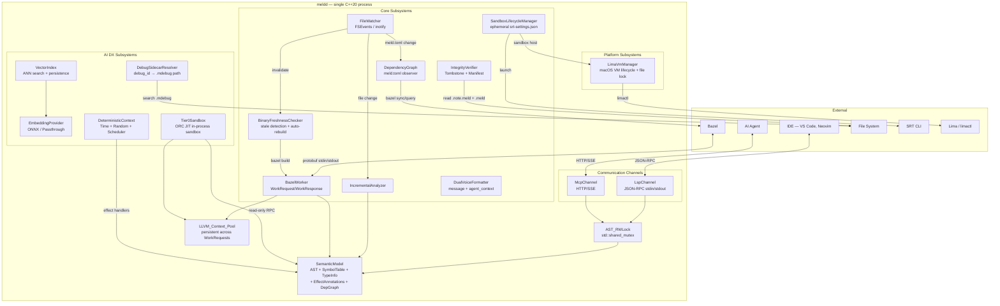

# Design Document: Meld Daemon (`meldd`)

## Overview

The Meld daemon (`meldd`) is a single long-lived C++20 process that serves as the central orchestrator of the Meld toolchain. It holds a memory-resident SemanticModel (parsed ASTs, symbol tables, type information, effect annotations, resolved dependency graph) and exposes this shared state through two communication channels: JSON-RPC (LSP) for human IDEs and MCP-HTTP/SSE for AI agents. Both channels observe the same state with zero drift.

Beyond serving as a language server, the daemon acts as a persistent Bazel worker (keeping the LLVM context hot), synchronizes the dependency graph with `meld.toml`, manages sandbox policy lifecycle, verifies binary integrity before execution, formats all responses in a dual-voice format (human-readable + machine-readable), maintains a vector-augmented symbol index for intent-based discovery, resolves debug sidecars for crash analysis, provides a deterministic execution context for reproducible AI agent runs, checks binary freshness before execution, hosts an in-process Tier 0 JIT sandbox for ephemeral agent scripts, and manages the Lima VM lifecycle on macOS for sandbox execution.

The LSP channel provides full language server features — syntax highlighting, code completion, diagnostics, navigation, formatting, and refactoring — all reading from the shared SemanticModel. The MCP channel provides full AI agent tool support — safety analysis, lifecycle queries, effect tracing, refactoring intents, code mode scripting, and structured diagnostics — also reading from the shared SemanticModel. This eliminates the need for separate LSP or MCP server processes.

**Cross-references (do not duplicate — reference only):**
- `.kiro/specs/meld-manifest/` — Req 10–16 (SandboxProvider, SRT integration, ephemeral policy lifecycle); Req 7 (verification modes); Req 17 (`.mdebug` sidecar format)
- `.kiro/specs/meld-compiler/` — Req 6 (ORC JIT Dev Server), Req 9 (Bazel rules), Req 32 (`.mdebug` emission)
- `.kiro/specs/meld-build/` — Req 8–9 (`meld.toml` parsing)
- `.kiro/specs/meld-core/` — Req 41, 99–118 (algebraic effects system used by deterministic handlers)


## Architecture

### High-Level Architecture



### Design Decisions

1. **Single process, dual channel**: Both LSP and MCP run in the same process sharing one SemanticModel instance. This eliminates state synchronization issues and guarantees zero semantic drift between human and agent views. The `AST_RWLock` (`std::shared_mutex`) allows concurrent read queries from both channels while serializing write operations (re-analysis).

2. **Lazy startup, eager connections**: The daemon accepts LSP/MCP connections immediately on startup, then indexes the workspace in the background. This ensures IDE responsiveness is not blocked by initial indexing of large workspaces. Progress is reported via LSP `window/workDoneProgress`.

3. **Persistent LLVM context for Bazel worker**: The `LLVM_Context_Pool` persists across `WorkRequest` invocations, avoiding the ~200ms cold-start overhead of re-initializing LLVM context, target machine, and standard library AST on each compile action. On unrecoverable LLVM errors, the context is reset (not the daemon process).

4. **Debounced file watching**: The `FileWatcher` debounces rapid file-change events (default 50ms window) to avoid redundant re-analysis during bulk operations like `git checkout`. Platform-specific backends (FSEvents on macOS, inotify on Linux) are abstracted behind a unified interface.

5. **Ephemeral sandbox policies**: Each execution gets a fresh `srt-settings.json` with a UUID-based filename, created with owner-read-only permissions. Policies are deleted after process exit. Stale policies from crashed sessions are cleaned up on next startup.

6. **Linked hash verification**: The daemon verifies a three-way integrity chain before execution: binary → `code_hash` in manifest → `manifest_hash` in Tombstone → `signature_blob`. Tampering with any artifact breaks the chain.

7. **Dual-voice response format**: Every diagnostic contains both `message` (human-readable) and `agent_context` (machine-readable: `rule_id`, `ast_selector`, `context_hash`, optional `fix` with AST_Patch). The LSP channel puts `agent_context` in `Diagnostic.data`; the MCP channel exposes both as top-level fields.

8. **Pluggable embedding provider**: The `VectorIndex` uses an abstract `EmbeddingProvider` interface. The reference implementation uses ONNX Runtime for local inference. A `PassthroughEmbeddingProvider` fallback disables vector search and falls back to keyword matching when no model is configured.

9. **Deterministic context via effect handlers**: The `DeterministicContext` installs standard algebraic effect handlers (no new kernel primitives) that intercept `EffectTime`, `EffectRandom`, and the task scheduler. This is activated explicitly via MCP `deterministic` parameter or CLI `--agent-test` flag.

10. **Binary freshness with auto-rebuild**: The `BinaryFreshnessChecker` compares binary build timestamps against source modification times using the SemanticModel's dependency graph. When stale, it triggers a rebuild through the Bazel Worker Protocol and blocks until completion. Results are cached and invalidated by the FileWatcher.

11. **In-process Tier 0 sandbox**: The `Tier0Sandbox` uses LLVM ORC JIT for in-memory compilation of ephemeral agent scripts, bypassing the Bazel build pipeline entirely. Scripts get read-only RPC bindings to the SemanticModel but no filesystem, network, or raw I/O access. Each sandbox instance is independent with its own memory (16MB default) and time (5000ms default) limits, destroyed immediately after execution.

12. **Coordinated Lima VM lifecycle**: On macOS, the `LimaVmManager` uses a POSIX file lock (`/tmp/meld-vmm.lock`) to coordinate a single global `meld-vm` Lima instance across N concurrent daemon processes. The first daemon to acquire the lock starts the VM; the last daemon to shut down stops it. On Linux, Lima management is skipped entirely since KVM and containerd are available natively.


## Components and Interfaces

### 1. SemanticModel (`semantic_model.hpp`)

The central in-memory representation of the workspace.

```cpp
namespace meld::daemon {

class SemanticModel {
public:
    // AST access (protected by AST_RWLock)
    std::shared_ptr<parser::ast::Module> get_ast(const std::filesystem::path& path) const;
    void update_ast(const std::filesystem::path& path, std::shared_ptr<parser::ast::Module> ast);
    void remove_ast(const std::filesystem::path& path);

    // Diagnostics
    std::vector<Diagnostic> get_diagnostics(const std::filesystem::path& path) const;
    std::vector<Diagnostic> get_all_diagnostics() const;

    // Symbol table
    const SymbolTable& symbol_table() const;

    // Type info cache
    TypeInfo get_type_info(const std::string& symbol_name) const;

    // Effect annotations
    EffectSet get_effects(const std::string& function_name) const;

    // Dependency graph
    const DependencyGraph& dependency_graph() const;

    // Vector index (Req 9)
    VectorIndex& vector_index();

private:
    mutable std::shared_mutex rwlock_;  // AST_RWLock
    std::unordered_map<std::filesystem::path, std::shared_ptr<parser::ast::Module>> ast_map_;
    std::unordered_map<std::filesystem::path, std::vector<Diagnostic>> diagnostics_map_;
    SymbolTable symbol_table_;
    std::unordered_map<std::string, TypeInfo> type_cache_;
    std::unordered_map<std::string, EffectSet> effect_cache_;
    DependencyGraph dep_graph_;
    VectorIndex vector_index_;
};

} // namespace meld::daemon
```

### 2. MeldDaemon (`daemon.hpp`)

The top-level daemon class that owns all subsystems.

```cpp
namespace meld::daemon {

struct DaemonConfig {
    std::filesystem::path workspace;
    uint32_t idle_timeout_seconds = 0;  // 0 = no timeout
    bool sandbox_verbose = false;
};

class MeldDaemon {
public:
    explicit MeldDaemon(DaemonConfig config);

    void run();       // Initialize subsystems, enter main event loop
    void shutdown();  // Graceful teardown

private:
    DaemonConfig config_;
    SemanticModel semantic_model_;
    std::unique_ptr<LspChannel> lsp_channel_;
    std::unique_ptr<McpChannel> mcp_channel_;
    std::unique_ptr<FileWatcher> file_watcher_;
    std::unique_ptr<IncrementalAnalyzer> analyzer_;
    std::unique_ptr<BazelWorker> bazel_worker_;
    std::unique_ptr<DependencyGraph> dep_graph_;
    std::unique_ptr<SandboxLifecycleManager> sandbox_mgr_;
    std::unique_ptr<IntegrityVerifier> verifier_;
    std::unique_ptr<DualVoiceFormatter> formatter_;
    std::unique_ptr<DebugSidecarResolver> sidecar_resolver_;
    std::unique_ptr<DeterministicContext> deterministic_ctx_;
    std::unique_ptr<BinaryFreshnessChecker> freshness_checker_;
    std::unique_ptr<Tier0Sandbox> tier0_sandbox_;
    std::unique_ptr<LimaVmManager> lima_vm_mgr_;  // macOS only
};

} // namespace meld::daemon
```

### 3. LspChannel (`lsp_channel.hpp`)

The LSP protocol channel providing full language server features (syntax highlighting, completions, diagnostics, navigation, formatting, refactoring) over JSON-RPC, reading from the shared SemanticModel.

```cpp
namespace meld::daemon {

class LspChannel {
public:
    LspChannel(SemanticModel& model, DualVoiceFormatter& formatter);

    void start();  // Begin JSON-RPC stdin/stdout transport
    void stop();

    // Publish diagnostics to connected IDE
    void publish_diagnostics(const std::filesystem::path& path,
                             const std::vector<Diagnostic>& diagnostics);

    // Publish progress notifications
    void report_progress(const std::string& title, uint32_t percentage);

    // LSP Language Features (Req 15–21)
    CompletionList get_completions(const TextDocumentPosition& position);
    std::vector<Location> get_definitions(const TextDocumentPosition& position);
    std::vector<Location> get_references(const TextDocumentPosition& position);
    Hover get_hover(const TextDocumentPosition& position);
    std::vector<DocumentSymbol> get_document_symbols(const std::string& uri);
    std::vector<SymbolInformation> get_workspace_symbols(const std::string& query);
    SignatureHelp get_signature_help(const TextDocumentPosition& position);
    std::vector<TextEdit> format_document(const std::string& uri);
    std::vector<TextEdit> format_range(const std::string& uri, const Range& range);
    WorkspaceEdit rename_symbol(const TextDocumentPosition& position, const std::string& new_name);
    std::vector<SemanticToken> get_semantic_tokens(const std::string& uri);

private:
    SemanticModel& model_;
    DualVoiceFormatter& formatter_;
};

} // namespace meld::daemon
```

### 4. McpChannel (`mcp_channel.hpp`)

The MCP protocol channel providing AI agent tools (code analysis, safety analysis, refactoring, code mode) over HTTP/SSE, reading from the shared SemanticModel.

```cpp
namespace meld::daemon {

class McpChannel {
public:
    McpChannel(SemanticModel& model, DualVoiceFormatter& formatter);

    void start();  // Begin HTTP/SSE transport
    void stop();

    // Publish diagnostics to connected AI agents
    void publish_diagnostics(const std::filesystem::path& path,
                             const std::vector<Diagnostic>& diagnostics);

    // Named MCP Tools (Req 29)
    json analyze_safety(const std::string& target);
    json query_lifecycle(const std::string& symbol_ref);
    json trace_effect(const std::string& expr_ref);
    json resolve_version_conflict(const std::string& dep_coordinate);
    json dry_run_patch(const json& transforms, bool deterministic = false);
    json apply_patch(const json& patches, bool deterministic = false);
    json diagnose_build(const std::string& target);
    json verify_closure();

    // AI DX Tools (Req 32–34)
    json get_module_specs(const std::string& module, std::optional<std::string> symbol = {});
    json find_intent(const std::string& query, const std::string& scope = "all", size_t max_results = 10);
    json refactor(const json& intent, bool dry_run = true);

    // Code Mode Tools (Req 36)
    json search_api(const std::string& query);
    json execute_script(const std::string& source, uint32_t timeout_ms = 5000, uint32_t memory_limit_mb = 16);

private:
    SemanticModel& model_;
    DualVoiceFormatter& formatter_;
};

} // namespace meld::daemon
```

### 5. FileWatcher (`file_watcher.hpp`)

Platform-abstracted filesystem notification with debouncing.

```cpp
namespace meld::daemon {

class FileWatcher {
public:
    using Callback = std::function<void(const std::filesystem::path&, FileEvent)>;

    enum class FileEvent { Created, Modified, Deleted };

    explicit FileWatcher(const std::filesystem::path& root,
                         std::chrono::milliseconds debounce = std::chrono::milliseconds(50));

    void watch(const std::string& pattern, Callback callback);  // e.g., "*.meld", "meld.toml"
    void start();
    void stop();

private:
    struct Impl;  // Platform-specific: FSEvents (macOS), inotify (Linux)
    std::unique_ptr<Impl> impl_;
    std::chrono::milliseconds debounce_;
};

} // namespace meld::daemon
```

### 6. IncrementalAnalyzer (`incremental_analyzer.hpp`)

Re-parses only changed files and their direct dependents.

```cpp
namespace meld::daemon {

class IncrementalAnalyzer {
public:
    IncrementalAnalyzer(SemanticModel& model);

    // Re-analyze a single changed file and its dependents
    void analyze_change(const std::filesystem::path& changed_file);

    // Handle file creation/deletion
    void handle_file_created(const std::filesystem::path& path);
    void handle_file_deleted(const std::filesystem::path& path);

private:
    SemanticModel& model_;
    std::vector<std::filesystem::path> find_dependents(const std::filesystem::path& path) const;
};

} // namespace meld::daemon
```

### 7. BazelWorker (`bazel_worker.hpp`)

Persistent Bazel worker with hot LLVM context.

```cpp
namespace meld::daemon {

class BazelWorker {
public:
    BazelWorker(SemanticModel& model);

    // Main loop: read WorkRequest from stdin, write WorkResponse to stdout
    void run();

private:
    SemanticModel& model_;
    std::unique_ptr<llvm::LLVMContext> llvm_context_;  // Persistent across invocations
    std::unordered_map<std::string, std::string> file_hashes_;  // For incremental invalidation

    WorkResponse compile(const WorkRequest& request);
    void reset_llvm_context();  // On unrecoverable error
};

} // namespace meld::daemon
```

### 8. DependencyGraph (`dependency_graph.hpp`)

In-memory dependency tree synchronized with `meld.toml`.

```cpp
namespace meld::daemon {

struct DependencyNode {
    std::string name;
    std::string git_url;
    std::string version;
    std::vector<std::string> allowed_effects;
    std::vector<DependencyNode*> transitive_deps;
};

class DependencyGraph {
public:
    void update_from_toml(const std::filesystem::path& toml_path);
    bool has_changed(const std::filesystem::path& toml_path) const;
    void refresh_from_bazel();  // Run bazel sync + bazel query

    const DependencyNode* find(const std::string& name) const;
    std::vector<const DependencyNode*> all_nodes() const;

private:
    std::unordered_map<std::string, std::unique_ptr<DependencyNode>> nodes_;
    std::string last_toml_hash_;
};

} // namespace meld::daemon
```

### 9. SandboxLifecycleManager (`sandbox_lifecycle.hpp`)

Manages ephemeral SRT policy files and sandboxed process tracking.

```cpp
namespace meld::daemon {

class SandboxLifecycleManager {
public:
    SandboxLifecycleManager(const IntegrityVerifier& verifier);

    // Generate policy, verify binary, launch sandboxed process
    SandboxResult launch(const std::filesystem::path& binary,
                         const std::vector<std::string>& args);

    // Clean up stale policies from previous sessions
    void cleanup_stale_policies();

    // Terminate processes exceeding timeout
    void enforce_timeouts();

private:
    const IntegrityVerifier& verifier_;
    std::vector<ActiveProcess> active_processes_;
    std::filesystem::path temp_dir_;
};

} // namespace meld::daemon
```

### 10. IntegrityVerifier (`integrity_verifier.hpp`)

Three-way integrity verification: binary ↔ manifest ↔ tombstone.

```cpp
namespace meld::daemon {

enum class VerificationMode { Offline, OnlineAudit };

struct VerificationResult {
    bool passed;
    std::string failed_check;       // Empty if passed
    std::string expected_value;
    std::string actual_value;
    std::filesystem::path binary_path;
};

class IntegrityVerifier {
public:
    explicit IntegrityVerifier(VerificationMode mode);

    VerificationResult verify(const std::filesystem::path& binary_path) const;

private:
    VerificationMode mode_;

    bool verify_signature(const Tombstone& tomb, const Manifest& manifest) const;
    bool verify_code_hash(const Manifest& manifest, const std::filesystem::path& binary) const;
    bool verify_manifest_hash(const Tombstone& tomb, const std::filesystem::path& manifest_path) const;
};

} // namespace meld::daemon
```

### 11. DualVoiceFormatter (`dual_voice.hpp`)

Formats every diagnostic with both human-readable and machine-readable content.

```cpp
namespace meld::daemon {

struct AgentContext {
    std::string rule_id;
    std::string ast_selector;
    std::string context_hash;
    std::optional<AstPatch> fix;
};

struct DualVoiceResponse {
    std::string message;          // Human-readable
    AgentContext agent_context;   // Machine-readable
};

class DualVoiceFormatter {
public:
    DualVoiceResponse format_diagnostic(const Diagnostic& diag) const;

    // Channel-specific serialization
    nlohmann::json to_lsp_diagnostic(const DualVoiceResponse& resp) const;
    nlohmann::json to_mcp_response(const DualVoiceResponse& resp) const;
};

} // namespace meld::daemon
```

### 12. VectorIndex (`vector_index.hpp`)

Semantic vector index for intent-based symbol discovery.

```cpp
namespace meld::daemon {

struct IndexedSymbol {
    std::string name;
    std::string module_coordinate;
    std::string type_signature;
    std::string effect_profile;
    std::string summary;              // From @blueprint if available
    std::vector<float> embedding;
    float relevance_score;            // Set during search
};

class VectorIndex {
public:
    explicit VectorIndex(std::unique_ptr<EmbeddingProvider> provider);

    // Incremental update: re-index symbols from a changed file
    void update_file(const std::filesystem::path& path,
                     const std::vector<SymbolInfo>& symbols);

    // Remove symbols from a deleted file
    void remove_file(const std::filesystem::path& path);

    // Approximate nearest-neighbor search
    std::vector<IndexedSymbol> search(const std::string& query, size_t top_k = 10) const;

    // Persistence
    void save_to_disk(const std::filesystem::path& index_dir) const;
    void load_from_disk(const std::filesystem::path& index_dir);
    void invalidate();

private:
    std::unique_ptr<EmbeddingProvider> provider_;
    std::unordered_map<std::filesystem::path, std::vector<IndexedSymbol>> file_symbols_;
    std::vector<IndexedSymbol> all_symbols_;  // Flat list for ANN search
};

} // namespace meld::daemon
```

### 13. EmbeddingProvider (`embedding_provider.hpp`)

Abstract interface for text-to-vector embedding.

```cpp
namespace meld::daemon {

class EmbeddingProvider {
public:
    virtual ~EmbeddingProvider() = default;
    virtual std::vector<float> embed(const std::string& text) const = 0;
    virtual size_t dimensions() const = 0;
};

class OnnxEmbeddingProvider : public EmbeddingProvider {
public:
    OnnxEmbeddingProvider(const std::filesystem::path& model_path, size_t dimensions);
    std::vector<float> embed(const std::string& text) const override;
    size_t dimensions() const override;
private:
    // ONNX Runtime session
};

class PassthroughEmbeddingProvider : public EmbeddingProvider {
public:
    std::vector<float> embed(const std::string& text) const override;  // Returns empty
    size_t dimensions() const override;  // Returns 0
};

} // namespace meld::daemon
```

### 14. DebugSidecarResolver (`debug_sidecar_resolver.hpp`)

Resolves `debug_id` to `.mdebug` sidecar path with caching.

```cpp
namespace meld::daemon {

class DebugSidecarResolver {
public:
    explicit DebugSidecarResolver(const std::filesystem::path& workspace_root);

    std::optional<std::filesystem::path> resolve(const std::string& debug_id) const;
    void invalidate(const std::string& debug_id);
    void invalidate_all();

private:
    std::filesystem::path workspace_root_;
    mutable std::unordered_map<std::string, std::filesystem::path> cache_;

    // Search order: co-located → .meld/debug/ → bazel-bin/
    std::optional<std::filesystem::path> search(const std::string& debug_id) const;
    bool verify_debug_id(const std::filesystem::path& sidecar, const std::string& expected_id) const;
};

} // namespace meld::daemon
```

### 15. DeterministicContext (`deterministic_context.hpp`)

Installs deterministic effect handlers for reproducible execution.

```cpp
namespace meld::daemon {

struct DeterministicConfig {
    uint64_t seed = 0;
    std::string epoch = "2024-01-01T00:00:00Z";
    uint32_t time_increment_ms = 1;
};

class DeterministicContext {
public:
    explicit DeterministicContext(DeterministicConfig config = {});

    void activate();    // Install deterministic effect handlers
    void deactivate();  // Restore real handlers
    bool is_active() const;

    const DeterministicConfig& config() const;

private:
    DeterministicConfig config_;
    bool active_ = false;
    // Handlers installed via algebraic effect system — no new kernel primitives
};

} // namespace meld::daemon
```

### 16. BinaryFreshnessChecker (`binary_freshness.hpp`)

Checks whether a compiled binary is up-to-date with respect to its source dependencies, and triggers automatic rebuilds when stale.

```cpp
namespace meld::daemon {

struct FreshnessResult {
    bool is_current;
    std::vector<std::filesystem::path> stale_sources;
    bool rebuild_triggered;
    std::optional<std::string> build_diagnostics;  // On rebuild failure
};

class BinaryFreshnessChecker {
public:
    BinaryFreshnessChecker(SemanticModel& model, BazelWorker& worker);

    // Check if binary is current; trigger rebuild if stale (blocks until complete)
    FreshnessResult check(const std::filesystem::path& binary_path);

    // Invalidate cached results for binaries depending on changed file
    void invalidate(const std::filesystem::path& changed_source);

    // Invalidate all cached results
    void invalidate_all();

private:
    SemanticModel& model_;
    BazelWorker& worker_;
    mutable std::unordered_map<std::filesystem::path, FreshnessResult> cache_;
    std::chrono::milliseconds debounce_window_{50};

    // Compare binary build timestamp against source mtimes
    bool is_stale(const std::filesystem::path& binary_path) const;

    // Find the Bazel target for a binary
    std::string resolve_target(const std::filesystem::path& binary_path) const;
};

} // namespace meld::daemon
```

### 17. Tier0Sandbox (`tier0_sandbox.hpp`)

In-process JIT sandbox for ephemeral agent scripts with read-only SemanticModel access.

```cpp
namespace meld::daemon {

struct Tier0Config {
    size_t max_memory_bytes = 16 * 1024 * 1024;  // 16MB default
    std::chrono::milliseconds max_execution_time{5000};  // 5s default
};

struct ScriptResult {
    bool success;
    std::string output;                          // Script return value
    std::optional<std::vector<Diagnostic>> diagnostics;  // Compile or runtime errors
};

class Tier0Sandbox {
public:
    Tier0Sandbox(const SemanticModel& model, Tier0Config config = {});

    // Compile and execute a Meld source string in an isolated context
    ScriptResult execute(const std::string& source);

private:
    const SemanticModel& model_;
    Tier0Config config_;

    // RPC bindings injected into the sandbox (read-only SemanticModel access)
    void install_rpc_bindings(/* JIT module context */);
};

} // namespace meld::daemon
```

### 18. LimaVmManager (`lima_vm_manager.hpp`)

Manages the Lima VM lifecycle on macOS with cross-daemon coordination via file lock.

```cpp
namespace meld::daemon {

struct VmStatus {
    bool running;
    size_t allocated_memory_mb;
    uint32_t active_microvm_count;
    uint32_t active_container_count;
};

class LimaVmManager {
public:
    explicit LimaVmManager(std::chrono::minutes idle_timeout = std::chrono::minutes(5));

    // Start the meld-vm instance if not already running (acquires file lock)
    bool ensure_running();

    // Stop the meld-vm instance if this is the last daemon (releases file lock)
    void shutdown();

    // Query current VM status
    VmStatus check_status() const;

    // Periodic check: stop VM if last daemon and idle
    void check_idle_shutdown();

    // Returns true on macOS, false on Linux (skip all Lima management)
    static bool is_required();

private:
    std::chrono::minutes idle_timeout_;
    int lock_fd_ = -1;  // POSIX file lock on /tmp/meld-vmm.lock

    bool acquire_lock();
    void release_lock();
    bool is_vm_running() const;
    bool is_last_daemon() const;
};

} // namespace meld::daemon
```


## Data Models

### SemanticModel State

| Field | Type | Description |
|-------|------|-------------|
| `ast_map_` | `unordered_map<path, shared_ptr<Module>>` | Parsed AST per source file |
| `diagnostics_map_` | `unordered_map<path, vector<Diagnostic>>` | Diagnostics per file |
| `symbol_table_` | `SymbolTable` | Interned symbols across workspace |
| `type_cache_` | `unordered_map<string, TypeInfo>` | Cached type information |
| `effect_cache_` | `unordered_map<string, EffectSet>` | Cached effect annotations |
| `dep_graph_` | `DependencyGraph` | Resolved dependency tree |
| `vector_index_` | `VectorIndex` | Semantic embedding index |
| `rwlock_` | `std::shared_mutex` | Concurrent read / exclusive write |

### DualVoiceResponse Structure

```json
{
  "message": "Function 'processData' performs effect 'Network' not listed in @uses(Log)",
  "agent_context": {
    "rule_id": "E0042-effect-leak",
    "ast_selector": "$.module.fn[processData].body.call[3]",
    "context_hash": "a1b2c3d4",
    "fix": {
      "operation": "replace",
      "target": "$.module.fn[processData].annotation[@uses]",
      "replacement": "@uses(Log, Network)"
    }
  }
}
```

### Bazel Worker Protocol Messages

```
WorkRequest (protobuf, stdin):
├── arguments: repeated string (compiler flags)
├── inputs: repeated Input (file paths + digests)
└── request_id: int32

WorkResponse (protobuf, stdout):
├── exit_code: int32
├── output: string (diagnostics)
└── request_id: int32
```

### DependencyGraph Node

| Field | Type | Description |
|-------|------|-------------|
| `name` | `string` | Package name |
| `git_url` | `string` | Git repository URL |
| `version` | `string` | Pinned version/tag |
| `allowed_effects` | `vector<string>` | From `meld.toml` `allow` array |
| `transitive_deps` | `vector<DependencyNode*>` | Resolved transitive closure |

### VectorIndex Persistence Format

The index is persisted to `.meld/vector_index/` as:
- `metadata.json`: embedding model config hash, symbol count, dimensions
- `embeddings.bin`: flat binary array of float vectors
- `symbols.json`: symbol metadata (name, module, signature, effect profile)

On startup, if `metadata.json` model config hash matches current `meld.toml` config, the index is loaded from disk. Otherwise it's rebuilt in the background.


## Correctness Properties

### Property 1: Channel Consistency

*For any* SemanticModel state, querying the same symbol via LSP and MCP SHALL return equivalent type/effect information.

**Validates: Requirements 1.4**

### Property 2: Incremental Equivalence

*For any* file change, incremental re-analysis SHALL produce the same diagnostics as a full re-analysis of the entire workspace.

**Validates: Requirements 2.2, 2.3**

### Property 3: Dual-Voice Completeness

*For any* diagnostic, both `message` and `agent_context` fields SHALL be non-empty, and `agent_context` SHALL contain valid `rule_id` and `ast_selector`.

**Validates: Requirements 7.1, 7.2, 7.6**

### Property 4: Incremental Index Equivalence

*For any* file change, incrementally updating the VectorIndex SHALL produce the same search results as rebuilding the entire index from scratch.

**Validates: Requirements 9.5**

### Property 5: Integrity Chain Soundness

*For any* binary with a valid manifest and tombstone, modifying the binary, the manifest, or both without access to the signing key SHALL cause verification to fail.

**Validates: Requirements 6.1, 6.2, 6.3, 6.4, 6.5**

### Property 6: Debounce Coalescing

*For any* sequence of N file-change events within the debounce window, the daemon SHALL perform at most one re-analysis covering all changed files.

**Validates: Requirements 2.6**

### Property 7: Worker Context Persistence

*For any* sequence of WorkRequests, the LLVM context SHALL persist across invocations — the second WorkRequest SHALL not re-initialize the LLVM context, target machine, or standard library AST.

**Validates: Requirements 3.2**

### Property 8: Worker Error Isolation

*For any* WorkRequest that causes an unrecoverable LLVM error, the daemon process SHALL remain alive and the next WorkRequest SHALL succeed after context reset.

**Validates: Requirements 3.6**

### Property 9: Ephemeral Policy Uniqueness

*For any* two concurrent execution requests, the daemon SHALL generate distinct `srt-settings.json` files with unique filenames.

**Validates: Requirements 5.1 (via meld-manifest Req 12.1)**

### Property 10: Deterministic Reproducibility

*For any* code execution under `DeterministicContext` with the same `DeterministicConfig`, the execution SHALL produce identical observable results.

**Validates: Requirements 11.1, 11.2, 11.3, 11.4**

### Property 11: Sidecar Resolution Correctness

*For any* binary with a valid `.mdebug` sidecar co-located, `resolve_debug_sidecar` SHALL return the sidecar path and the sidecar's `debug_id` SHALL match the requested `debug_id`.

**Validates: Requirements 10.1, 10.3**

### Property 12: Dependency Graph Consistency

*For any* modification to `meld.toml`, the in-memory DependencyGraph SHALL reflect the updated dependency declarations after sync completes, and diagnostics SHALL be republished to both channels.

**Validates: Requirements 4.2, 4.5**

### Property 13: Freshness Check Consistency

*For any* binary whose transitive source dependencies have not changed since the last build, `check_binary_freshness` SHALL return `is_current = true` without triggering a rebuild. For any binary with at least one modified source dependency, it SHALL return `is_current = false` (before rebuild) and trigger a rebuild.

**Validates: Requirements 12.1, 12.2, 12.3**

### Property 14: Freshness Cache Invalidation

*For any* file change detected by the FileWatcher, cached freshness results for all binaries whose transitive dependency set includes the changed file SHALL be invalidated.

**Validates: Requirements 12.6, 12.7**

### Property 15: Tier 0 Sandbox Isolation

*For any* script executed in the `Tier0Sandbox`, the script SHALL have NO ability to modify the SemanticModel, write to the filesystem, open network connections, or perform raw I/O. The only host interaction is through injected read-only RPC bindings.

**Validates: Requirements 13.6, 13.7, 13.8**

### Property 16: Tier 0 Resource Limits

*For any* script executed in the `Tier0Sandbox`, if the script exceeds the configured memory limit or execution time, the sandbox SHALL terminate the script and return a structured diagnostic. The sandbox instance SHALL be fully destroyed after execution.

**Validates: Requirements 13.4, 13.5, 13.9**

### Property 17: Tier 0 Concurrent Independence

*For any* two concurrent `Tier0Sandbox` executions, each SHALL operate in an independent sandbox instance with its own memory and time limits. A crash or timeout in one SHALL NOT affect the other.

**Validates: Requirements 13.10**

### Property 18: Lima VM Single Instance

*For any* number of concurrent `meldd` daemon processes on macOS, there SHALL be exactly one `meld-vm` Lima instance running globally. The POSIX file lock at `/tmp/meld-vmm.lock` SHALL ensure mutual exclusion during VM start/stop operations.

**Validates: Requirements 14.2, 14.3, 14.5**

### Property 19: Lima VM Last-Daemon Shutdown

*For any* sequence of daemon shutdowns, the last daemon to shut down SHALL stop the Lima VM. No daemon shutdown SHALL stop the VM while other daemons are still active.

**Validates: Requirements 14.6, 14.7**

### Property 20: Lima VM Platform Skip

On Linux, the `LimaVmManager` SHALL perform no operations — all Lima lifecycle management is skipped. The daemon SHALL proceed directly to native KVM/containerd sandbox execution.

**Validates: Requirements 14.8**

---

### LSP Channel Properties (Req 15–21)

### Property 21: Semantic Token Provision

*For any* valid Meld file, the LspChannel SHALL provide semantic tokens that enable syntax highlighting.

**Validates: Requirements 15.1**

### Property 22: Language Construct Classification

*For any* Meld source code, all language constructs SHALL be correctly identified and classified by type (symbols, literals, keywords, operators, comments).

**Validates: Requirements 15.2**

### Property 23: Syntax Error Diagnostics

*For any* Meld code containing syntax errors, the LspChannel SHALL provide diagnostic information with precise error locations.

**Validates: Requirements 15.3**

### Property 24: Valid Syntax Parsing

*For any* syntactically valid Meld code, the LspChannel SHALL parse the content without generating errors.

**Validates: Requirements 15.4**

### Property 25: Parse Error Recovery

*For any* Meld file with parsing errors, the LspChannel SHALL continue processing the remainder of the file after encountering errors.

**Validates: Requirements 15.5**

### Property 26: Context-Aware Completions

*For any* cursor position in a Meld file, completion suggestions SHALL be appropriate for the current scope and context.

**Validates: Requirements 16.1**

### Property 27: Symbol Completion Accuracy

*For any* symbol completion request, all available variables, functions, types, and imported symbols in scope SHALL be suggested.

**Validates: Requirements 16.2**

### Property 28: Function Signature Help

*For any* function call context, signature help SHALL provide accurate parameter information and documentation.

**Validates: Requirements 16.3**

### Property 29: Type Completion Accuracy

*For any* type annotation context, completions SHALL include all valid type names (built-in, user-defined, and aliases).

**Validates: Requirements 16.4**

### Property 30: Context-Sensitive Filtering

*For any* syntactic position, completion suggestions SHALL be filtered to exclude inappropriate options for that context.

**Validates: Requirements 16.5**

### Property 31: Grammar Conformance Validation

*For any* Meld code, syntax validation SHALL conform exactly to the Meld grammar specification.

**Validates: Requirements 17.1**

### Property 32: Type Error Reporting

*For any* code with type mismatches, the LspChannel SHALL report clear type errors with descriptions and suggested fixes.

**Validates: Requirements 17.2**

### Property 33: Undefined Symbol Detection

*For any* undefined symbol reference, the LspChannel SHALL report an error and suggest similar available names.

**Validates: Requirements 17.3**

### Property 34: Refinement Constraint Validation

*For any* refinement type constraint violation, the LspChannel SHALL validate logical predicates and report violations.

**Validates: Requirements 17.4**

### Property 35: Dispatch Ambiguity Detection

*For any* ambiguous multiple dispatch function call, the LspChannel SHALL detect and report dispatch resolution errors.

**Validates: Requirements 17.5**

### Property 36: Definition Navigation Accuracy

*For any* symbol, "go to definition" SHALL navigate to the correct declaration location.

**Validates: Requirements 18.1**

### Property 37: Reference Finding Completeness

*For any* symbol, "find references" SHALL locate all usages across the workspace without missing any.

**Validates: Requirements 18.2**

### Property 38: Document Symbol Outline Accuracy

*For any* Meld file, the document symbols SHALL provide a complete hierarchical outline of all functions, types, and declarations.

**Validates: Requirements 18.3**

### Property 39: Workspace Symbol Search Completeness

*For any* workspace, symbol search SHALL provide access to all symbols across all files.

**Validates: Requirements 18.4**

### Property 40: Hover Information Accuracy

*For any* symbol, hover SHALL display correct type information, documentation, and signature details.

**Validates: Requirements 18.5**

### Property 41: Document Formatting Consistency

*For any* Meld document, formatting SHALL produce output that conforms to standard style conventions.

**Validates: Requirements 19.1**

### Property 42: Range Formatting Precision

*For any* selected code range, formatting SHALL only modify the selected region while preserving surrounding formatting.

**Validates: Requirements 19.2**

### Property 43: Symbol Renaming Completeness

*For any* symbol rename operation, all references across the workspace SHALL be updated correctly.

**Validates: Requirements 19.3**

### Property 44: Rename Conflict Detection

*For any* rename operation that would cause naming conflicts, the LspChannel SHALL detect and prevent the unsafe rename.

**Validates: Requirements 19.4**

### Property 45: Semantic Preservation During Formatting

*For any* code formatting operation, the semantic meaning SHALL be preserved while improving readability.

**Validates: Requirements 19.5**

### Property 46: Workspace File Discovery Completeness

*For any* workspace, opening SHALL discover and index all Meld source files recursively.

**Validates: Requirements 20.1**

### Property 47: LSP Incremental Index Updates

*For any* file system change (add, modify, delete), the workspace index SHALL be updated incrementally to reflect the change.

**Validates: Requirements 20.2**

### Property 48: Cross-File Resolution Accuracy

*For any* cross-file reference, imports, exports, and module dependencies SHALL be resolved correctly.

**Validates: Requirements 20.3**

### Property 49: Large Workspace Responsiveness

*For any* workspace containing a large number of Meld source files, the LspChannel SHALL maintain responsive performance by using incremental parsing and caching so that individual file operations do not degrade proportionally to workspace size.

**Validates: Requirements 20.4**

### Property 50: Configuration Change Handling

*For any* workspace configuration change, affected files SHALL be reloaded and reindexed appropriately.

**Validates: Requirements 20.5**

### Property 51: Homoiconic Analysis Correctness

*For any* homoiconic Meld code, the LspChannel SHALL understand the relationship between AST representation and runtime values.

**Validates: Requirements 21.1**

### Property 52: Macro System Support

*For any* macro definition, the LspChannel SHALL provide appropriate language service support for meta-macro system constructs.

**Validates: Requirements 21.2**

### Property 53: Refinement Type Evaluation

*For any* refinement type, logical predicates and constraint expressions SHALL be evaluated correctly.

**Validates: Requirements 21.3**

### Property 54: Multiple Dispatch Resolution

*For any* multiple dispatch function call, dispatch SHALL be resolved based on all argument types correctly.

**Validates: Requirements 21.4**

### Property 55: Tree Initialization Validation

*For any* tree initialization syntax, constructor block syntax and nested property assignments SHALL be validated correctly.

**Validates: Requirements 21.5**

---

### MCP Channel Properties (Req 22–36)

### Property 56: MCP Project Discovery Completeness

*For any* valid Meld workspace, the McpChannel SHALL discover and provide access to all available projects and workspaces.

**Validates: Requirements 22.1**

### Property 57: MCP Codebase Structure Representation

*For any* Meld codebase, the hierarchical organization of files, modules, and symbols SHALL be accurately represented.

**Validates: Requirements 22.2**

### Property 58: MCP Code Artifact Exposure Completeness

*For any* Meld code, AST representations, symbol tables, and type information SHALL be completely exposed.

**Validates: Requirements 22.3**

### Property 59: MCP Dependency Analysis Accuracy

*For any* module structure, import/export relationships and dependency graphs SHALL be correctly analyzed.

**Validates: Requirements 22.4**

### Property 60: MCP Documentation Extraction Completeness

*For any* Meld code with documentation, all inline comments, docstrings, and metadata annotations SHALL be extracted.

**Validates: Requirements 22.5**

### Property 61: MCP Grammar Parsing Conformance

*For any* valid Meld code, parsing SHALL conform to the official Meld grammar and provide detailed AST information.

**Validates: Requirements 23.1**

### Property 62: MCP Type Analysis Accuracy

*For any* Meld type system constructs, refinement types, multiple dispatch signatures, and type constraints SHALL be validated correctly.

**Validates: Requirements 23.2**

### Property 63: MCP Control Flow Analysis Completeness

*For any* Meld control flow patterns, pattern matching and functional constructs SHALL be analyzed correctly.

**Validates: Requirements 23.3**

### Property 64: MCP Macro Processing Accuracy

*For any* macro definition, meta-macro system constructs and expansion rules SHALL be understood correctly.

**Validates: Requirements 23.4**

### Property 65: MCP Code Validation Completeness

*For any* invalid Meld code, syntax errors, type mismatches, and semantic violations SHALL be identified.

**Validates: Requirements 23.5**

### Property 66: MCP Symbol Search Completeness

*For any* symbol in a codebase, all definitions, references, and usages SHALL be located by symbol name search.

**Validates: Requirements 24.1**

### Property 67: MCP Type Signature Search Accuracy

*For any* type pattern query, all functions and methods with matching signatures SHALL be found.

**Validates: Requirements 24.2**

### Property 68: MCP Code Pattern Identification Accuracy

*For any* code pattern, similar constructs, idioms, and implementation approaches SHALL be identified correctly.

**Validates: Requirements 24.3**

### Property 69: MCP Language Feature Filtering Accuracy

*For any* specific Meld construct query, code using those features SHALL be located correctly.

**Validates: Requirements 24.4**

### Property 70: MCP Code Generation Syntax Validation

*For any* generated code snippet, syntax SHALL be validated according to Meld grammar rules.

**Validates: Requirements 25.1**

### Property 71: MCP Type Definition Generation Correctness

*For any* generated type definition, type safety and constraint satisfaction SHALL be ensured.

**Validates: Requirements 25.2**

### Property 72: MCP Function Generation Dispatch Compatibility

*For any* generated function implementation, multiple dispatch rules and signature compatibility SHALL be respected.

**Validates: Requirements 25.3**

### Property 73: MCP Module Generation Consistency

*For any* generated complete module, import/export consistency and dependency requirements SHALL be validated.

**Validates: Requirements 25.4**

### Property 74: MCP Generated Code Formatting Compliance

*For any* generated code, standard Meld style conventions and formatting rules SHALL be applied.

**Validates: Requirements 25.5**

### Property 75: MCP Symbol Renaming Semantic Preservation

*For any* symbol rename operation via MCP, all references SHALL be updated while preserving semantic correctness.

**Validates: Requirements 26.1**

### Property 76: MCP Function Extraction Correctness

*For any* function extraction operation, proper scoping, type signatures, and multiple dispatch compatibility SHALL be maintained.

**Validates: Requirements 26.2**

### Property 77: MCP Module Reorganization Consistency

*For any* module reorganization, import/export statements and dependency relationships SHALL be updated correctly.

**Validates: Requirements 26.3**

### Property 78: MCP Design Pattern Application Correctness

*For any* design pattern transformation, code behavior SHALL be preserved while maintaining Meld idioms.

**Validates: Requirements 26.4**

### Property 79: MCP Code Optimization Functional Equivalence

*For any* code optimization, functional equivalence SHALL be ensured while suggesting improvements.

**Validates: Requirements 26.5**

### Property 80: MCP Project Configuration Access Completeness

*For any* project configuration, build settings, dependencies, and compilation options SHALL be provided.

**Validates: Requirements 27.1**

### Property 81: MCP Project Structure Exposure Accuracy

*For any* project structure, directory organization, module hierarchies, and file relationships SHALL be exposed correctly.

**Validates: Requirements 27.2**

### Property 82: MCP Build Artifact Analysis Completeness

*For any* build artifacts, information about generated files, compilation outputs, and intermediate representations SHALL be provided.

**Validates: Requirements 27.3**

### Property 83: MCP Version Control Integration Accuracy

*For any* Git repository, change history and branch information SHALL be provided.

**Validates: Requirements 27.4**

### Property 84: MCP Test Suite Identification Completeness

*For any* test suite, test files, test cases, and coverage information SHALL be identified correctly.

**Validates: Requirements 27.5**

### Property 85: MCP Build System Integration Accuracy

*For any* build system configuration, Bazel SHALL be interfaced correctly to understand compilation processes.

**Validates: Requirements 28.1**

### Property 86: MCP Compiler Output Access Completeness

*For any* compilation result, errors, warnings, and diagnostic information SHALL be provided.

**Validates: Requirements 28.2**

### Property 87: MCP Testing Framework Integration Accuracy

*For any* testing framework, tests SHALL be executed correctly and results with coverage data SHALL be provided.

**Validates: Requirements 28.4**

### Property 88: MCP Documentation Tool Integration Completeness

*For any* documentation generation, API documentation and code examples SHALL be generated and updated correctly.

**Validates: Requirements 28.5**
