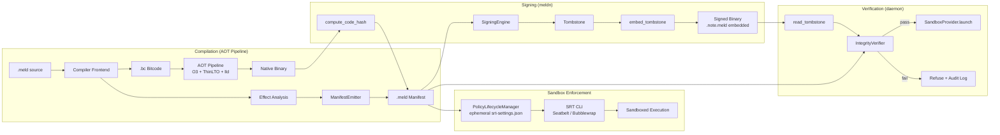
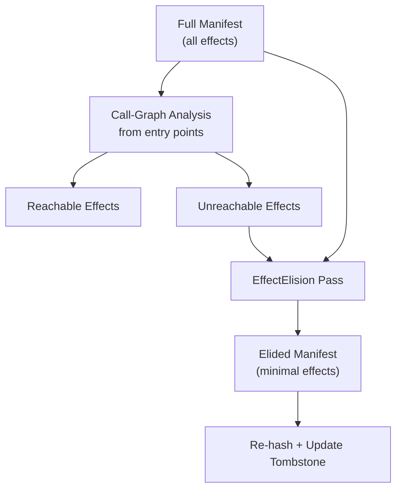
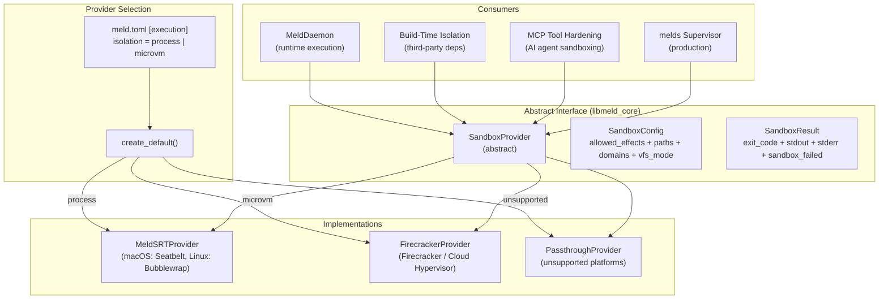
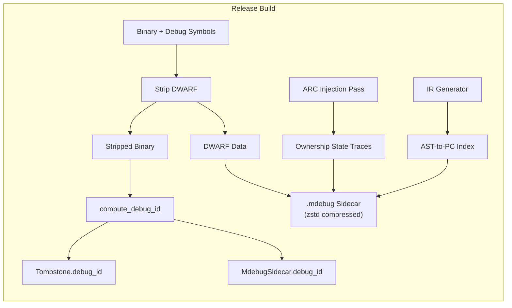

# Design Document: Meld Manifest & Binary Security

## Overview

This design covers the complete chain of trust from compilation through deployment for Meld binaries. The system has four layers:

1. **Manifest Layer** — The compiler emits a `.meld` manifest sidecar alongside each binary, containing a binary-serialized map of `Symbol Name → Effect Bitmask + Resource Bounds` for every exported symbol, plus a `code_hash` of the binary's executable segments.

2. **Tombstone Layer** — A non-loadable `.note.meld` (ELF) or Mach-O section is embedded in the binary containing `manifest_hash`, `signature_blob`, `EffectID`, and `debug_id`, creating a linked hash chain for mutual authentication.

3. **Signing Layer** — The `meldn` (Notary) utility signs the manifest using either traditional key-based signing or Sigstore keyless signing (Fulcio + Rekor), embedding the signature in the Tombstone. It also provides `verify` (pre-deploy integrity check) and `bundle` (air-gapped preparation) commands.

4. **Sandbox Layer** — The `SandboxProvider` interface translates Meld effects into OS-specific isolation via SRT (Seatbelt on macOS, Bubblewrap on Linux), with ephemeral per-execution policies, build-time isolation, and MCP tool hardening.

Additionally, the `.mdebug` debug sidecar format provides stripped DWARF data, AST-to-PC mapping, and Ownership State Traces for production binaries, linked to the binary via `debug_id` in the Tombstone.

**Cross-references (do not duplicate — reference only):**
- `.kiro/specs/meld-compiler/` — Req 8 (AOT pipeline), Req 12 (version-aware mangling), Req 20–22 (ARC injection), Req 32 (`.mdebug` emission)
- `.kiro/specs/meld-core/` — Req 99–118 (`@effect`/`@uses` annotation system)
- `.kiro/specs/meld-build/` — Req 1–6 (Bazel rules), Req 11 (link-time effect validation)
- `.kiro/specs/meld-daemon/` — Req 5 (SRT lifecycle), Req 6 (integrity verification), Req 10 (sidecar resolution)
- `.kiro/specs/meld-mcp-server/` — Req 8 (MCP tools sandboxed per Req 15)
- `.kiro/specs/meld-async/` — Req 7 (Isolate system; sandbox adds OS-level restriction on top)


## Architecture

### Chain of Trust Pipeline



### Effect Elision (Release Builds)



### Sandbox Provider Architecture



### Debug Sidecar Architecture




### Design Decisions

1. **Binary-serialized manifest**: The manifest uses a compact binary format (not JSON or protobuf) to minimize read overhead at build and startup time. A format version number ensures forward compatibility.

2. **Combined Integrity Hash for signing**: The signature covers a Combined Integrity Hash: `H_total = Hash(code_hash + manifest_hash + debug_id)`. This means the manifest contains `code_hash` (hash of binary), the Tombstone contains `manifest_hash` (hash of manifest), `debug_id`, and `signature_blob` (signature over the combined hash). Tampering with any artifact — including swapping the debug sidecar — breaks verification. No single point of failure.

3. **Non-loadable Tombstone section**: The `.note.meld` section is marked non-loadable in the ELF/Mach-O headers, adding zero runtime memory overhead and zero runtime instructions. It's purely compile-time metadata.

4. **Sigstore-first, key-based fallback**: Keyless signing via Sigstore (Fulcio + Rekor) is the primary signing mode for CI/CD. Traditional key-based signing is supported as a fallback for air-gapped environments. Ephemeral keys are generated in-memory and destroyed after Rekor logging. Fulcio and Rekor endpoints are configurable for private Sigstore instances.

5. **FFI Bridge Rule defaults to "Full IO"**: Untagged `@extern("C")` functions are treated as requiring all effect permissions. This is the safe default — it forces consumers to grant full permissions for dependencies with untagged FFI, incentivizing explicit `@effect` annotations.

6. **Effect elision runs after ThinLTO**: The Global Effect Elision pass runs after cross-module inlining so that inlined code is included in the reachability analysis. This produces the tightest possible manifest for production binaries.

7. **Stateless SandboxProvider interface**: Each `launch()` call carries its full `SandboxConfig`. No state is shared between invocations. This simplifies testing and allows the daemon to swap providers without restart.

8. **Deny-by-default sandbox policy**: Effects not present in `SandboxConfig.allowed_effects` are denied in the SRT policy. The only exception is read-only access to the Meld standard library and runtime paths, which is always granted.

9. **Ephemeral per-execution policies**: Each execution gets a fresh `srt-settings.json` with a UUID-based filename and owner-read-only permissions. Policies are deleted after process exit. Stale policies from crashed sessions are cleaned up on next daemon startup.

10. **Separate concerns for manifest and debug sidecar**: The `.meld` manifest handles effect/security metadata. The `.mdebug` sidecar handles debug metadata (DWARF, AST-to-PC, ownership traces). They are independent files linked through the Tombstone's `debug_id` and `manifest_hash` fields.

11. **Deterministic `debug_id`**: The `debug_id` is a content-addressable hash of the binary's code segments, so identical builds produce the same ID and can share `.mdebug` sidecars across machines and CI runs.

12. **`meldn` as a three-verb CLI**: The notary utility provides `sign` (produce signed tombstone), `verify` (check integrity pre-deploy), and `bundle` (prepare air-gapped bundles). All three share the same `SigningEngine` and `SigstoreClient` internals. The `bundle` command fetches Rekor SETs and Fulcio certificates and embeds them as a self-contained Sigstore Bundle in the Tombstone.

13. **Tiered sandbox with provider selection via `meld.toml`**: The `SandboxProvider::create_default()` factory reads `[execution]` from `meld.toml` to select between `MeldSRTProvider` (process-level, default) and `FirecrackerProvider` (hardware-level). This keeps the selection mechanism centralized and declarative.

14. **MicroVM as Tier 3 — not a replacement for SRT**: The `FirecrackerProvider` is an additional isolation tier for zero-trust/multi-tenant environments. It boots a minimal guest kernel per execution, providing kernel-level exploit protection that process sandboxing cannot offer. The ~100-150ms boot overhead makes it unsuitable for the fast A2C feedback loop, so SRT remains the default.


## Components and Interfaces

### 1. Core Types (`core_types.hpp`)

```cpp
namespace meld::manifest {

enum class Effect : uint8_t {
    Network         = 0x01,
    FileSystemRead  = 0x02,
    FileSystemWrite = 0x04,
    ProcessExec     = 0x08,
    SystemTime      = 0x10,
    State           = 0x20
};

using EffectBitmask = uint8_t;  // Bitwise OR of Effect values

struct ResourceBounds {
    std::vector<std::string> allowed_domains;   // For Network
    std::vector<std::filesystem::path> read_paths;   // For FileSystemRead
    std::vector<std::filesystem::path> write_paths;  // For FileSystemWrite
};

struct SymbolEffectEntry {
    std::string symbol_name;
    EffectBitmask effects;
    ResourceBounds bounds;
};

} // namespace meld::manifest
```

### 2. Manifest (`manifest.hpp`)

```cpp
namespace meld::manifest {

struct Manifest {
    uint16_t format_version;
    std::string project_name;
    std::string project_version;
    std::array<uint8_t, 32> code_hash;  // SHA-256
    std::vector<SymbolEffectEntry> symbols;

    std::vector<uint8_t> serialize() const;
    static Manifest deserialize(std::span<const uint8_t> data);
    static std::array<uint8_t, 32> compute_code_hash(const std::filesystem::path& binary);
};

class ManifestEmitter {
public:
    Manifest build(const SymbolTable& symbols, const EffectAnalysis& effects,
                   const ProjectConfig& config);
    void emit(const Manifest& manifest, const std::filesystem::path& output_path);
};

} // namespace meld::manifest
```

### 3. Tombstone (`tombstone.hpp`)

```cpp
namespace meld::manifest {

struct Tombstone {
    std::array<uint8_t, 32> manifest_hash;  // SHA-256 of manifest
    std::vector<uint8_t> signature_blob;     // Signature or Sigstore Bundle
    std::string effect_id;                   // For SRT policy lookup
    std::string debug_id;                    // Links to .mdebug sidecar

    // ELF embedding
    static void embed(const std::filesystem::path& binary, const Tombstone& tomb);
    static Tombstone read(const std::filesystem::path& binary);

    // Mach-O embedding
    static void embed_macho(const std::filesystem::path& binary, const Tombstone& tomb);
    static Tombstone read_macho(const std::filesystem::path& binary);
};

} // namespace meld::manifest
```

### 4. BridgeRule (`bridge_rule.hpp`)

```cpp
namespace meld::manifest {

class BridgeRule {
public:
    // Check FFI functions for @effect annotations
    std::vector<Diagnostic> check(const std::vector<FunctionDecl>& ffi_functions);

    // Get effect entries for FFI functions (tagged or defaulted to Full IO)
    std::vector<SymbolEffectEntry> get_ffi_entries(
        const std::vector<FunctionDecl>& ffi_functions);

private:
    static constexpr EffectBitmask FULL_IO = 0x3F;  // All effects
};

} // namespace meld::manifest
```

### 5. EffectElision (`effect_elision.hpp`)

```cpp
namespace meld::manifest {

class EffectElision {
public:
    // Elide unreachable effects from manifest (release builds only)
    Manifest elide(const Manifest& full_manifest,
                   const CallGraph& call_graph,
                   const std::vector<std::string>& entry_points);

    // Check if elision should run
    static bool should_run(CompilationMode mode);

private:
    EffectBitmask compute_reachable_effects(
        const CallGraph& graph, const std::string& entry_point);
};

} // namespace meld::manifest
```

### 6. SigningEngine (`signing.hpp`)

```cpp
namespace meld::manifest {

class SigningEngine {
public:
    // Traditional key-based signing
    std::vector<uint8_t> sign(std::span<const uint8_t> manifest_bytes,
                               const std::filesystem::path& private_key);

    // Verify signature against public key
    bool verify(std::span<const uint8_t> manifest_bytes,
                std::span<const uint8_t> signature,
                const std::filesystem::path& public_key);
};

} // namespace meld::manifest
```

### 7. Sigstore Integration (`sigstore.hpp`)

```cpp
namespace meld::manifest {

struct SigstoreBundle {
    std::vector<uint8_t> signature;
    std::vector<uint8_t> fulcio_certificate;
    std::vector<uint8_t> rekor_set;  // Signed Entry Timestamp
};

class SigstoreClient {
public:
    // Keyless signing via OIDC identity
    SigstoreBundle sign(std::span<const uint8_t> manifest_bytes);

    // Offline verification against bundled trust root
    bool verify_offline(std::span<const uint8_t> manifest_bytes,
                        const SigstoreBundle& bundle);

    // Online verification with Rekor revocation check
    bool verify_online(std::span<const uint8_t> manifest_bytes,
                       const SigstoreBundle& bundle);
};

} // namespace meld::manifest
```

### 8. Verifier (`verifier.hpp`)

```cpp
namespace meld::manifest {

enum class VerificationMode { Offline, OnlineAudit };

struct VerificationResult {
    bool passed;
    std::string failed_check;
    std::string expected_value;
    std::string actual_value;
};

class Verifier {
public:
    explicit Verifier(VerificationMode mode);

    VerificationResult verify(const std::filesystem::path& binary_path,
                              const std::filesystem::path& manifest_path);

private:
    VerificationMode mode_;
    SigningEngine signing_engine_;
    SigstoreClient sigstore_client_;
};

} // namespace meld::manifest
```

### 9. SandboxProvider (`sandbox_provider.hpp`)

```cpp
namespace meld::manifest {

struct SandboxConfig {
    std::set<Effect> allowed_effects;
    std::vector<std::filesystem::path> read_only_paths;
    std::vector<std::filesystem::path> read_write_paths;
    std::vector<std::string> allowed_domains;
    std::filesystem::path working_directory;
};

struct SandboxResult {
    int exit_code;
    std::string stdout_output;
    std::string stderr_output;
    bool sandbox_failed;  // true = sandbox itself failed, not the process
};

class SandboxProvider {
public:
    virtual ~SandboxProvider() = default;
    virtual SandboxResult launch(const SandboxConfig& config,
                                  const std::vector<std::string>& command) = 0;

    static std::unique_ptr<SandboxProvider> create_default();
};

} // namespace meld::manifest
```

### 10. MeldSRTProvider (`srt_provider.hpp`)

```cpp
namespace meld::manifest {

class MeldSRTProvider : public SandboxProvider {
public:
    SandboxResult launch(const SandboxConfig& config,
                          const std::vector<std::string>& command) override;

private:
    nlohmann::json build_srt_policy(const SandboxConfig& config) const;

    // Effect → SRT policy mapping
    void map_network(nlohmann::json& policy, const SandboxConfig& config) const;
    void map_filesystem_read(nlohmann::json& policy, const SandboxConfig& config) const;
    void map_filesystem_write(nlohmann::json& policy, const SandboxConfig& config) const;
    void map_process_exec(nlohmann::json& policy, const SandboxConfig& config) const;

    // Always granted
    void add_stdlib_read_access(nlohmann::json& policy) const;
};

} // namespace meld::manifest
```

### 11. PolicyLifecycleManager (`policy_lifecycle.hpp`)

```cpp
namespace meld::manifest {

class PolicyLifecycleManager {
public:
    explicit PolicyLifecycleManager(const std::filesystem::path& temp_dir);

    // Generate ephemeral policy, return path
    std::filesystem::path generate_policy(const SandboxConfig& config);

    // Delete policy file
    void cleanup_policy(const std::filesystem::path& policy_path);

    // Clean up stale policies from previous sessions
    void cleanup_stale();

private:
    std::filesystem::path temp_dir_;
    std::string generate_uuid() const;
};

} // namespace meld::manifest
```

### 12. BuildSandbox (`build_sandbox.hpp`)

```cpp
namespace meld::manifest {

class BuildSandbox {
public:
    // Third-party: zero network, read-only source, RW only bazel-out/
    static SandboxConfig third_party_config(
        const std::filesystem::path& source_root,
        const std::filesystem::path& bazel_out);

    // First-party: workspace reads allowed, no network
    static SandboxConfig first_party_config(
        const std::filesystem::path& workspace_root,
        const std::filesystem::path& bazel_out);
};

} // namespace meld::manifest
```

### 13. McpSandbox (`mcp_sandbox.hpp`)

```cpp
namespace meld::manifest {

class McpSandbox {
public:
    // Derive sandbox config from module's effect manifest
    static SandboxConfig from_manifest(const Manifest& manifest);

    // Intersection of multiple module configs (most restrictive)
    static SandboxConfig intersect(const std::vector<SandboxConfig>& configs);

    // Check if sandbox disable is allowed
    static bool can_disable_sandbox();  // Checks MELD_UNSAFE_NO_SANDBOX=1
};

} // namespace meld::manifest
```

### 14. SandboxDiagnostics (`sandbox_diagnostics.hpp`)

```cpp
namespace meld::manifest {

struct SandboxDiagnostic {
    Effect denied_effect;
    std::string blocked_resource;
    std::string source_module;
    std::string suggested_fix;
    std::string rule_id;
    std::string ast_selector;
    std::string context_hash;
};

class SandboxDiagnostics {
public:
    void report_denial(const SandboxDiagnostic& diag);
    void set_verbose(bool verbose);
    void log_policy(const nlohmann::json& policy);
    void print_statistics() const;

private:
    bool verbose_ = false;
    uint64_t total_executions_ = 0;
    uint64_t total_denials_ = 0;
};

} // namespace meld::manifest
```

### 15. MdebugSidecar (`mdebug_sidecar.hpp`)

```cpp
namespace meld::manifest {

struct AstToPcEntry {
    uint64_t pc_start;
    uint64_t pc_end;
    std::string ast_selector;
};

struct OwnershipTraceEntry {
    uint64_t instruction_offset;
    uint32_t reference_id;
    uint8_t strong_count_status;   // 0=zero, 1=one, 2=many
    uint8_t weak_count_status;
    uint8_t lifecycle_state;       // 0=valid, 1=moved, 2=potentially_dangling
};

struct MdebugSidecar {
    uint16_t format_version;
    std::string debug_id;
    std::vector<uint8_t> dwarf_data;
    std::vector<AstToPcEntry> ast_to_pc_index;
    std::vector<OwnershipTraceEntry> ownership_traces;

    std::vector<uint8_t> serialize() const;   // zstd compressed
    static MdebugSidecar deserialize(std::span<const uint8_t> data);
    static std::string compute_debug_id(const std::filesystem::path& binary);
};

} // namespace meld::manifest
```

### 16. IMA Integration (`ima_integration.hpp`)

```cpp
namespace meld::manifest {

class ImaIntegration {
public:
    // Register binary hash with IMA/TPM (Linux only, opt-in)
    bool register_hash(const std::filesystem::path& binary,
                       const std::array<uint8_t, 32>& hash);

    // Check if IMA is available on this platform
    static bool is_available();

    // Emit IMA-compatible hash record
    std::vector<uint8_t> emit_ima_record(const std::filesystem::path& binary,
                                          const std::array<uint8_t, 32>& hash);
};

} // namespace meld::manifest
```

### 17. `meldn` Notary CLI (`meldn_main.cpp`)

```cpp
namespace meld::manifest {

struct MeldnConfig {
    std::string fulcio_url = "https://fulcio.sigstore.dev";
    std::string rekor_url = "https://rekor.sigstore.dev";
    // Overridable via --fulcio-url, --rekor-url, or meld.toml [signing]
};

// Combined Integrity Hash used for signing
std::array<uint8_t, 32> compute_combined_hash(
    const std::array<uint8_t, 32>& code_hash,
    const std::array<uint8_t, 32>& manifest_hash,
    const std::string& debug_id);

} // namespace meld::manifest

// CLI entry point dispatches to:
//   meldn sign  --binary <path> --manifest <path> [--key <path> | --sigstore]
//   meldn verify --binary <path> [--offline | --online]
//   meldn bundle --binary <path>  (fetches SETs/certs, embeds in Tombstone)
```

### 18. FirecrackerProvider (`firecracker_provider.hpp`)

```cpp
namespace meld::manifest {

struct ExecutionConfig {
    std::string isolation = "process";    // "process" or "microvm"
    std::string runtime = "firecracker";  // "firecracker" or "cloud-hypervisor"
    std::filesystem::path rootfs;         // Optional custom rootfs path
};

class FirecrackerProvider : public SandboxProvider {
public:
    explicit FirecrackerProvider(ExecutionConfig config);

    SandboxResult launch(const SandboxConfig& config,
                          const std::vector<std::string>& command) override;

private:
    ExecutionConfig config_;

    // Translate Meld effects to VM configuration
    VmConfig build_vm_config(const SandboxConfig& config) const;

    // Map effects to virtio device restrictions
    void configure_virtio_net(VmConfig& vm, const SandboxConfig& config) const;
    void configure_virtio_blk(VmConfig& vm, const SandboxConfig& config) const;

    // VSOCK bridge for guest-host communication
    int setup_vsock(const VmConfig& vm) const;

    // Boot minimal guest kernel
    int boot_guest(const VmConfig& vm, const std::vector<std::string>& command) const;

    // Stream stdout/stderr from guest via VSOCK
    SandboxResult collect_output(int vsock_fd) const;

    // Locate VMM binary
    std::filesystem::path find_vmm_binary() const;

    // Default rootfs path
    std::filesystem::path default_rootfs_path() const;
};

} // namespace meld::manifest
```

### 19. Updated SandboxConfig (VFS support)

```cpp
// Addition to existing SandboxConfig (sandbox_provider.hpp)
struct SandboxConfig {
    std::set<Effect> allowed_effects;
    std::vector<std::filesystem::path> read_only_paths;
    std::vector<std::filesystem::path> read_write_paths;
    std::vector<std::string> allowed_domains;
    std::filesystem::path working_directory;
    bool vfs_mode = false;  // When true, writes go to memory-only tmpfs
};
```


## Data Models

### Manifest Binary Format

```
┌──────────────────────────────────────────────┐
│ Header (10 bytes)                            │
│  ┌──────────────────────────────────────┐    │
│  │ magic: "MELD" (4 bytes)             │    │
│  │ format_version: uint16_t (2 bytes)  │    │
│  │ symbol_count: uint32_t (4 bytes)    │    │
│  └──────────────────────────────────────┘    │
├──────────────────────────────────────────────┤
│ Project Coordinate                           │
│  ┌──────────────────────────────────────┐    │
│  │ name_length: uint16_t               │    │
│  │ name: utf8_bytes                    │    │
│  │ version_length: uint16_t            │    │
│  │ version: utf8_bytes                 │    │
│  └──────────────────────────────────────┘    │
├──────────────────────────────────────────────┤
│ Code Hash (32 bytes)                         │
│  SHA-256 of binary executable segments       │
├──────────────────────────────────────────────┤
│ Symbol Effect Entries (repeated)             │
│  ┌──────────────────────────────────────┐    │
│  │ name_length: uint16_t               │    │
│  │ name: utf8_bytes                    │    │
│  │ effect_bitmask: uint8_t             │    │
│  │ bounds_length: uint32_t             │    │
│  │ bounds: serialized ResourceBounds   │    │
│  └──────────────────────────────────────┘    │
└──────────────────────────────────────────────┘
```

### Tombstone Section Layout (`.note.meld`)

```
┌──────────────────────────────────────────────┐
│ ELF Note Header                              │
│  namesz: 5 ("meld\0")                       │
│  descsz: variable                            │
│  type: NT_MELD (custom)                      │
├──────────────────────────────────────────────┤
│ Tombstone Payload                            │
│  ┌──────────────────────────────────────┐    │
│  │ manifest_hash: 32 bytes (SHA-256)   │    │
│  │ signature_blob_length: uint32_t     │    │
│  │ signature_blob: variable bytes      │    │
│  │ effect_id_length: uint16_t          │    │
│  │ effect_id: utf8_bytes               │    │
│  │ debug_id_length: uint16_t           │    │
│  │ debug_id: utf8_bytes                │    │
│  └──────────────────────────────────────┘    │
└──────────────────────────────────────────────┘
```

### SRT Policy JSON (`srt-settings.json`)

```json
{
  "network": {
    "mode": "allow",
    "allowedDomains": ["api.example.com", "cdn.example.com"]
  },
  "filesystem": {
    "readOnly": ["/usr/local/lib/meld/", "/path/to/source/"],
    "readWrite": ["/tmp/meld-build-output/"]
  },
  "process": {
    "allowExec": false
  }
}
```

### Effect-to-SRT Mapping Table

| Meld Effect | SRT Policy Field | Deny Behavior |
|-------------|-----------------|---------------|
| `Network` | `"network": { "mode": "allow", "allowedDomains": [...] }` | `"network": { "mode": "deny" }` |
| `FileSystemRead` | `"filesystem": { "readOnly": [...] }` | No read paths (except stdlib) |
| `FileSystemWrite` | `"filesystem": { "readWrite": [...] }` | No write paths |
| `ProcessExec` | `"process": { "allowExec": true }` | `"process": { "allowExec": false }` |
| `SystemTime` | (no SRT mapping — handled by effect system) | N/A |
| `State` | (no SRT mapping — handled by effect system) | N/A |

### `.mdebug` Sidecar Format

```
┌──────────────────────────────────────────────┐
│ Header                                       │
│  magic: "MDEB" (4 bytes)                    │
│  format_version: uint16_t                   │
│  debug_id_length: uint16_t                  │
│  debug_id: utf8_bytes                       │
│  section_count: uint8_t (always 3)          │
├──────────────────────────────────────────────┤
│ Section Table                                │
│  [0] dwarf_offset: uint64_t, dwarf_size     │
│  [1] ast_pc_offset: uint64_t, ast_pc_size   │
│  [2] own_trace_offset: uint64_t, size       │
├──────────────────────────────────────────────┤
│ DWARF Section (zstd compressed)              │
│  Full debug info stripped from release binary│
├──────────────────────────────────────────────┤
│ AST-to-PC Index                              │
│  count: uint32_t                            │
│  entries: [pc_start, pc_end, selector_len,  │
│            selector_utf8] repeated           │
├──────────────────────────────────────────────┤
│ Ownership State Traces                       │
│  count: uint32_t                            │
│  entries: [instr_offset, ref_id,            │
│            strong_status, weak_status,       │
│            lifecycle_state] repeated         │
└──────────────────────────────────────────────┘
```


## Correctness Properties

### Property 1: Manifest Round-Trip

*For any* valid Manifest, serializing then deserializing SHALL produce an equivalent Manifest with identical format version, project coordinate, code hash, and symbol effect entries.

**Validates: Requirements 1.2, 1.4**

### Property 2: Effect Mapping Completeness

*For any* `SandboxConfig`, every `Effect` in `allowed_effects` SHALL produce a corresponding non-empty SRT policy section, and every `Effect` NOT in `allowed_effects` SHALL produce a deny entry.

**Validates: Requirements 11.1, 11.2, 11.3, 11.4, 11.5**

### Property 3: MdebugSidecar Round-Trip

*For any* valid MdebugSidecar, serializing (with zstd compression) then deserializing SHALL produce an equivalent MdebugSidecar with identical debug_id, DWARF data, AST-to-PC index, and ownership traces.

**Validates: Requirements 17.2, 17.7**

### Property 4: Linked Hash Chain Integrity

*For any* signed binary+manifest pair, modifying the binary (breaking `code_hash`), modifying the manifest (breaking `manifest_hash`), modifying the `debug_id`, or modifying any combination without access to the signing key SHALL cause verification of the Combined Integrity Hash to fail.

**Validates: Requirements 2.4, 5.2, 5.3, 5.4, 5.5, 5.6**

### Property 5: Tombstone Embedding Round-Trip

*For any* valid Tombstone, embedding it in an ELF binary and reading it back SHALL produce an identical Tombstone. Same for Mach-O.

**Validates: Requirements 2.1, 2.2, 2.3**

### Property 6: FFI Full IO Default

*For any* `@extern("C")` function without an `@effect` annotation, the BridgeRule SHALL assign `FULL_IO` (all effects) and emit a warning.

**Validates: Requirements 3.1, 3.2, 3.3**

### Property 7: Effect Elision Soundness

*For any* manifest and call graph, the elided manifest SHALL contain only effects reachable from at least one entry point. No reachable effect SHALL be removed.

**Validates: Requirements 4.1, 4.2**

### Property 8: Ephemeral Policy Uniqueness

*For any* two concurrent policy generations, the PolicyLifecycleManager SHALL produce distinct filenames.

**Validates: Requirements 12.1**

### Property 9: Deny-by-Default Enforcement

*For any* `SandboxConfig` where an effect is absent from `allowed_effects`, the generated SRT policy SHALL deny the corresponding capability.

**Validates: Requirements 11.5**

### Property 10: MCP Intersection Policy

*For any* set of module manifests with different effect sets, the MCP sandbox SHALL use the intersection (most restrictive) as the sandbox policy.

**Validates: Requirements 15.3**

### Property 11: Debug ID Determinism

*For any* binary, `compute_debug_id` SHALL produce the same result for identical binary content, regardless of filesystem path or timestamp.

**Validates: Requirements 2.6, 17.6**

### Property 12: Stdlib Always Readable

*For any* `SandboxConfig` (including empty `allowed_effects`), the generated SRT policy SHALL grant read-only access to the Meld standard library and runtime paths.

**Validates: Requirements 11.6**

### Property 13: Combined Integrity Hash Covers DebugID

*For any* signed binary, modifying only the `debug_id` in the Tombstone (without re-signing) SHALL cause the Combined Integrity Hash verification to fail.

**Validates: Requirements 5.1, 5.6**

### Property 14: FirecrackerProvider Effect Translation

*For any* `SandboxConfig` with `Effect::Network` absent from `allowed_effects`, the `FirecrackerProvider` SHALL configure the VM without `virtio-net`, and the guest SHALL have no network connectivity.

**Validates: Requirements 18.3**

### Property 15: Provider Selection Determinism

*For any* `meld.toml` with `[execution] isolation = "microvm"`, `create_default()` SHALL return a `FirecrackerProvider`. For `isolation = "process"` or absent, it SHALL return a `MeldSRTProvider`.

**Validates: Requirements 18.7, 18.8**
